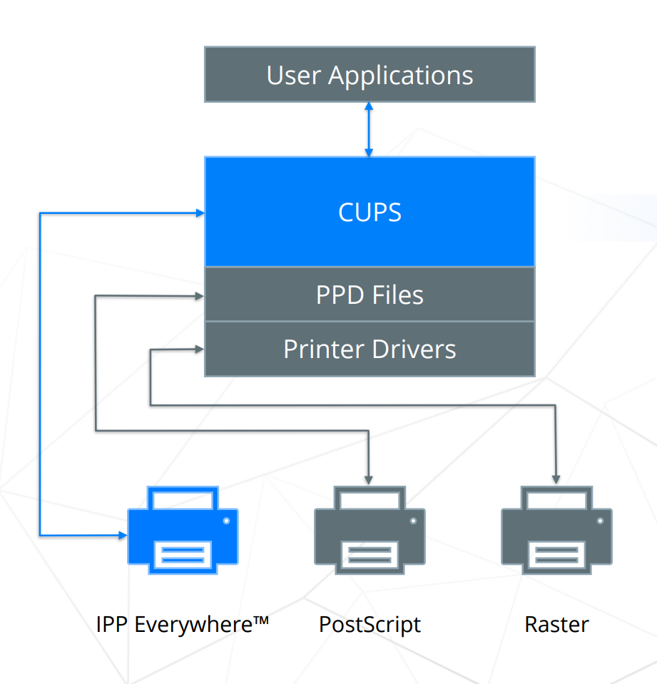
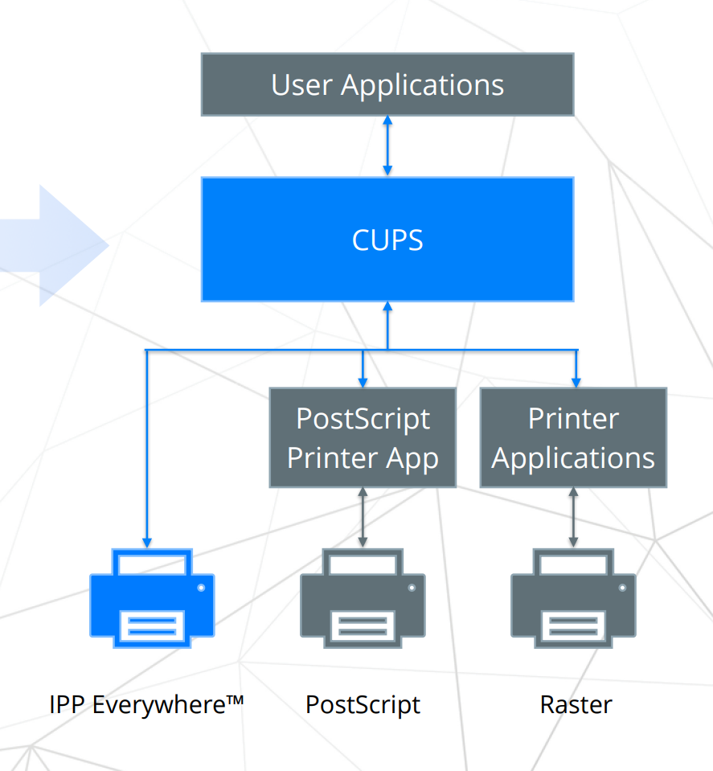
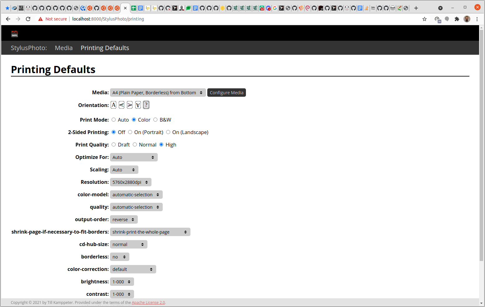
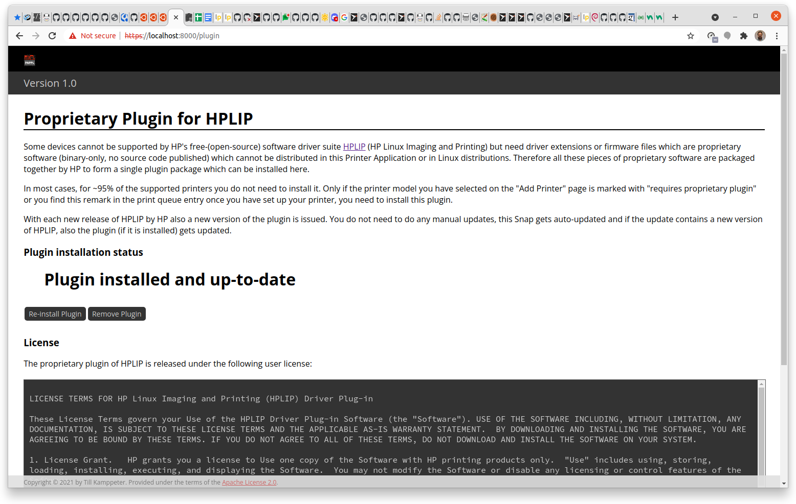
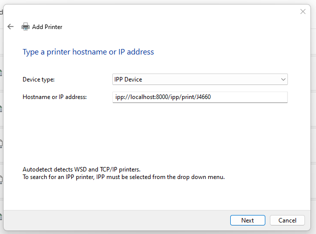

**This page represents the state of August 2022**

Even having [achieved many nice things in the last 21 years](/achievements/) there is always a lot to do, especially currently, on the way to the New Architecture for printing and scanning, to make everything completely standards-conforming and get rid of obsolete methods and technologies.

Also the development of the systems and environments our work is intended for does not stop and we need to integrate our software, for example with printer setup tools and print dialogs of different desktop environments and applications, packaging methods like Snap, Flatpak, Docker, ..., new forms of OS distributions (immutable core, all-Snap, ...), ...

We also need to improve on things like CI and automatic testing of our code and also on documentation, especially for the APIs of our libraries.

For all this we are always in search for contributors of the community. Therefore we are once reaching out by presenting on several conferences, like the OpenPrinting micro-conferences on the Linux Plumbers Conference ([2019](/OpenPrinting-Microconference-on-Linux-Plumbers-Conference-2019/), [2020](/OpenPrinting-News-September-2020/#openprinting-microconference-on-linux-plumbers-conference-2020), [2021](/OpenPrinting-News-October-2021/#openprinting-micro-conference-on-the-linux-plumbers-2021), [2022](https://lpc.events/event/16/sessions/142/#20220914)), [Linux App Summit](/OpenPrinting-News-Flash-OpenPrinting-and-Ubuntu-on-the-Linux-App-Summit-2022/), [GUADEC](/OpenPrinting-News-July-2022/#guadec-2022), ..., and also internet platforms, like [Ubuntu on Air](https://ubuntu.com/blog/ubuntuonair) ([YouTube channel](https://www.youtube.com/UbuntuOnAir)). And second, we are participating in the [Google Summer of Code](http://g.co/gsoc) every year, having 5-8 3-month projects each year and some of the contributors continue to work with us voluntarily.

*YouTube Video of the Ubuntu Office Hours with Till Kamppeter, Aveek Basu, Divyasheel Kumar, and Pranshu Kharkwal, hosted by Monica Ayhens-Madon (Click to play on YouTube)*

## The New Architecture for printing and scanning
Emphasis of our work at OpenPrinting is the New Architecture. 6 of our 7 GSoC contributors this year are working on it and also Michael Sweet's and my work are focused on it.

Subject of the [New Architecture](https://events.gnome.org/event/77/contributions/285/attachments/88/187/guadec-2022-new-architecture.pdf) is getting a streamlined, standards-conforming printing and scanning workflow without obsolete methods and technologies and integrating well into modern operating system and network environments.

*YouTube Video of the Ubuntu Desktop Team Indaba with Till Kamppeter and Michael Sweet, hosted by Heather Ellsworth and Monica Ayhens-Madon (Click to play on YouTube)*

for 22 years now, since its 1.0 launch, [CUPS](#cups) uses principally the same architecture:

- PostScript was the standard job format as printers usually used with UNIX were PostScript devices.
- Capabilities of a printer are described by a PPD (PostScript Printer Description) file.
– The PPD file describes all user-settable options, resources (trays, paper sizes, resolution, quality, color, ...) in a static text file.
– To cover non-PostScript printers the PPD file format got extended (by Michael Sweet) to specify a filter to generate the printer’s native format.
– Filters use Ghostscript (or Poppler) to convert PostScript input.
– Print queues were manually created, with drivers (= PPDs + filters) assigned to them.

Why do we want to do away with PPD files?

– In 1984 Adobe stopped development on PPDs (and also PostScript), so we started with an obsolete (but useful) format right away.
– In 2006 we [abolished PostScript as print job format](/achievements/#pdf-instead-of-postscript-as-standard-print-job-format) and replaced it by PDF.
– PPD files can represent user-settable options only as enumerated choice or boolean. Ugly workarounds for things like passwords or color adjustment are needed, implemented in [CUPS](https://openprinting.github.io/cups/doc/spec-ppd.html) and [Foomatic](https://openprinting.org/printers).

As CUPS was always following the standards of the Printer Working Group ([PWG](http://www.pwg.org/)), a consortium of printer, OS, general IT, ... industry with which OpenPrinting works closely together and with Michael Sweet (author of CUPS) actively developing on the Internet Printing Protocol (IPP) for decades, we flllow them even more to create an all-IPP CUPS without the legacy of PPD files and driver filters.

These are exactly the established standards of driverless IPP (IPP Everywhere, AirPrint, Mopria) with print destinations advertising themselves via DNS-SD (also known as mDNS, ZeroConf, BonJour), communicating via pure IPP and using common data formats for print jobs (PDF, PWG Raster, Apple Raster, PCLm).

– [CUPS 3.x](#cups) will not support PPD files from the ground up.
– The CUPS Snap does not allow adding PPDs and filters as it consists of an immutable file system image in a security sandbox. 
– Now only driverless IPP printers are supported.
– No manually created CUPS queues: IPP printer discovered, temporary queue automatically created (exception, CUPS sharing daemon).
– Filtering only for driverless standard formats: PDF, PWG Raster, Apple Raster, PCLm output, no need to add filters

*Current CUPS architecture*

*New CUPS architecture*

This will not only eliminate any obsolete technologies and methods, but also much better integrate in modern system environments,  operating systems with with immutable core file system or distribution-independent, sandboxed packaging, like [Snap](https://snapcraft.io/], [Flatpak](https://flathub.org/), or [Docker](https://hub.docker.com/).

This is due to the fact that components only interact via IP-based protocols like IPP and DNS-SD and no files o one component have to be installed in the file system of another, especially no binary executable files. So every component can be in its own sandbox and have its own immutable file system.

Most modern printers, even the cheapest ones as manufacturers want to allow printing from smartphones, do driverless IPP printing, most commonly AirPrint but currently also Mopria. So they work perfectly under Linux and alike operating systems, currently and also after the transition to the new architecture.

But we will not drop or exclude legacy and specialty printers which do not do driverless IPP and therefore need a driver. There will be no printer drivers based on PPD files, and filter executables any more, but a completely new format, the [Printer Applications](#printer-applications).

These are emulations of driverless IPP printers which internally convert the job data to the printer's native format and pass it on to the physical printer. This way CUPS only needs to deal with driverless IPP printers and manual creation of print queues (with drivers) is not needed any more.

As modern multi-function devices do not only provide driverless IPP printing but also driverless eSCL (or WSD) network scanning. we go a similar way for scanning, creating [Scanner Applications](#scanner-applications) and so eliminate the need of SANE drivers which are libraries, dynamically linked by the application which scans, which is even worse for distribution-independent, sandboxed packaging. This way we can also create distribution-indpendent sandboxed packages for scanner and multi-function device drivers.

This way the New Architecture also helps printer/scanner manufacturers who for some reason cannot or do not want to go driverless, can easily create and distribute drivers for their devices.

## CUPS
CUPS is the standard print environment in Linux and other POSIX-style oprating systems for more than 20 years now.It is the daemon managing print queues with appropriate printer drivers, receiving, queueing, spooling, and printing print jobs from applications, sharing print queues on the netwok, ...

With [CUPS having moved from Apple to OpenPrinting](/achievements/#cups-upstream-home-is-openprinting-now), developemnt, especially of new fetures, restarted. We do annual feature releases again and bug fix releases as needed inbetween.

Michael Sweet has presented a [roadmap](OpenPrinting-News-October-2021/#cups) for the further development o CUPS on the [Linux Plumbers Conference 2021](/OpenPrinting-News-October-2021/#openprinting-micro-conference-on-the-linux-plumbers-2021) ([slides](https://linuxplumbersconf.org/event/11/contributions/1023/attachments/737/1443/lpc-cups-2021.pdf)) and on the [OpenPrinting Summit/PWG meeting 2022](/OpenPrinting-News-June-2022/#openprinting-summitpwg-meeting) ([slides](https://ftp.pwg.org/pub/pwg/liaison/openprinting/presentations/cups-plenary-may-2022.pdf)).

### CUPS 2.5.x
Its development is supposed to start soon and it is scheduled to be released towards the end of 2022. This is the last series in the 2.x generation, the last series still supporting the current architecture based on print queues with PPD files and printer-model-specific filters (aka drivers).

Main new feature here is full support for [OAuth](https://en.wikipedia.org/wiki/OAuth) authotization and [OpenID](https://en.wikipedia.org/wiki/OpenID) authorization servers. There are [IPP attributes to support OAuth](https://ftp.pwg.org/pub/pwg/ipp/slides/ipp-wg-agenda-august-22.pdf) (from slide 28 on). Especially also an interface (most probably D-Bus) bewtween cups and the a GUI tool for the user authentication is planned to be created.

OAuth authentication should replace the more awkward Kerberos which requires root access. Also there are several free software implementations of OAuth support, especially also Michael Sweet's own[mOAuth](https://www.msweet.org/moauth).

### CUPS 3.x
The next generation of CUPS implements the New Architecture: Classic printer drivers based on PPDs and printer-model-specific filters are not supported any more. In adition, the CUPS project gets split into various smaller modules: libcups, commands, local server, sharing server.

Release is scheduled for end of 2023, meaning that until then all related software, like [cups-filters](#cups-filters), [all printer drivers](/achievements/#all-free-drivers-in-a-ppd-less-world---or---all-free-drivers-in-snaps), [print dialogs](#the-print-dialogs), [printer setup tools](#gnome-control-center---printers-module), ... needs to be prepared for the New Architecture, which is subject of most of our work currently.

Michael Sweet has already started the development on the new [libcups3](https://github.com/michaelrsweet/libcups).

Planned splitting of the project is as follows:

**libcups**

CUPS library

**Commands**

Command line interface: `lp`, `lpstat`, `cancel`, `lpinfo`, `lpadmin`, ...

**Local Server**

In case one only needs print functionality on the local machine and does not want to share out print queue to other machines, a simple user daemon (not running as root), the local server is used.

Queues are automatically set up temporarily on discovered IPP printers, as current CUPS daemons already do. Manaul queue creation is not supported, also no PPDs and no adding of filters. There is no web interface.

The damon is accessed through the usual domain socket and will get a new D-Bus API for GUIs connecting printing, authentication, and notifications. The daemon does listen on port 631.

Profiles can be created to acces printers and servers outside the DNS-SD-discoverable local network.

**Sharing Server**

If print queues are supposed to get shared out to the network, the sharing server is used.

It listens on port 631 for remote clients inquiries, behaves as a standard IPP printer on the network.

It has a web interface and can be configured similar to current (2.x) CUPS daemons.

## cups-filters 2.x
cups-filters provides filters (to convert data formats for printing) and backends (to communicate with printer hardware) for use with CUPS under non-Mac operating systems. The project originates in Apple (owner of CUPS that time) outsourcing the filters which were not used by Mac OS to OpenPrinting back in 2011.

With the replacement of classic printer drivers consisting of PPD files and filter executables by Printer Applications we are also changing the architecture of cups-filters, in the new 2.x generation.

First mentions of the needed architecture change and a possible cups-filters 2.x generation happened in [March](/OpenPrinting-News-March-2020/#cups-filters) and [April](/OpenPrinting-News-April-2020/#cups-filters) 2020.

Development started mid-2020 (2 years ago) with creating a libppd containing all PPD support functionality of libcups (in libcups3 it will get removed) for retro-fitting classic drivers and PostScript PPDs in [July](/OpenPrinting-News-July-2020/#cups-filters).

Next step was turning all the individual filter executables into library functions, the filter functions, for being easily used by [Printer Applications](#printer-applications), starting in [August](/OpenPrinting-News-August-2020/#cups-filters) and with this separating the cups-filter 1.x development into its own branch.

These changes have been all performed already and being made use of in the [printer-driver-retro-fitting Printer Applications](/achievements/#all-free-drivers-in-a-ppd-less-world---or---all-free-drivers-in-snaps).

To finalize cups-filters 2.x the support for PPD files in the filter functions has been completely separated from libcupsfilters and moved into libppd, so that libcupsfilters can be installed without installing libppd and so distributions do not need to keep the PPD-file-retro-fitting library in their standard installation.

Currently we are in the phase of final testing, code clean-up and separating the projects: libcupsfilters, libppd, cups-filters-legacy (the filter executabls), and cups-browsed, to allow the release of cups-filters 2.0b1 in some weeks.

## Printer Applications
As mentioned earlier Printer Applications are the new format for printer drivers, emulations of IPP printers, to turn the all-IPP New Architecture reality. They also can be easily put into sandboxed, distribution-independent packages like Snaps, for easy distribution of printer drivers by hardware manufacturers.

We already have [retro-fitted the drivers for ~10000 printer models](/achievements/#all-free-drivers-in-a-ppd-less-world---or---all-free-drivers-in-snaps), the drivers which are usually available in Linux distributions into 4 Printer Applications and put up those in the Snap Store, to not lose any printer support when switching to the New Architecture, but there are still a lot of things to do.

### PAPPL
Michael Sweet's [PAPPL](https://github.com/michaelrsweet/pappl/) is the base for all currently available Printer Applications, the [4 retro-fitting ones of OpenPrinting](/achievements/#all-free-drivers-in-a-ppd-less-world---or---all-free-drivers-in-snaps) and also Michael Sweet's [LPrint](https://github.com/michaelrsweet/lprint) and [hp-printer-app](https://github.com/michaelrsweet/hp-printer-app).

It provides everything which every Printer Application needs:
- A daemon which emulates an IPP printer
- A web interface to configure the printers (drivers, loaded media, default settings ...
- Advertising the printers via DNS-SD
- Receiving Apple/PWG Raster jobs and images and feeding the pixels into the actual driver
- Handling certificates and encryption
- ...

This makes it much easier to create a Printer Application and one only needs to add the driver itself, what turns the jobs into the printer's native format, an what tells the outside world about the capabilities of the printer.

PAPPL is nearly complete and currently Michael Sweet has added support for supply level readout and for localization of option and choice strings.

PAPPL is under continuous development.

### pappl-retrofit
[pappl-retrofit](https://github.com/OpenPrinting/pappl-retrofit) is based on PAPPL and provides everything what Printer Applications which retro-fit classic CUPS drivers need:
- Convert PPD file collections into human-readable lists of supported printers
- Convert PPD options into printer IPP attributes and web interface options
- Manage installable accessories (like trays) and adapt option lists to the accessory configuration
- Poll accessory configuration and default settings from the printer
- Manage list of loaded media for `media-ready` IPP attribute

This reduces the effort of programming for creating a Printer Application to a minimum. Only a few lines of C to configure the Printer Application are needed.

pappl-retrofit is nearly feature-complete and for the soon coming 1.x release only support of the most recent PAPPL features, supply level read-out and localization will be added.

### Native Gutenprint Printer Application
[Gutenprint](http://gimp-print.sourceforge.net/), high-quality printer driver for many Epson and Canon inkjets, dye-sublimation photo printers, and several other printers, is already available as a [retro-fitting Printer Application](https://github.com/OpenPrinting/gutenprint-printer-app).

As Gutenprint is under active development, we want to have a **native** Printer Application of it, meaning that we do not simply wrap its classic CUPS driver incarnation into a Printer Application with pappl-retrofit, but instead, make a Printer Application directly linking libgutenprint, getting rid of the restrictions and workarounds of PPD files, allowing full liberty of how to make all the options and adjustments available to the user. One must know that for some Epson inkjets there are more than 100 options in the PPD file, many of them are numeric, like color intensities, light/dark ink transitions, ...

We tried to achieve this in this years GooGle Summer of Code, but unfortunately, the contributor has failed on this task in the midterm evaluations.

Now we are looking for an alternative way to do this, but it is not urgent as for switching a distribution over into the New Architecture (for example when using the CUPS Snap, or even making the distribution all-Snap) we already have the retro-fitting Gutenprint Printer Application.

*Options for Epson inkjet printer in the Gutenprint Printer Application*

### Native HPLIP Printer Application
Another printer driver which is under active developemtn and therefore should be available as native Printer Application, maintained by its developers, is [HPLIP](https://developers.hp.com/hp-linux-imaging-and-printing/) (HP Linux Imaging and Printing). Blocker on suggesting the HPLIP developers at HP to create a Printer Application from it is the missing [scanning support](#scanner-applications) in PAPPL, as many of HP's printers are multi-function devices and the classic HPLIP driver also includes a SANE driver for the scanners.

For the printing part of HP's devices we have at least a [retro-fitting Printer Application](https://github.com/OpenPrinting/hplip-printer-app) for the time being, even with support for HP's proprietary plugin.

*Installing HPLIP's proprietary plugin in the HPLIP Printer Applications*

### Braille Printer Application
Accessibilty is an important part of an operating system for everyone's daily use. This does not only mean an accessible user interface but also support for devices which serve for accessibility, like Braille embossers for written communication with blind people. Therefore we need to support them like we support usual printers, which deposit visible markings on the media surface.

Our support for Braille embossers is currently provided in the [cups-filters](https://github.com/OpenPrinting/cups-filters) project and, to not lose the support when switching into the New Architecture we currently have Chandresh Soni creating a Braille Printer Application as a Google Summer of Code project, with me and upstream maintainer Samuel Thibault as mentors.

### Reviving legacy printers under Windows
I am working at Canonical in The Desktop Team, my job being leading the OpenPrinting project, and in the Desktop Team we also have a sub-team working on WSL (Windows Subsystem for Linux), a facility to run Linux applications under Windows. This brought me to the idea of running Printer Applications under WSL, to revive legacy printers which got abandoned by Microsoft and also by their manufacturers.

My first public mention of this idea was during the [virtual release party of Ubuntu 22.04](https://www.youtube.com/watch?v=CBPefa0Ckq8&t=15480s) on the [LAS 2022](/OpenPrinting-News-Flash-OpenPrinting-and-Ubuntu-on-the-Linux-App-Summit-2022/), in my second part praising the WSL team.

The first working implementation of this idea is available now, the first [HOWTO](/wsl-printer-app/) of WSL team member Carlos Nihelton, which he has worked out and written in cooperation with me. Thanks a lot to him!

*Creating Windows print queue pointing to Printer Application running under WSL*

It works, but it is still somewhat awkward, as it requires to compile the Printer Application and its dependencies (pappl-retrofit and PAPPL) from source.

We will update the HOWTO whenever the developement of WSL progresses. With WSL to use systemd, to support DNS-SD via Avahi, to use AppArmor, and finally to have snapd working in it things will get easier, finally hopefully just in a Snap! Each step of developemnt will remove steps from the HOWTO.

My intention is to present the idea on the [Ubuntu Summit](https://summit.ubuntu.com/) in November, and I hope in a much easier implementation as currently.

## Scanner Applications
Most modern printers do driverless IPP and many of them are multi-function devices with built-in scanner, and these ones do not only driverless printing but also driverless scanning!

We have [Linux support for the underlying scanning protocols eSCL and WSD](/achievements/#sane-backends-for-driverless-scanning---escl-and-wsd-airscan) and the eSCL communication protocol is also [published](/OpenPrinting-News-May-2021/#driverless-scanning), but what we still do not have is PAPPL support for scanning, to easily create Scanner Applications for non-driverless scanners as we already hav Printer Applications.

Currently, we have the SANE backends as scanner drivers, which are dynamically linkable libraries. They must be put into a defined system directory to get found by the applications which scan and they also need to have binary compatibility with the applications. This can usually only be achieved by applications and scanner drivers being built for the host operating system distribution, for security reasons even preferably by the maintainers of the distribution.

With scanner drivers packaged as Scanner Applications we have the same advantages as with Printer Applications for printing. We only have IP communication, in our case DNS-SD and the HTML-based eSCL between application and scanner driver and so we can do sandboxed, distribution-independent packaging of the applications and of scanner drivers, allowing the two components being in separate sandboxes.

This way scanner manufacturers can distribute their drivers in distribution-independent packages (like Snaps) and they work with all applications, also third-party ones which come as Snaps or Flatpaks.

And for multi-function devices the Printer Application can provide both printing and scanning support, which makes setting up the device much easier, just in a (single) Snap!

We have already tried to add scanner support to PAPPL but contributors dropped out during the pandemic and so we are only able to complete the support in this year's Google Summer of Code. The base for the API got already being done [last year by Bhavna Kosta](https://github.com/Bhavna2020/GSoC-2021) ([Slides of Linux Plumbers 2021](https://linuxplumbersconf.org/event/11/contributions/1029/attachments/785/1474/Scanning%20in%20PAPPL.pdf)). Then this year we have 2 contributors: Rishabh Maheshwari does the eSCL parser and Deepak Khatri does the interface to the driver for the actual scanner. Mentoring is done mainly by me but also by Deepak Patankar, who also started as a GSoC contributor for OpenPrinting some years ago and also already mentored for us.

Having this working we will do:

- SANE scanning support in [pappl-retrofit](https://github.com/OpenPrinting/pappl-retrofit)
- Create a Scanner Application from sane-backends and also Scanner Applications from other SANE drivers and snap (= create Snaps of) them.
- When snapping user applications which scan, only include sane-airscan for scanning support, as this is enough to connect with the snapped scanner drivers.
- Add scanning support to our [retro-fitting HPLIP Printer Application](https://github.com/OpenPrinting/hplip-printer-app)
- Suggest HP's developers to create a [native HPLIP Printer Application](#native-hplip-printer-application), which supports both printing and scanning.

## GNOME Control Center - "Printers" module
Unfortunately, not every printer gets immediately ready for printing when just connecting it and turning it on, especially printers which need a driver or printers on another than the local network. Therefore we also still need a printer setup tool even in a world of driverless IPP printing.

Most used printer setup tool is probably the "Printers" module of the GNOME Control Center. Simply because most Linux distributions use GNOME as their default desktop.

The functionality of printer setup tools is usually more or less the same: In a main panel all CUPS print queues are listed and one has buttons/menus on each entry to configure the queue, default option settings, driver, ... On the main panel there is also a button to open the panel to add a new printer, which means creating a new CUPS queue. Here one chooses a discovered printer and assigns a (lassic) driver to it (which is often done automatically).

The New Architecture requires some changes but the UI will still look very similar afterwards. The main panel will show IPP print services instead of CUPS queues, as now all printers are driverless IPP printers for CUPS (3.x), either network printers or Printer Applications, and CUPS queues are created automatically on-demand. So the user now configures the IPP printers, via their web admin interfaces and/or IPP System Service. The IPP service entries in the printer setup tools have therefore buttons/menus to access these configuration facilities then.

There will also be the "Add Printer" button, but on the panel for adding a printer discovered printers will only be listed if they are not driverless IPP printers and need a Printer Application. Buttons and menus allow operations to find and install the correct Printer Application and make the printer connected with it. After that the printer appears as IPP print service on the main panel.

These changes are currently worked on, in a way that the "Printers" module works with both the current CUPS and also in the New Architecture, simply by listing both CUPS queues and IPP services, and so showing all available printers, both with permanent CUPS queue and also those for which CUPS would create a temporary queue on-demand, and in both cases the user is directed to the correct configuration interfaces. The add-printer panel will also support both Printer Applications and classic drivers. After the switchover to the New Architecture the then unavailable items will simply not get displayed.

The coding is done in a nice sub-team of two GSoC contributors plus their mentors. In addition, code of the last two year's GSoCs get made use of, too. Shivam Mishra does the main panel with all ist functionality and Mohit Verma the add-printer panel. Mentoring is done by me, by Divyasheel Kumar (worked on listing IPP services last year), and upstream maintainer Marek Kasik.

Several feature requests are posted on GNOME's GitLab and cups-pk-helper'a GitHub and there the coding work gets discussed:

- [GNOME #1877](https://gitlab.gnome.org/GNOME/gnome-control-center/-/issues/1877): Improve setting of IPP options
- [GNOME #1878](https://gitlab.gnome.org/GNOME/gnome-control-center/-/issues/1878): Allow to add new printers via Printer Applications
- [GNOME #1879](https://gitlab.gnome.org/GNOME/gnome-control-center/-/issues/1879): Do not show setting of drivers for IPP printers
- [GNOME #1911](https://gitlab.gnome.org/GNOME/gnome-control-center/-/issues/1911): Printers: Make adminurl available for IPP printers
- [cups-pk-helper #1](https://github.com/freedesktop/cups-pk-helper/pull/1): Added discovery of Printers via lpinfo, PAPPL and Printer Applications

## The print dialogs
Also print dialogs need changes for the New Architecture. They first of all should not try to download the print queue's PPD files via CUPS' HTTP interface or even worse, grab them from the local file system. Second they need to support temporary CUPS queue, those queues for IPP printers which are created on-demand when polling the printer's capabilities or sending a job. The latter print dialogs should have supported already earlier but several still do not.

The most obvious approach would be that all print dialogs (GTK, Qt, LibreOffice, Firefox, Chromium, ...) get changed appropriately, but this requires the maintainer's, often volunteers, time, is not top-priority in the projects, ... and so takes time if done at all.

Therefore we created the concept of the [Common Print Dialog Backends](/achievements/#common-print-dialog-backends) (CPDB) to not only let all print dialogs support multiple print technologies (CUPS, print to file, cloud printing services, ...) but also move the responsibility on correct support of each print technology to the maintainers of that print technologies, for example to OpenPrinting for CUPS.

This is done by the print technology support being in separate modules (backends) which are available to the print dialogs as D-Bus services. This way the backends can get updated separately and they can also be in separate sandboxed packages, aloowing easy Linux support for any cloud/online printing service provider.

Currently, GSoC contributor Gaurav Guleria (mentored by me and upstream manintainers Marek Kasik and Albert Astals Cid) is working on CPDB support for the print dialogs. He already completed the GTK dialog ([Merge Request](https://gitlab.gnome.org/GNOME/gtk/-/merge_requests/4930) with discussion) and also did a lot of fixes and improvements on [CPDB](https://github.com/OpenPrinting/cpdb-libs) itself. Now he is working on the Qt dialog to add CPDB support also there, to make it finally cute.

## Optimizing DNS-SD browsing
DNS-SD is an important concept for the printing. By the current standards, network printers, especially IPP printers advertise themselves in the local network via DNS-SD, tellung about how they are accessed (IP, port, resource -> makes up URI), model name, and basic capabilities, job data formats, paper size class, duplex, scanner, fax, ... This way clients can find and use printers automatically (which is supported by CUPS). Once the client knows about the presence of an IPP printer it polls its full capabilities by a `get-printer-attributes` IPP request and is ready to print.

For this several components of CUPS and cups-filters call functions of the Avahi library ask avahi-daemon whether there are any devices in the network which provide IPP print services: The CUPS daemon to be able to create temporary print queues for IPP printers, the `dnssd` CUPS backend to find all kinds of network printers, `cups-browsed` to find IPP printers and remote CUPS queues to form clusters, the `driverless` utility to emulate a driver for driverless printers to set them up with classic printer setup tools, ...

As the DNS-SD browsing with Avahi always follow the same scheme, getting a list of all services of a given type (browsing, very fast) and the getting detailed information of a given service (resolving, needs time) we have a lot of code duplication here. Also we have performance problems as on browsing one gets many duplicate listings as the same device can apper under several network interfaces (and one can have many: local, wired, wireless, virtual machines, ...), HTTP/HTTPS, IPv4/Ipv6 and if not identifying these duplicates one can spend a lot of time on unneeded resolving.

Sachin Thakan, mentored by me, is working on optimizing this in this year's Google Summer of Code.

## Distribution-independent packaging
Linux distributions are usually composed of binary packages (RPM or DEB in most cases), for the kernel, for systemd, for CUPS, for applications, ... so that user can easily put together their system without needing to compile anything. Problem is here that these packages are made for only one version of a distribution, for example for Ubuntu 22.04. They are also usually made by the maintainers of this distribution, not by the maintainers of the packaged application. Also there are no new versions of an application packaged for an already released distribution version.

To overcome this, to get a packaging system which is distribution-independent and also gives enough security to run third-party binary code, sandboxed packaging methods got introduced. Each package comes with all its libraries and other parts it depends on in a security-encapsulated sandbox. Also what comes with the package is an immutable, manipulation-proof file system image. It also can only communicate with the host system and other packages only through well-defined channels.

Most sophisticated system in terms of security and flexibility is [Snap](https://snapcraft.io/), it is very similar to smartphone app packaging. See also the [Ubuntu Indaba with Mark Shuttleworth](/OpenPrinting-News-May-2022/#openprinting-snaps-and-the-ubuntu-indaba-with-mark-shuttleworth).

This is also the system I have most experience with. Right when it was launched back in mid-2017 I started [snapping (packaging as a Snap) CUPS](/achievements/#the-cups-snap). I posted several feature requests on Snap and worked together with the Snap developers to integrate the CUPS Snap in the Snap infrastructure, creating an [interface](https://forum.snapcraft.io/t/new-interface-cups-for-all-snaps-which-print/) for snapped applications being able to safely print without being able to mess up the system.

Not only CUPS, but also [ipp-usb](/achievements/#driverless-printers-on-usb---ipp-over-usb) and the [4 retro-fitting Pringter Applications](achievements/#all-free-drivers-in-a-ppd-less-world---or---all-free-drivers-in-snaps) I have snapped and are available in the [Snap Store](https://snapcraft.io/search?q=openprinting). All these I am regularly updating for new versions of the contained classic printer drivers and other included software.

Having snapped CUPS I wondered why not packaging CUPS also in other formats, as Flatpak or AppImage. I investigated and found out the following:

- **[Flatpak is not suitable](/OpenPrinting-News-March-2022/#flatpak-and-printing):** It is especially made for desktop/GUI applications. One cannot package daemons. The packaged app cannot be run as root. The channels to communicate with the outside world are not file system mounts ot AppArmor allowances as with Snap, but portals, D-Bus interfaces to common GUI dialogs as "Open", "Save as ...", and "[Print](/achievements/#common-print-dialog)".
- **[AppImage is not suitable, too](/OpenPrinting-News-April-2022/#appimage-and-printing):** AppImage does nothing more that providing an immutable file system image with the packaged application and all its libraries and other dependencies. It is an executable which simply opens the file system and runs the included application. There is no security concept, the application has access to the whole system (or at least to what the invoking user has access to). There is also no support for daemons, like for example auto-starting it.
- **[Docker is an alternative](/OpenPrinting-News-May-2022/#official-docker-image-of-cups-and-printer-applications):** Especially on systems based on a minimal/immutable/atomic/image-based OS designed for applications being installed as Flatpaks or systems not based on systemd, not using AppArmor, Snaps cannot get installed and an alternative method to install distribution-independent packages of CUPS and Printer Applications is needed. Here Docker images (OCI-compatible containers) as official versions from OpenPrinting on [DockerHub](https://hub.docker.com/) got suggested. I had some discussion with Robert McQueen and he posted on [the Flatpak list](https://lists.freedesktop.org/archives/flatpak/2022-May/002244.html) and there came up [further suggestions](https://lists.freedesktop.org/archives/flatpak/2022-May/thread.html).

After releasing [cups-filters 2.0b1](#cups-filters-2-x) and [pappl-retrofit 1.0b1](#pappl-retrofit) I will look into creating the Docker images of CUPS and the Printer Applications.

## Printer Application look-up via the OpenPrinting web site
The part of the web site for looking up (legacy, non-driverless) printers and drivers (the [OpenPrinting database web app](https://github.com/OpenPrinting/foomatic-db-webapp/) has [successfully moved](/achievements/#the-openprinting-web-site) to a new server at Oregon State University Open Source Lab ([OSUOSL](https://osuosl.org)). Violet Kurtz and Lance Albertson, both from OSUOSL have helped a lot on this.

This is the base for being able to do further development and updates on our web app, especially the [Printer Application look-up service](/OpenPrinting-News-November-2021/#printer-querying-on-the-openprinting-web-server) which is needed for the printer setup tools to find the correct Printer Application to install when submitting the printer's device ID as search term. The service is especially needed as the developers of the Snap Store [did not show interest on hardware-signature-based search](https://forum.snapcraft.io/t/hardware-associated-snaps-snap-store-search-by-hardware-signature) and we also want to provide the Printer Applications [in other formats in the future](#distribution-independent-packaging).

Violet Kurtz is making good progress on the [extension of the web app for this functionality](https://github.com/OpenPrinting/foomatic-db-webapp/pull/15).
