## Introduction

In the [previous HOWTO](/wsl-printer-app-compile/) we've seen how WSL 2 and Printer Applications can revive older printers which Windows doesn't offer drivers for.
Although effective, it's quite complicated to build the necessary components from source. 

That complexity is really not necessary anymore.

If you've seen the latest news, [Microsoft recently announced support for systemd inside WSL 2](https://devblogs.microsoft.com/commandline/systemd-support-is-now-available-in-wsl/), which, among other features, allows us running Snaps.
To know more of what can be done with systemd in Ubuntu WSL and how to enable it, check out [the post in Ubuntu's blog](https://ubuntu.com/blog/ubuntu-wsl-enable-systemd).
The following steps will leverage that power to install a Printer Application as a Snap, which encapsulates all dependencies and small details required to run
it, and make the printer discoverable for Windows by using Avahi.

> Since both Avahi and the Printer Application will run as daemons, and since systemd is a new feature for WSL, I recommend following this guide on a dedicated Ubuntu WSL instance instead of doing it on the main instance you use for other purposes.
> Its also worth mentioning that the current state of systemd on WSL2 won't allow background services to keep your distro instance alive, so the services will run as long as the distro itself is running.

As before, it’s necessary to point out that the following steps would simply be impossible without the amazing [usbipd-win](https://github.com/dorssel/usbipd-win) project, which offers a Windows software for sharing locally connected USB devices to other machines, including Hyper-V guests and WSL 2. We use it to make the printer visible inside Ubuntu WSL.

## How to

**Editor's Note:** USB IPD only needs to get installed if the printer gets actually connected by USB. For network-connected (Ethernet/Wi-Fi) printers it is not needed. Depending on your printer model you will perhaps need a different Printer Application ([OpenPrinting](https://snapcraft.io/search?q=OpenPrinting), [LPrint](https://snapcraft.io/lprint), or if you are in doubt, use our [look-up service](/OpenPrinting-News-September-2022/#openprinting-web-server-printer-application-look-up-service-is-now-live)).

1. Connect the printer to the USB port. Make sure it’s not supported on Windows by checking Settings > Bluetooth & devices > Printers & scanners.

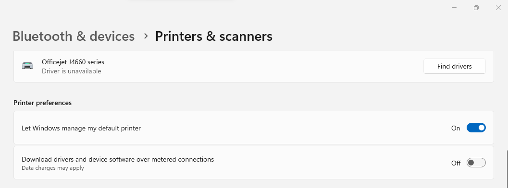

2. Install the usbipd-win software. The easiest way is through winget. Open Powershell and issue the following command:

`winget install --interactive --exact dorssel.usbipd-win`

> An alternative way is downloading the installer from the GitHub repository [releases page](https://github.com/dorssel/usbipd-win/releases) and executing it.

3. It will display a regular setup wizard. Follow its steps until the end. When prompted, accept the dialog to elevate permissions. In the end restart your computer to let the system changes take effect.

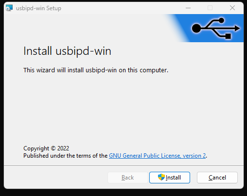

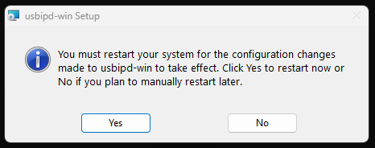


4. Make sure you have the Ubuntu-Preview application. It can be installed from [Microsoft Store](https://apps.microsoft.com/store/detail/ubuntu-preview/9P7BDVKVNXZ6). It contains the latest (usually unstable) development snapshot
   of Ubuntu WSL. It enables systemd by default.

   > If you want to use an existing instance of Ubuntu WSL, refer to the [Ubuntu blog post](https://ubuntu.com/blog/ubuntu-wsl-enable-systemd) on how to enable systemd.
   > If you're not using Ubuntu-Preview make sure to adjust the distro name in the relevant commands listed throughout the guide.


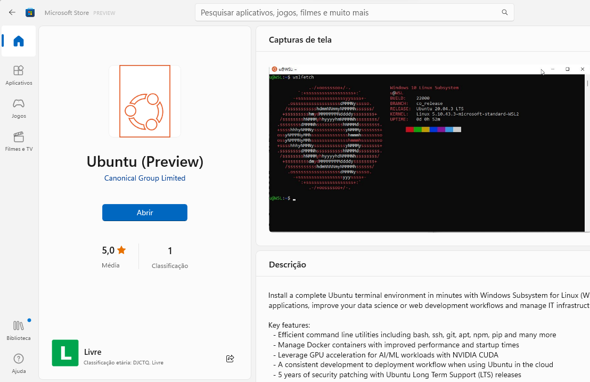


5. Install the Avahi daemon and the Linux counterpart of USB IPD inside Ubuntu WSL. Refer to the [project’s wiki](https://github.com/dorssel/usbipd-win/wiki/WSL-support) for further information.

```
sudo apt update
sudo apt install avahi-daemon linux-tools-virtual hwdata
sudo update-alternatives --install /usr/local/bin/usbip usbip `ls /usr/lib/linux-tools/*/usbip | tail -n1` 20
```

6. Check your USB devices on Windows Powershell. Take note of the printer’s bus ID (in this case `1-3`):

```
usbipd wsl list

BUSID  VID:PID    DEVICE                                                        STATE
1-3    03f0:2b12  Officejet J4660 series, HP Officejet J4660 series, HP Off...  Attached - Ubuntu-22.04
1-7    0408:a060  HD WebCam                                                     Not attached
1-10   04ca:3015  Generic Bluetooth Adapter                                     Not attached
5-1    046d:c534  USB Input Device                                              Not attached
5-4    258a:002a  USB Input Device                                              Not attached

```

7. Attach the printer to Ubuntu WSL. Run that command as administrator, if that’s the first time.

```
usbipd wsl attach --busid <BUS_ID> -d Ubuntu-Preview
```

> For this case <BUS_ID> is `1-3`.


8. Check that the printer is visible from Ubuntu WSL.


```
~$ lsusb

Bus 002 Device 001: ID 1d6b:0003 Linux Foundation 3.0 root hub
Bus 001 Device 002: ID 03f0:2b12 HP, Inc Officejet J4660 series
Bus 001 Device 001: ID 1d6b:0002 Linux Foundation 2.0 root hub

```

9. Install the Printer Application Snap.

```
sudo snap install --edge hplip-printer-app
```

10. Assert that both hplip-printer-app and avahi-daemon are running.

```
ps aux | grep -E 'avahi|hplip'
```
> Running the command above should provide a list of processes running with those names on them. Having only `grep` or having one but not the other would mean a
failure. A successful run looks like the image below.

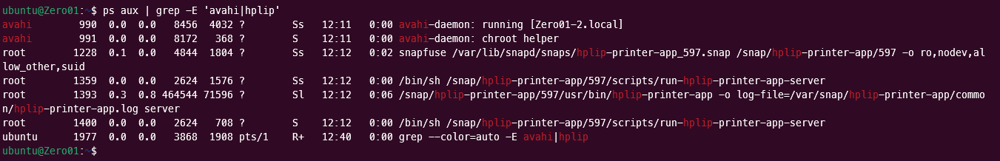


11. Open any browser (either on Windows or Ubuntu WSL, if you have one installed) and open the address `http://localhost:8000` to access the application web interface.

> Don’t worry too much if your browser complains about the TLS certificate. You’re accessing localhost, after all. Just keep going.

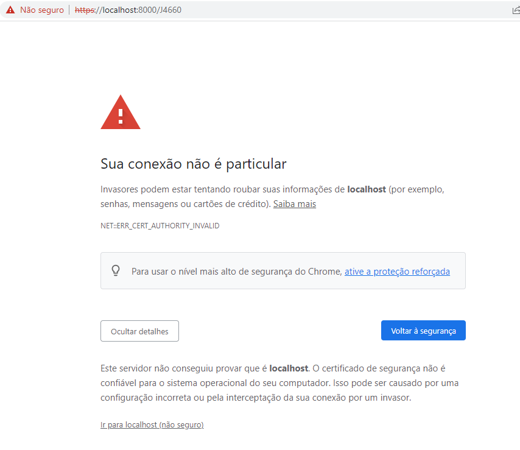

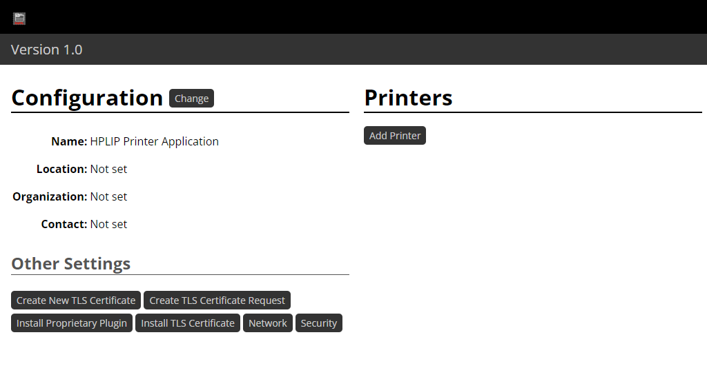

12. Add a printer through the web interface by clicking on the “Add Printer” button (the device must be powered up, connected to your computer through USB and
    attached to Ubuntu WSL. Refer to step 6). Take note of the “Name” you assign to the printer. That will be later used to refer to that printer on Windows.

> Notice that two devices were listed in my case for the same printer. If that happens to you make sure to select the one that refers to the driver (HPLIP in our case).

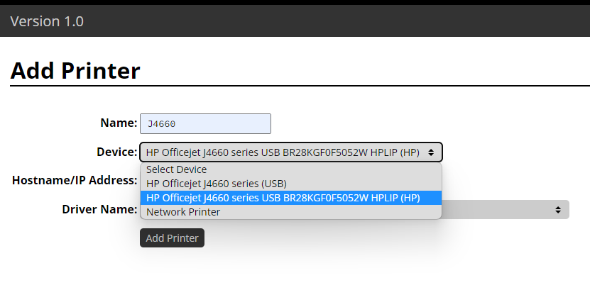

13. Confirm by clicking on the bottom “Add Printer” button.

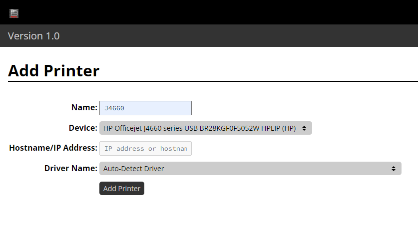

14. You should see a result like the following. Hit the button “Print Test Page” if you want to test the setup until here.

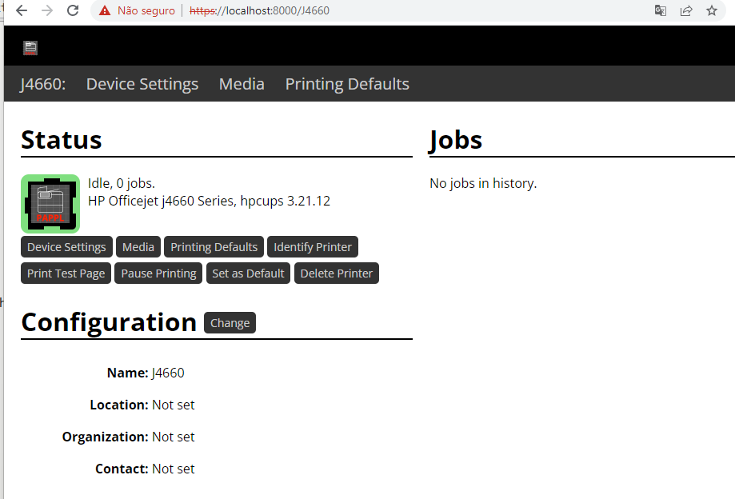

15. Add the printer to Windows. Go to Settings > Bluetooth & devices > Printers & scanners and hit the “Add device” button. Thanks to Avahi the auto discover
    will just work and Windows will show the printer we just added through the web interface. The name listed here is the same we used in the step 12.


16. Click on the "Add device" button for printer you want to add (J4660 in our case). It may take some seconds to connect and install the printer to the Windows environment. Once done
    it will show the label "Ready" below the printer name as well as list it downwards as the known device at this point.

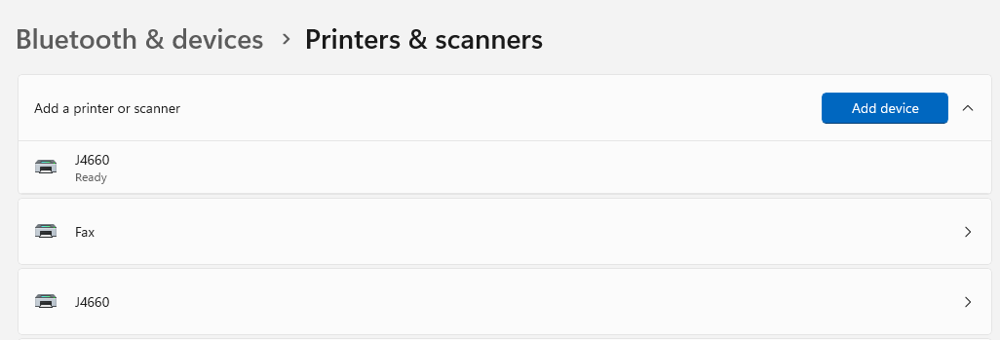

17. We're done. From then on everything should just work as you'd expect. Open any document you wish to print and set the “Printer” to the name of the printer we just added (J4660, in my case). Adjust any other pertinent settings, such as colors, paper size etc. as you normally would.

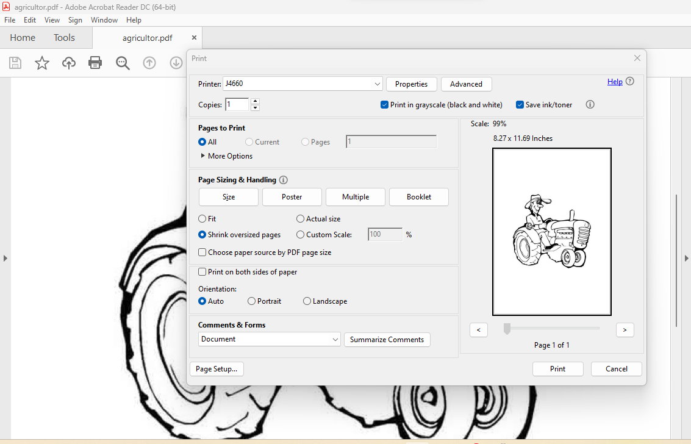

18. Check that the job appears in the web interface for that printer.

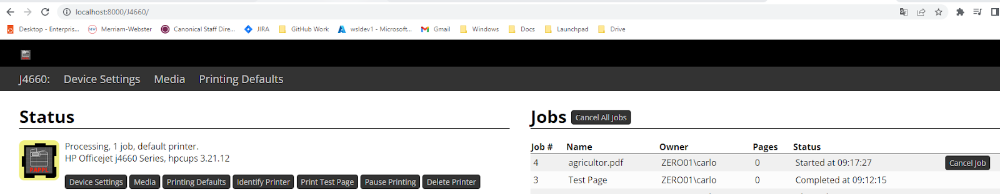

19. Close the browser tab when you're bored of looking into the print queue details.

Now one can simply print on Windows.

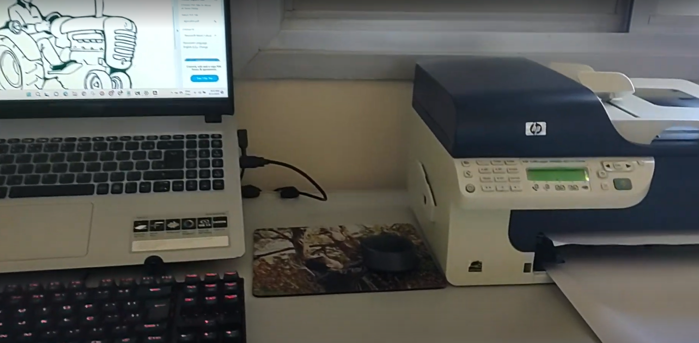

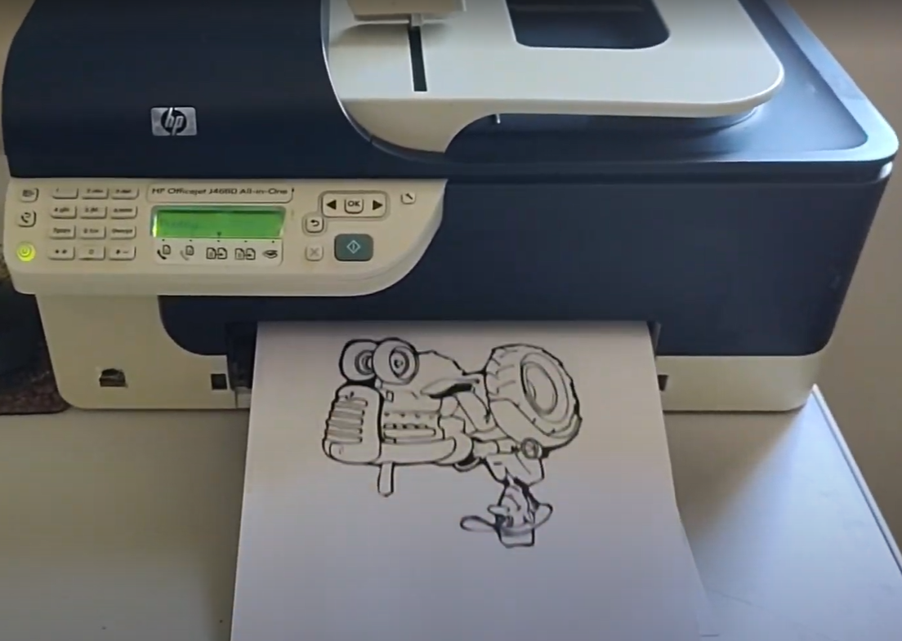

20. Exit the Ubuntu-Preview instance when you're done printing. As said before, systemd and background services won't prevent the distro instance from shutting down as usual.


As said before, all the complexity is gone since now we can run snapd and Avahi on WSL 2, thanks to systemd.

Happy printing!

