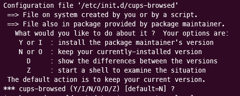
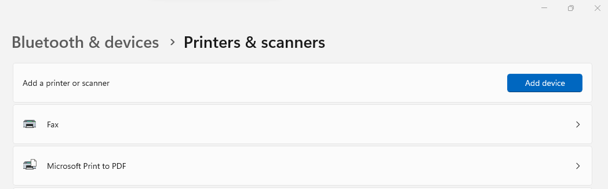
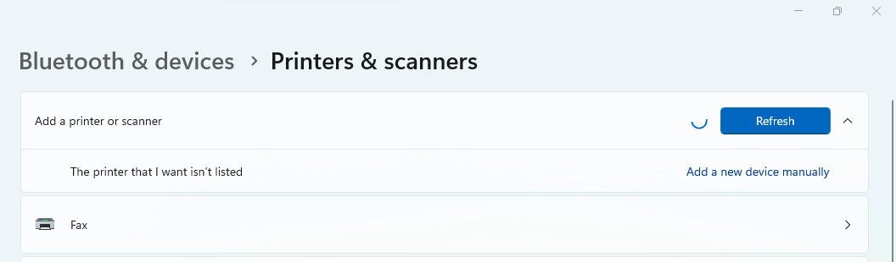
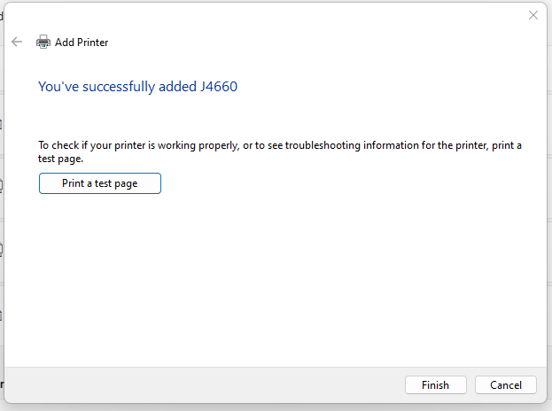
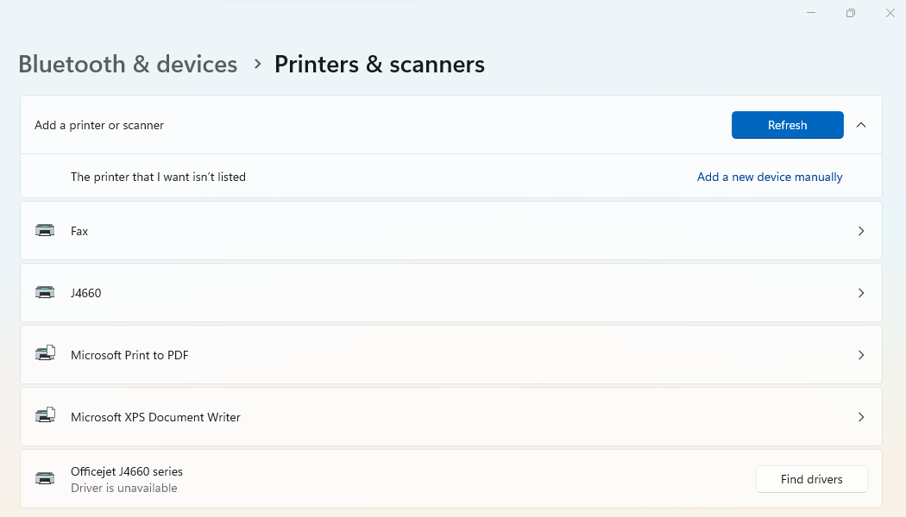

## Introduction

I have an old HP OfficeJet J4660 series printer for which Windows 11 doesn't offer drivers and I can only use that printer when I’m on Ubuntu. Working in the Ubuntu WSL team means I work a lot of time on Windows, thus sometimes it makes sense to be able to print some stuff, like when I need to make my copilot happy painting some complex piece of art. Unfortunately I was not able to do it. Until now.


Powered by Ubuntu WSL and Printer Applications, we can expose any printer Ubuntu has drivers for as an IPP Everywhere printer and connect it to Windows. The Printer Application emulates a driverless IPP printer, so that the printing system does not need to distinguish, it simply needs to support driverless IPP printers.

The following how-to guide lists the steps required to be able to run the [HPLIP Printer Application](https://github.com/OpenPrinting/hplip-printer-app) inside Ubuntu WSL and accessing the printer on Windows. That can be considered the dirty way, since WSL cannot yet support snaps. When that day comes, all complex compilation and running steps below will simply be replaced by one `snap install` command.

Notice that WSL 2 is required. We will use Ubuntu 22.04.1 LTS for this guide. (Ubuntu 20.04 and older releases won’t work due certain packages required to be in newer versions than the ones offered by those releases).

It’s necessary to point out that the following steps would simply be impossible without the amazing [usbipd-win](https://github.com/dorssel/usbipd-win) project, which offers a Windows software for sharing locally connected USB devices to other machines, including Hyper-V guests and WSL 2. We use it to make the printer visible inside Ubuntu WSL.

## How to

1. Connect the printer to the USB port. Make sure it’s not supported on Windows by checking Settings > Bluetooth & devices > Printers & scanners.


2. Install the usbipd-win software. The easiest way is through winget. Open Powershell and issue the following command:

`winget install --interactive --exact dorssel.usbipd-win`

> An alternative way is downloading the installer from the GitHub repository [releases page](https://github.com/dorssel/usbipd-win/releases) and executing it.

3. It will display a regular setup wizard. Follow its steps until the end. When prompted, accept the dialog to elevate permissions. In the end restart your computer to let the system changes take effect.


4. Install the Linux counterpart inside Ubuntu WSL. Refer to the [project’s wiki](https://github.com/dorssel/usbipd-win/wiki/WSL-support) for further information.

```
sudo apt install linux-tools-virtual hwdata
sudo update-alternatives --install /usr/local/bin/usbip usbip `ls /usr/lib/linux-tools/*/usbip | tail -n1` 20
```

5. Check your devices. Take note of the printer’s bus ID (in this case `1-3`):

```
usbipd wsl list

BUSID  VID:PID    DEVICE                                                        STATE
1-3    03f0:2b12  Officejet J4660 series, HP Officejet J4660 series, HP Off...  Attached - Ubuntu-22.04
1-7    0408:a060  HD WebCam                                                     Not attached
1-10   04ca:3015  Generic Bluetooth Adapter                                     Not attached
5-1    046d:c534  USB Input Device                                              Not attached
5-4    258a:002a  USB Input Device                                              Not attached

```

6. Attach the printer to Ubuntu WSL. Run that command as administrator, if that’s the first time.

```
usbipd wsl attach --busid <BUS_ID> -d Ubuntu-22.04
```

> For this case <BUS_ID> is `1-3`.

7. Check that the printer is visible from Ubuntu WSL.

```
~$ lsusb

Bus 002 Device 001: ID 1d6b:0003 Linux Foundation 3.0 root hub
Bus 001 Device 002: ID 03f0:2b12 HP, Inc Officejet J4660 series
Bus 001 Device 001: ID 1d6b:0002 Linux Foundation 2.0 root hub

```

8. Install some dependencies in Ubuntu WSL

```
sudo apt install autotools-dev autoconf automake autopoint libavahi-client-dev libavahi-glib-dev libcurl4-gnutls-dev libglib2.0-dev libgnutls28-dev libjpeg-dev libpam0g-dev libpng-dev libusb-1.0-0-dev zlib1g-dev libcups2-dev libcupsimage2-dev libssl-dev libtool libqpdf-dev poppler-utils libfontconfig1-dev libpoppler-cpp-dev libtiff5-dev libdbus-1-dev libexif-dev librsvg2-bin sharutils liblcms2-dev ghostscript
```

9. Clone the required repositories. We need to build them from source.

```
mkdir ~/PrintApp && cd ~/PrintApp

git clone https://github.com/OpenPrinting/cups-filters

git clone https://github.com/michaelrsweet/pappl

git clone https://github.com/OpenPrinting/pappl-retrofit

git clone https://github.com/OpenPrinting/hplip-printer-app

```

10. Compile the framework dependencies:


CUPS Filters

> Make sure the libcupsfilters1 package is not present in the system in the end, since we’ll need to link against the ones built from source.

```
cd ~/PrintApp/cups-filters
./autogen.sh
./configure --prefix=/usr --disable-ldap --disable-foomatic --disable-braille --disable-mutool
make
sudo make install

sudo apt remove libcupsfilters-dev

sudo make install
```

PAPPL

```
cd ~/PrintApp/pappl
./configure --prefix=/usr
make
sudo make install
```

PAPPL Retrofit

```
cd ~/PrintApp/pappl-retrofit
./autogen.sh
./configure --prefix=/usr
make
sudo make install
```

11. Compile the HPLIP printer application.

```
cd ~/PrintApp/hplip-printer-app

sudo make install
```

12. Make sure the compiled binary really works.

```
hplip-printer-app --help
```

13. Optionally, provide a printer test page if you want to test it before using the printer for real.

```
sudo ps2pdf ./testpage.ps /usr/share/hplip-printer-app/testpage.pdf
```

14. Make sure the printer driver is installed. For our case that’s HPLIP. When prompted to whether existing files should be overwritten, answer ‘N’ (the default, just hit enter).

```
sudo apt install hplip printer-driver-hpcups
```



15. Start the server.

```
sudo hplip-printer-app server
```

16. Open any browser (either on Windows or Ubuntu WSL, if you have one installed) and open the address `http://localhost:8000` to access the application web interface.

> Don’t worry too much if your browser complains about the TLS certificate. You’re accessing localhost, after all. Just keep going.


17. Add a printer through the web interface by clicking on the “Add Printer” button (the device must be powered up, connected to your computer through USB and attached to Ubuntu WSL. Refer to step 6). Take note of the “Name” you assign to the printer. That will be later used to refer to that printer through IPP.

> Notice that two devices were listed in my case for the same printer. If that happens to you make sure to select the one that refers to the driver (HPLIP in our case).


18. Confirm by clicking on the bottom “Add Printer” button.


19. You should see a result like the following. Hit the button “Print Test Page” if you want to test the setup until here.


20. Add the printer to Windows. Go to Settings > Bluetooth & devices > Printers & scanners and hit the “Add device” button.



21. Soon it will show another button to “Add a new device manually”. On the “Add Printer” wizard that just appeared, select the third option “Add a printer using an IP address or hostname”.



22. Set “Device type” to “IPP Device” and “Hostname or IP address” to the following scheme:
`ipp://localhost:8000/ipp/print/<QUEUE>` where `<QUEUE>` is the name that you took note on step 17, when adding the printer through the web interface. (J4660 for my case).


23. A quick progress bar should display and then a success page is shown on the wizard. You can print a test page if you want.




24. Once complete, make sure the newly added printer is present in the devices list (J4660 in my case). You may still see the unsupported one, just ignore it.




25. Open any document you wish to print and set the “Printer” to the name of the printer we just added (J4660, in my case). Adjust any other pertinent settings, such as colors, paper size etc. as you normally would.


26. Check that the job appears in the web interface for that printer.


27. Close the browser tab and quit the server when you’re done (Ctrl-C).

Now one can simply print on Windows.


As said before, all the complexity of that setup will be handled by snapd once it becomes available in WSL.

Happy printing!


