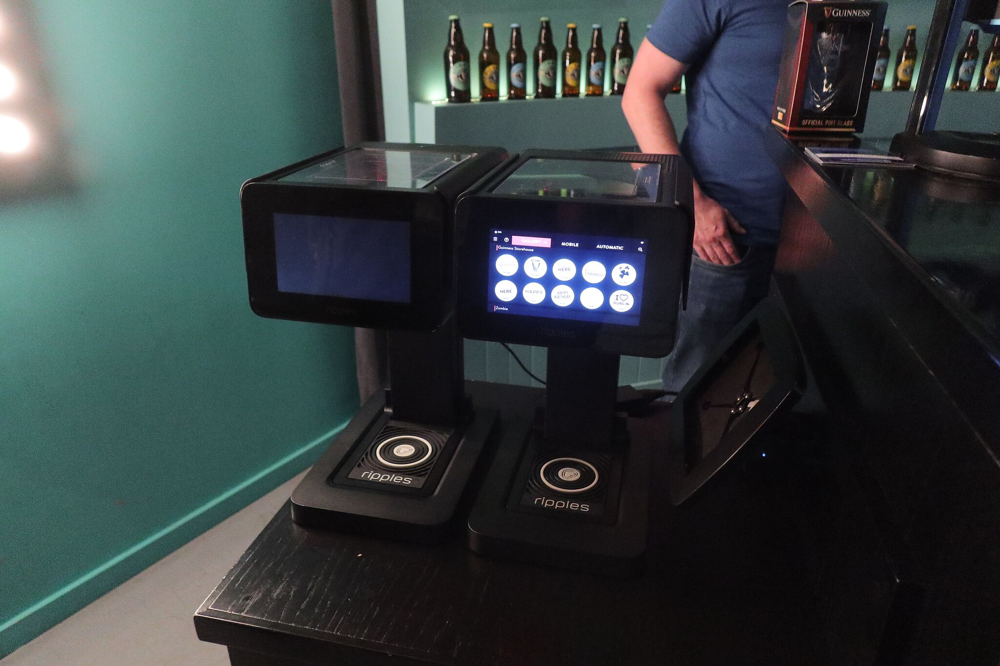
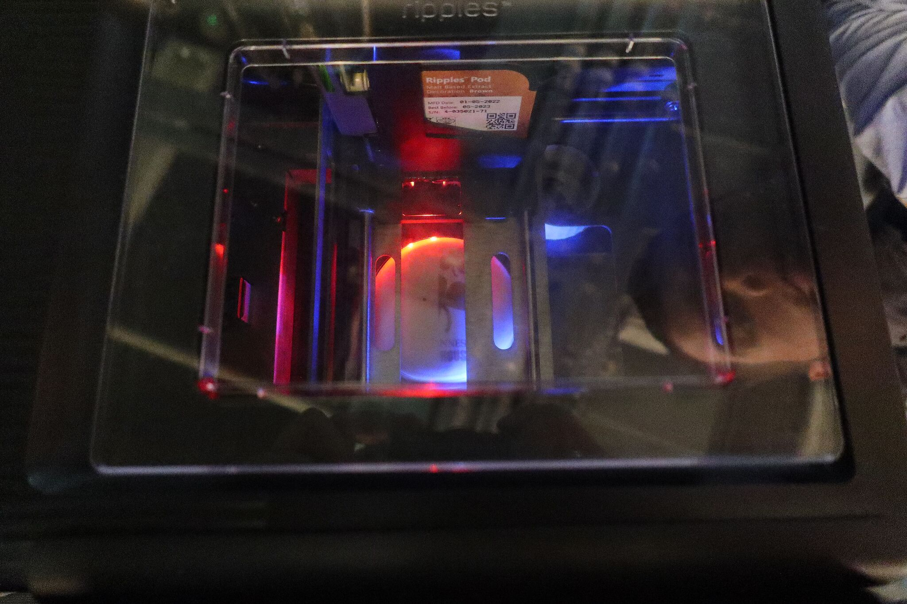
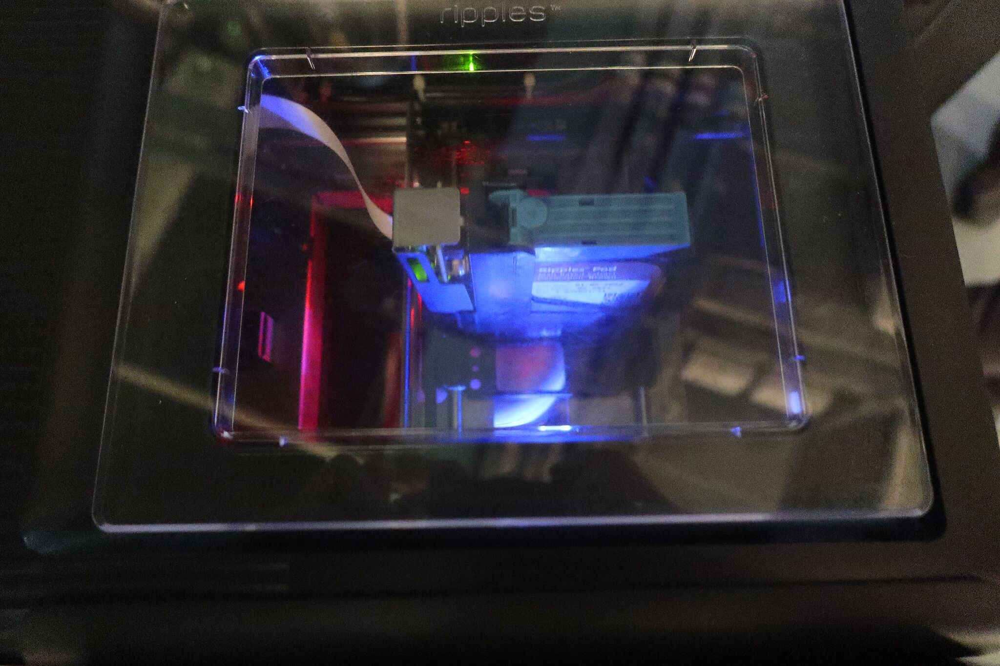
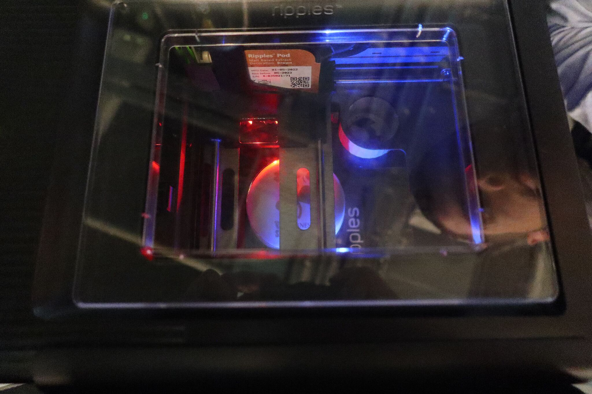

We are a little late this month, mainly due to my conference trip to Dublin, Ireland, last week, but also to catch the release of systemd/Snap-supporting WSL2. The month is nearly over, tomorrow there is already the new [Ubuntu Desktop Team Indaba](https://discourse.ubuntu.com/t/ubuntu-desktop-team-indaba-september-23-2022-15-00-utc/), this time about snapcraft 7/Ubuntu Core 22. Do not miss it while reading all the exciting stuff here ...

So let us start ...

I am back from Dublin, Ireland, now, having attended two conferences, the Linux Plumbers conference and the Open Source Summit (OSS) 2022. Conferences have often nice social events in the evenings after each day of talks and hallway sessions. This time the OSS had their main social event in the Storehouse of Guinness, the place where it is shown how this famous beer is made. And there I have seen something very special ...

You perhaps have read or heard about [how I got to do OpenPrinting](/history/). I did a PhD in physics, was system administrator for the department's network, discovered and deployed CUPS back in 2000, got discovered by MandrakeSoft, and finally switched the subject I was working on to

> Structured Deposition of Ink and Toner Particles on Paper Substrates

or, in a more colloquial English: Printing. But only paper? One can print on other materials, too. Let us try:

> Structured Deposition of Malt Particles on Beer Foam Substrates

Yes, you are reading right, you can have pictures on the foam of your beer, even your picture. Back to the Storehouse. Up on the forth floor, after you have seen how this holy black liquid with the nice foam on the top is made, you will get a so-called Stoutie, a Guinness with a picture on its foam.

First they (or you) draw the beer, and then, they put it into their malt jet printer:

<br>
*The malt jet printer, with touch screen operation!*

<br>
*Printing has started ...*

<br>
*... Print head moving ...*

<br>
*... Printing continues ...*

<br>
*... and ready!*

I do not know whether you can print with a Linux machine to this device, so probably it would be a "Paperweight" in [our database](https://openprinting.org/printers) ...

Cheers!!


## Saving old printers under Windows is getting easier

You remember my announcement of the HOWTO about running Printer Applications under Windows via WSL to save legacy printers in the [August News](/OpenPrinting-News-August-2022/#using-windows-we-can-help-you-too)?

You were perhaps thinking about the poor Windows users whose printers stopped working now having to compile a hell lot of libraries from our site to get their old treasure working again. That is not needed any more. The new version of WSL supports systemd and with this also snapd and with this Snaps, including all the [Printer Application Snaps](https://snapcraft.io/search?q=OpenPrinting). And systemd enables more Linux workflows you are used to in WSL, like auto-starting the daemons (also of the Printer Applications). No compiling, auto-starting daemons, Avahi advertising your printer to the hosting Windows (no manual input of the URI) ...

Here is the [first announcement from Microsoft](https://devblogs.microsoft.com/commandline/systemd-support-is-now-available-in-wsl/) and the first [Ubuntu blog](https://ubuntu.com/blog/ubuntu-wsl-enable-systemd) from Oliver Smith, Product Manager Enterprise Desktop at Canonical.

So update your WSL as soon as it gets released and watch out for the update of our [HOWTO](/wsl-printer-app/).

And for everyone who wants to start tinkering (no compiling required!), here a quick mini-HOWTO, based on Oliver's blog and private chat with Carlos:

First, follow Oliver's instructions on enabling systemd in your WSL. It is the section "How to enable systemd in Ubuntu WSL" near the beginning of the [blog](https://ubuntu.com/blog/ubuntu-wsl-enable-systemd).

Now make sure you have Avahi installed (package `avahi-daemon`):
```
dpkg -l | grep avahi-daemon
```
and install it if needed
```
sudo apt install avahi-daemon
```
With this the Windows print environment will auto-discover the Printer Application running under WSL.

If your printer is connected via USB, install USB IPD as described in [Carlos' current version of the HOWTO](/wsl-printer-app/#how-to).

Now find the suitable Printer Application in the Snap Store ([OpenPrinting](https://snapcraft.io/search?q=OpenPrinting), [LPrint](https://snapcraft.io/lprint)) or if you are in doubt, use our [look-up service](#openprinting-web-server-printer-application-look-up-service-is-now-live). Install it with just a simple:
```
sudo snap install <NAME>
```
Replace <NAME> by the name of the Printer Application which you need for your printer.

Now set up your printer inside the Printer Application using a web browser, as described in [Carlos' HOWTO](/wsl-printer-app/) further down.

If your printer does not appear automagically under Windows now (as it would do under Linux) add the printer to Windows. Go to "Settings" > "Bluetooth & devices" > "Printers & scanners" and hit the “Add device” button. You should find an entry for your printer provided by the Printer Application in the list, with the name you have given to it when setting it up in the Printer Application.

Now you can print as described in the end of [Carlos' HOWTO](/wsl-printer-app/).

Thanks a lot to Serhat Toktamisoglu and his WSL team at Canonical, Didier Roche, Jean-Baptiste Lallement, Carlos Nihelton, and Eduard Gómez Escandell and especially Dani Llewellyn as community contributor for getting the systemd support into WSL in such a short time.

Thanks to the people at Microsoft cooperating with our team at Canonical on WSL.

Thanks to Carlos Nihelton for working out the steps to run Printer Applications under WSL, even already before the addition of systemd support.

Thanks to Serhat Toktamisoglu for supporting me on this project.

And thanks to Oliver Smith for his great blog entry, being a HOWTO for getting started with systemd-enabled WSL, and also spreading the news.


## OpenPrinting Micro-Conference on the Linux Plumbers 2022
We have another great [Linux Plumbers Conference](https://lpc.events/event/16/) behind us, after 2 years of virtual-only due to the pandemic finally in-person again! You are really missing something with virtual conferences (see also above).

Our micro-conference on was a success again! We discussed a lot on OpenPrinting's plans for the next 12 months.

Unfortunately there are some technical problems with the recording, so that it is not ready right now. We will add the link as soon as we get it. Please stay tuned.

Me, Piotr Pawliczek, Valentin Viennot, and Monica Ayhens-Madon were live on stage, while Michael Sweet, Zdenek Dohnal, and Aveek Basu have participated remotely.

We had the following [sessions](https://lpc.events/event/16/sessions/142/#20220914):

**Introduction**<br>
Presenter: Till Kamppeter<br>
[Slides](https://lpc.events/event/16/contributions/1163/attachments/941/1856/openprinting-mc-introduction.pdf)<br>

**CUPS 2.5 and 3.0 Development**<br>
Presenter: Michael Sweet<br>
[Slides](https://lpc.events/event/16/contributions/1163/attachments/941/1849/lpc-cups-2022.pdf)<br>
Mostly as reported here from earlier conferences. CUPS 2.5.x delayed to release in May 2023, 3.x stays in time for release end of 2023. There was no coding yet for 2.5.x and 2.5.x also needs OAUth integration with the desktop. Does not make sense when one cannot use OAuth. No worries for switchover into New Architecture by CUPS 3.x or the CUPS Snap: All free drivers are available in Printer Applications, GNOME Control Center and print dialogd support available by then, rehearsal by Ubuntu with CUPS Snap.

**Testing and CI for OpenPrinting projects**<br>
Presenters: Michael Sweet, Till Kamppeter<br>
[Slides](https://lpc.events/event/16/contributions/1161/attachments/942/1851/lpc-printing-ci-2022.pdf)<br>
CUPS and some other projects do CI via Github Actions triggered on each GIT commit: `make test`, static analysers, try to build Docker image, ... We want to expand this to all important OpenPrinting projects, in addition regression tests (from Red Hat), filter regression tests on huge amount of print data files from bug report (like Ghostscript), perhaps also private tests for CVEs.

**Restricting access to IPP printers with OAuth2 framework**<br>
Presenter: Piotr Pawliczek<br>
[Slides](https://lpc.events/event/16/contributions/1165/attachments/1093/2097/LPC2022_OAuth2_for_IPP.pdf)<br>
Desktop/GUI integration is required, best with OAuth2 support already existing in the desktop toolkits and Linux distributions. Zdenek Dohnal has reached out to the upstream developers of GTK/GNOME about the OAuth2 integration and already available components, especially GNOME Online Accounts (GOA), evolution-data-server (eds), opening browser, user/password input pop-ups, RestOAuth2Proxy from librest 1.0, liboauth, ... We will post here when we findour way through this.

**Documentation for OpenPrinting projects**<br>
Presenter: Till Kamppeter<br>
Slides: [CUPS](https://lpc.events/event/16/contributions/1160/attachments/943/1853/lpc-printing-docs-2022.pdf), [Site](https://lpc.events/event/16/contributions/1160/attachments/943/1860/documentation-openprinting-extra.pdf)<br>
Documentation for programmers, administrators, and users needed, in CUPS the former is mainly automated by especially formatted comments in the source code and extracting these with an appropriate tool and the rest is written manually. We want to extend this to all important OpenPrinting projects. In addition, we should also consolidate all printing debugging documentation created by the distributions: Debian, Ubuntu, Fedora, SUSE, ...

**Sandboxing/Containerizing alternatives to Snap for Printer Applications**<br>
Presenters: Till Kamppeter, Valentin Viennot<br>
Slides: [General](https://lpc.events/event/16/contributions/1164/attachments/944/2160/containerization-cups-printer-applications-intro.pdf), [Chiselled containers](https://lpc.events/event/16/contributions/1164/attachments/944/1881/linux-plumbers-valentin-viennot.pdf)<br>
Only containerization alternative to Snap are OCI-compliant containers: Docker, ROCKs, ... For this session I have invited Valentin Viennot, Product Manager ROCKs & container images at Canonical, as last-minute guest to talk about optimizing containers for security and size by removing (chiselling) unnecessary OS components. Valentin would help us on this for containers of CUPS and of Printer Applications, both in OCI-compliant and Snap format and to distribute via the ROCKs store.

We have cancelled the 3D-printing session as we did not have enough to discuss about this subject.

Phoronix has written about Mike's part on our micro-conference: [CUPS 3.0 Continues Being Crafted To Overhaul Linux Printing](Phoronix has written about Mike's part on our micro-conference)

Thanks a lot to Monica Ayhens-Madon for taking care of the remote attendees while I was concentrating on the people in the room, to Steven Rostedt and James Bottomley to organize the Linux Plumbers and to help me with everything micro-conference-related, especially also having given last-minute in-person admission to Valentin, and also thanks to Zdenek Dohnal for taking notes of the discussions.


## Open Source Summit Europe 2022
Once in Dublin for the Linux Plumbers (see above) I also attended this year's [Open Source Summit Europe](https://events.linuxfoundation.org/open-source-summit-europe/) of the Linux Foundation. This is one of the largest free software conferences, with 15 tracks.

I had access to the whole conference and all evening events due to being one of the [8 fellows](https://www.linuxfoundation.org/about/leadership) of the Linux Foundation.

I did not give a talk there but met a lot of people, also an old friend from the early 2000s and also Kate Stewart from the Linux Foundation to talk about the Future of OpenPrinting. There were also great social events in the evenings, in the Guinness Storehouse (see also above) and in the Teelings Distillery.

And I won a BeagleBone IA64 in the [closing plenary of the embedded Linux track](https://sched.co/15zDv)!


## Ubuntu Summit 2022
A lot of organization and preparation work is going on! I am also one of the members of the event's organization team.

The [site](https://summit.ubuntu.com/) has completely changed now. The preliminary announcement page has been replaced by an Indico-based interactive site where you can [register for attending](https://events.canonical.com/event/2/abstracts/) and [submit your proposal](https://events.canonical.com/event/2/registrations/) for a talk or a workshop.

Please be quick with your ideas for contributions. The call for proposals ends on September 30. And note that Canonical will pay all your costs (travel, accommodation, meals) if your in-person proposal gets accepted. Formats available are interactive workshops, regular talks in two sizes and lightning talks in two sizes.

I have already seen first proposals coming in and there are already many interesting talks which would make the Summit be a great conference. But we need many, many more. Especially success stories with Ubuntu, techniques of getting your work done with Ubuntu, and of application development and distribution are highly welcome. Also hands-on workshops, especially about robotics, IoT, Raspberry Pi, embedded, ... are sought-after.

We also want to offer a Snap Tutorial Track ("Your application everywhere, just in a Snap!"), so that the many application developers in the community learn how to snap their work to easily distribute it, making it available in many distributions: Ubuntu, Debian, SUSE, Red Hat, Windows (see [above](#saving-old-printers-under-windows-is-getting-easier)), ...

For this we are looking for workshops about advanced Snap techniques (GTK/GNOME, Qt/KDE, Flutter, Games, ...). Interactive hands-on workshops are preferred.

See also the [Ubuntu blog](https://ubuntu.com/blog/ubuntu-summit-2022-call-for-proposals) from Heather Ellsworth (also in the organization team) about the call for proposals, with detailed instructions for a hopefully successful proposal.

And here is the [initial announcement blog](https://ubuntu.com/blog/uds-is-now-ubuntu-summit) from Philipp Kewisch, Community Manager at Canonical and one of the chairs of the event.

And if you are eager to get the latest news quickly instead of waiting for my October News Post, subscribe to the official [Ubuntu Summit newsletter](https://lists.ubuntu.com/mailman/listinfo/summit-news).

Any questions? Please ask [summit@ubuntu.com](mailto:summit@ubuntu.com).

Get in touch with the people behind Ubuntu in Prague!!


## Google Summer of Code 2022
Now the third month of the coding period of the Google Summer of Code 2022 has passed and our contributors are continuing their great work! And the coding is not over yet, as we are applying a new feature of the GSoC. We have extended the coding period for all our 7 students, primarily to compensate for them having exams of their schools during the original coding period, or classes already having restarted. For that we extended by 4 weeks.

In our GNOME Control Center sub-team (Mohit and Shivam) we have extended for even 6 weeks, to give the GNOME design team the time to get the changes on the GUI right.

And here are the third editions of their little summaries (again in our group chat on Telegram) of what they have done:

**Converting Braille embosser support into a printer application**<BR>
Contributor: Chandresh Soni<BR>
Mentors: Till Kamppeter, Samuel Thibault<BR>
> Hello everyone, in the last few weeks I have created a separate driver for embossers and integrated them with the main application. I have also completed automake for the printer application, with only minor changes remaining. I plan to begin testing the application this week and fine-tune it based on the results of the testing.

**Scanning Support in PAPPL**<BR>
Contributor: Deepak Khatri<BR>
Mentors: Till Kamppeter, Michael Sweet, Dheeraj Yadav, Deepak Patankar<BR>
> Hi everyone, in last few days I have been going through my work to integrate it into pappl. In last few weeks I improved scanner objects and try to implement the API papplSystemSetScannerDrivers. I am also trying to understand the similarities of code to be used in Driver Interface.

**Adding Common Print Dialog Backends (CPDB) support to existing Print Dialogs**<BR>
Contributor: Gaurav Guleria<BR>
Mentors: Till Kamppeter<BR>
> I have started work on the CPDB support for Qt Print Dialog. I have created a basic CPDB print plugin for Qt here: [https://github.com/TinyTrebuchet/qtbase/tree/cpdb](https://github.com/TinyTrebuchet/qtbase/tree/cpdb) with help from Albert Astals Cid (tsdgeos). I have also got in touch with the Qt development team to decide how exactly should CPDB support be added into the QPrintDialog. Further, I have done some bug fixes,  improvement and added new features to cpdb-libs. cpdb-libs now has support for obtaining and setting user and system wide default printers: [https://github.com/OpenPrinting/cpdb-libs/pull/10](https://github.com/OpenPrinting/cpdb-libs/pull/10) and also supports multiple unique media margins for each media size: [https://github.com/OpenPrinting/cpdb-libs/pull/8](https://github.com/OpenPrinting/cpdb-libs/pull/8)

Discussion with the Qt upstream developers on their mailing list: [Initial post](https://lists.qt-project.org/pipermail/development/2022-September/042993.html), [thread "Adding CPD support to Qt print dialog"](https://lists.qt-project.org/pipermail/development/2022-September/thread.html)

**GNOME Control Center GUI for discovering non-driverless printers and finding suitable Printer Applications for them**<BR>
Contributor: Mohit Verma<BR>
Mentors: Till Kamppeter, Michael Sweet, Pranshu Kharkwal, Divyasheel, Deepak Patankar<BR>
> I have completed the work of discovery of Printer Applications along with their binary paths. I have also weeded out the duplicate entries listed by Avahi. With the Printer Application look-up service in place, I have started the work on a temporary GUI for the Printer Application which can be adjusted to the final design once it is finalized by Marek Kasik. This GUI will be completed by the end of this week. So, by the end of this month we will have a makeshift GUI which can search for the most appropriate Printer Application [on the Open Printing](#openprinting-web-server-printer-application-look-up-service-is-now-live) and install it as well along with other desired functionalities.

Further discussion happened on Mohit´s issue report:

- [GNOME Issue report #1878](https://gitlab.gnome.org/GNOME/gnome-control-center/-/issues/1878): Allow to add new printers via Printer Applications

cups-pk-helper changes:

- [cups-pk-helper PR #7](https://gitlab.freedesktop.org/cups-pk-helper/cups-pk-helper/-/merge_requests/7): Added discovery of Printers via lpinfo, PAPPL and Printer Applications

**Scanning Support in PAPPL with eSCL Support**<BR>
Contributor: Rishabh Maheshwari<BR>
Mentors: Till Kamppeter, Michael Sweet, Dheeraj Yadav, Deepak Patankar<BR>
> I have completed all the necessary functions required for the parsing of client scanner requests and store the device capabilities in a data structure. I have also completed developing the helper functions required for this functioning. Currently, I am waiting for Deepak to finish his work towards developing some simple test facility which emulates the behavior of a scanner using static images which will be used by me for testing my code.

**Add Avahi calls for discovering and resolving driverless IPP printers and Optimize the processes**<BR>
Contributor: Sachin Thakan<BR>
Mentors: Till Kamppeter, Michael Sweet, Deepak Patankar<BR>
> Hi all, I have been working on integrating my earliar work into cups-filter. In last few weeks, I refactored and improved my avahi implementation and tried building cups-filter on my system(having encountered some issues with my already build version of cups-filter) to get started with 2nd phase of the project. I am hoping to make fast progress in coming weeks. Thanks

**Create new printer setup tool for the GNOME Control Center**<BR>
Contributor: Shivam Mishra<BR>
Mentors: Till Kamppeter, Pranshu Kharkwal, Divyasheel, Deepak Patankar<BR>
> Hi everyone, I have completed integration of GUI functionality of configuring IPP system service with IPP printing services listing in the main panel along with CUPS queues. As of now I'm working on fine-tuning & other possible updates, and also looking for integration of discovery of Printer applications in the module.

Feature requests so far:
- [#1877](https://gitlab.gnome.org/GNOME/gnome-control-center/-/issues/1877): Improve setting of IPP options
- [#1879](https://gitlab.gnome.org/GNOME/gnome-control-center/-/issues/1879): Do not show setting of drivers for IPP printers
- [#1911](https://gitlab.gnome.org/GNOME/gnome-control-center/-/issues/1911): Printers: Make adminurl available for IPP printers


## Common Print Dialog Backends 2.0
While our GSoC contributor Gaurav Guleria is working on [adding CPDB support to the print dialogs](/current/#the-print-dialogs) (see [above](#google-summer-of-code-2022)) he has continued to do fixes and improvements on the [CPDB framework](/achievements/#common-print-dialog-backends) itself:

- Support for each media having multiple sets of margins
- Support for overall default printers
- Distinguishing print and fax queues amd providing needed extra options

Also this will get included in the 2.0 release of the Common Print Dialog Backends.

For the release itself I will still wait a little bit, as Gaurav could find other needs of functionality during his work on the Qt dialog.


## CUPS Snap and snapd printing interface
**[CUPS Snap](https://github.com/OpenPrinting/cups-snap) in the [Snap Store](https://snapcraft.io/cups)**

Now with the [`cups` snapd interface in place](https://openprinting.github.io/achievements/#the-cups-snap) Snap package maintainers are starting to use it.

Unfortunately, we have hit a bug in snapd with the new `cups` interface. The automatic dependency installation of the CUPS Snap via the pseudo content interface with `default-provider: cups` interferes badly if the Snap using the `cups` interface for printing is seeded (being in the list of default packages used in the OS distribution), even if the CUPS Snap is also seeded ([bug report on snapd](https://github.com/canonical/workshops/issues/32)).

I hope the bug gets solved soon by the snapd team at Canonical. Otherwise we will simply skip right to the real integration of the CUPS Snap dependency in the `cups` interface without any ugly workarounds. For this I have already planned to meet the snapd team in-person for working on an appropriate solution on Canonical's internal Engineering Sprint in Prague, in the week before the [Ubuntu Summit](#ubuntu-summit-2022). The implementation will then be scheduled to be finished for Ubunru 23.04, the first Ubuntu using the CUPS Snap as standard print environment and the New Architecture.

Application developers in the community uploading their work to the Snap Store can still freely use the `cups` interface without any problems. Only the few Snaps which are in the default installation/the ISO of Ubuntu are affected (and have to stay with `cups-control` for the time being), and those are usually maintained by Canonical employees anyway.


## Approaching cups-filters 2.0
We get really close now. I am in the middle of cleaning up all the code to get a unique coding style and to make it more readable.

For the coding style I follow the [`DEVELOPING.md`](https://github.com/OpenPrinting/cups/blob/master/DEVELOPING.md#coding-guidelines) file of the CUPS source code, to extend this to all OpenPrinting projects.

To improve the readability of the code, I also add missing spaces in comma-separated lists (`xxx,yyy,zzz` -> `xxx, yyy, zzz`) and around operators (`x=a*(b+c)%4` -> `x = a * (b + c) % 4`), what got nearly completely missed out by several contributors.

Comments are re-formatted to use `// ...` instead of `/* ... */`, like in PAPPL, so C and C++ files get the same comment style.

I did this already on the [code for the `cfFilterPDFToPDF()` filter function](https://github.com/OpenPrinting/cups-filters/commit/6709100d8bf) and on a [bunch of other files of libcupsfilters](https://github.com/OpenPrinting/cups-filters/commit/6709100d8b).

In addition, I did final testing, bug fixing and polishing:

- Made the new cups-filters correctly working with the PPD files for driverless printers generated by CUPS (temporary CUPS queues and creating queues with `lpadmin ... -m everywhere ...`) and also with PPD files of older cups-filters 1.x versions ([commit](https://github.com/OpenPrinting/cups-filters/commit/e414b73493)).
- Added NULL checks when filter functions of libppd (especially also `ppdFilterExternalCUPS`) are called without PPD file, to avoid crashes. This especially prevented all maintenance tasks (poll default option settings and installable accessory configuration from PostScript printers, identify printer, …) in the retro-fitting Printer Applications from working ([commit ](https://github.com/OpenPrinting/cups-filters/commit/9485dfb099), [commit](https://github.com/OpenPrinting/cups-filters/commit/0e3cc273717)).
- Replaced all `assert()` calls in the 3 libraries (libfontembed, libcupsfilters, libppd) by macros to only be actual `assert()` calls when the `DEBUG` macro is set, to avoid automatic bug reports (apport) in production use ([coomit](https://github.com/OpenPrinting/cups-filters/commit/3fe4c23b671e)).
- Correctly check final output type to determine which filter does the page logging ([commit](https://github.com/OpenPrinting/cups-filters/commit/0d3db9bca0)).
- Page logging for PostScript output ([commit](https://github.com/OpenPrinting/cups-filters/commit/7575c7b528f6)).
- Compare MIME type strings case-insensitively in the `cfFilterUniversal()` filter function ([commit](https://github.com/OpenPrinting/cups-filters/commit/acef0dcde1a1)).
- When generating a printer IPP attributes record from the PPD file, make sure that all attributes concerning custom page size are included ([commit](https://github.com/OpenPrinting/cups-filters/commit/5402498e9ad)).
- Import template directory name when calling `cfFilterBannerToPDF()` via `cfFilterUniversal()` ([commit](https://github.com/OpenPrinting/cups-filters/commit/428de32e82)).
- Let `ppdFilterPDFToPS()` correctly determine the print resolution ([commit](https://github.com/OpenPrinting/cups-filters/commit/08e459dc6ed0)).
- Improvements on getting printer IPP attributes from the PPD, on attributes `printer-resolution`, `device-uri`, `document-format-supported`, `print-content-optimize-supported`, `media-col-ready`, `media-ready`, removed irrelevant code about supply levels ([commit](https://github.com/OpenPrinting/cups-filters/commit/d8f80496ab))
- Fixed selection of PDF renderer in the build system ([commit](https://github.com/OpenPrinting/cups-filters/commit/1b91b33))
- Added support for Poppler's `pdftops` to the `cfFilterUniversal()` filter function/`universal` CUPS filter ([commit](https://github.com/OpenPrinting/cups-filters/commit/22f2457bc))
- In `cfFilterPDFToRaster()` fixed margins of output pages ([commit](https://github.com/OpenPrinting/cups-filters/commit/48a53d2722d))
- `cfFilterRasterToPDF()` only accepts PWG Raster, not CUPS Raster, so renamed it to `cfFilterPWGToPDF()` ([commit](https://github.com/OpenPrinting/cups-filters/commit/0aad4d5b)) and only feed PWG Raster into it ([commit](https://github.com/OpenPrinting/cups-filters/commit/39200e9101)).
- Finally removed the not-used-by-anyone PHP and Perl APIs ([commit](https://github.com/OpenPrinting/cups-filters/commit/65a53b4237))
- Also removed legacy image format support ([commit](https://github.com/OpenPrinting/cups-filters/commit/c338f036a6)).
- Merged [pull request](https://github.com/OpenPrinting/cups-filters/pull/482) to add configuration directive to cups-browsed to not check the network interfaces too frequently, to improve its performance. Thanks a lot to Zdenek Dohnal from Red Hat for the contribution.


## pappl-retrofit
I have also adapted the printer driver retro-fit library and where needed thet Printer Application to the last and final changes of the cups-filters 2.x API, and while doing this, also fixed a crasher in pappl-retrofit ([commit](https://github.com/OpenPrinting/pappl-retrofit/commit/a27210136a), [commit](https://github.com/OpenPrinting/ghostscript-printer-app/commit/88111ba0622daa43258e1c5959bfa5eab746e1a2)).

Naturally I have also tested everything and found that after printing a job or doing an administrative task (Identify printer, poll accessory configuration) the Printer Applications start to consume 100% CPU permanently. After reporting a [bug on PAPPL](https://github.com/michaelrsweet/pappl/issues/218) earlier, Michael Sweet actually found a 100%-COU problem in the job history clean-up code and fixed it, but the 100%-CPU problem persisted for me. I Investigated further and found that it only happens on printers with CUPS backends. So I worked around it by temporarily de-activating the not yet completed supply read-out support ([commit](https://github.com/OpenPrinting/pappl-retrofit/commit/17a2f9ea44)). But doing more tests the 100%-CPU monster was rearing its heads again, but before I could investigate, I had to reboot on a browser memory clog-up crash and after that the 100% CPU was gone, probably a bad effect of the system having run out of memory ...

Now it seems to be all working as intended.


## OpenPrinting web server: Printer Application look-up service is now live
We have finally deployed the [Printer Application look-up service](/current/#printer-application-look-up-via-the-openprinting-web-site) for printer setup tools on the [OpenPrinting web server for printer/driver look-ups](https://openprinting.org/printers)!

I did some tests and everything works as expected. Printer Application Snaps installed on the server find the correct drivers for the given printer device ID and the user (or better the printer setup tool) gets as answer a hierarchy list of what are the best Printer Applications which support their printer and with which internal driver.

I passed this on to our [GSoC contributors working on the GNOME Control Center](#google-summer-of-code-2022), so that they make use of it.

If you want to try it out, try URLs like:

- [`https://openprinting.org/query.php?papps=true&device-id=MFG:HP;MDL:LaserJet%204050`](https://openprinting.org/query.php?papps=true&device-id=MFG:HP;MDL:LaserJet%204050)
- [`https://openprinting.org/query.php?papps=true&device-id=MFG:Epson;MDL:Stylus%Photo%20R800`](https://openprinting.org/query.php?papps=true&device-id=MFG:Epson;MDL:Stylus%Photo%20R800)

This is actually a machine communication interface for printer setup tools, an interface for humans will come later.

Thanks a lot to Violet Kurtz from the OSUOSL for implementing this!


## Snap Store Overview
From OpenPrinting we have already [6 Snaps in the Snap Store](https://snapcraft.io/search?q=OpenPrinting):

|Name|Description|Downloads|
|:---|:---|---:|
|[cups](https://snapcraft.io/cups)|[CUPS](https://github.com/OpenPrinting/cups-snap)|82922|
|[ipp-usb](https://snapcraft.io/ipp-usb)|[ipp-usb](https://github.com/OpenPrinting/ipp-usb)|2715|
|[ps-printer-app](https://snapcraft.io/ps-printer-app)|[PostScript Printer Application](https://github.com/OpenPrinting/ps-printer-app)|2558|
|[ghostscript-printer-app](https://snapcraft.io/ghostscript-printer-app)|[Ghostscript Printer Application](https://github.com/OpenPrinting/ghostscript-printer-app)|1787|
|[hplip-printer-app](https://snapcraft.io/hplip-printer-app)|[HPLIP Printer Application](https://github.com/OpenPrinting/hplip-printer-app)|5742|
|[gutenprint-printer-app](https://snapcraft.io/gutenprint-printer-app)|[Gutenprint Printer Application](https://github.com/OpenPrinting/gutenprint-printer-app)|4661|


## CUPS
Currently released is [**2.4.2**](https://github.com/OpenPrinting/cups/releases/tag/v2.4.2).

There will be further bug fix releases in the 2.4.x series. Some bug fixes were done during the last month, see changes below.

Ubuntu Kinetic Kudu ([22.10](https://discourse.ubuntu.com/t/kinetic-kudu-release-schedule/) will most probably come with 2.4.3.

The CUPS Snap (in the Edge channel) and our CUPS-driver-retro-fitting Printer Application Snaps use the current GIT master of CUPS.

The CUPS Snap in the stable channel is version 2.4.2.

```
Changes in CUPS v2.4.3 (TBA)
----------------------------

- Fixed an OpenSSL certificate loading issue (Issue #465)
- Fixed Brazilian Portuguese translations (Issue #288)
- Fixed invalid memory access during generating IPP Everywhere queue (Issue #466)
- Fixed memory leaks in `create_local_bg_thread()` (Issue #466)
- Fixed TLS certificate generation bugs.
- Ignore some of IPP defaults if the application sends its PPD alternative (Issue #484)

- Now report fax attributes and values as needed (Issue #459)

- Update print-color-mode if the printer is modified via ColorModel PPD option (Issue #451)
```


## cups-filters
Currently released is [1.28.16](https://github.com/OpenPrinting/cups-filters/releases/tag/1.28.16).

The restructuring of the code to separate the siamesian twins of the filter functions and PPD file support is completed and we also have done a lot of testing and bug fixing. Now we are finally polishing the coding style and updating the license/copyright headers for the 2.0.0 release.

See above for more details.

As cups-filters 2.0.0 will not make it into Ubuntu 22.10 we continue with further bug fix backport releases in the 1.x series.

[1.28.16](https://github.com/OpenPrinting/cups-filters/releases/tag/1.28.16)

Bug fix release, to make images be printed in their original size with "print-scaling=none" and to not use deprecated data types for reading TIFF images.

Ubuntu Kinetic Kudu ([22.10](https://discourse.ubuntu.com/t/kinetic-kudu-release-schedule/) will coming with cups-filters 1.28.16 or a later 1.28.x release.

The CUPS Snap is currently locked to the [/e496badbf2](https://github.com/OpenPrinting/cups-filters/commit/e496badbf2) commit (from May 20) of cups-filter's GIT master (2.x) until the restructuring gets more tested. The Printer Application Snaps use the current GIT master of cups-filters and so are the first application for real-life testing.

```
CHANGES IN V1.28.16

	- imagetoraster, imagetopdf, libcupsfilters: Added support for
	  reading the resolution of an image from its EXIF data when
	  loading it. This way we get the image reproduced in its
	  original size with "print-scaling=none" (Issue #362).
	- libcupsfilters: Replaced deprecated data types uint16 and
	  uint32. The function to read TIFF image files via libtiff in
	  cupsfilters/image-tiff.c uses the deprecated types uint16
	  and uint32. The replacements for these types are uint16_t
	  and uint32_t.
```


## PAPPL
Currently released is [1.2.2](https://github.com/michaelrsweet/pappl/releases/tag/v1.2.2).

In the last months the development of the 1.3.x series has already started. See changes below.

[1.2.2](https://github.com/michaelrsweet/pappl/releases/tag/v1.2.2)

General bug fix release. See changes below.

All the CUPS-driver-retro-fitting Printer Applications in the Snap Store (see above) use the current GIT master of PAPPL, so they contain all the latest fixes and improvements.

See also the [currently open](https://github.com/michaelrsweet/pappl/issues) and [closed](https://github.com/michaelrsweet/pappl/issues?q=is%3Aissue+is%3Aclosed) issues of PAPPL.

```
Changes in v1.3b1
-----------------

- Added timer APIs to manage periodic tasks (Issue #208)
- Added debug logging for device management.
- Fixed a device race condition with job processing.
- Fixed a potential value overflow when reading SNMP OIDs (Issue #210)
- Fixed more CUPS 2.2.x compatibility issues (Issue #212)
- Fixed a 100% CPU usage bug when cleaning the job history (Issue #218)
- Fixed the default values of `--with-papplstatedir` and `--with-papplsockdir`
  to use the `localstatedir` value (Issue #219)
- Fixed a initialization timing issue with USB gadgets on newer Linux kernels.
- Updated PAPPL to conform to the new prototype PWG 5100.13 specification
  (Issue #216)
```

```
Changes in v1.2.2
-----------------

- Added debug logging for device management.
- Fixed a device race condition with job processing.
- Fixed a potential value overflow when reading SNMP OIDs (Issue #210)
- Fixed more CUPS 2.2.x compatibility issues (Issue #212)
- Fixed a 100% CPU usage bug when cleaning the job history (Issue #218)
- Fixed the default values of `--with-papplstatedir` and `--with-papplsockdir`
  to use the `localstatedir` value (Issue #219)
- Fixed a initialization timing issue with USB gadgets on newer Linux kernels.
```
