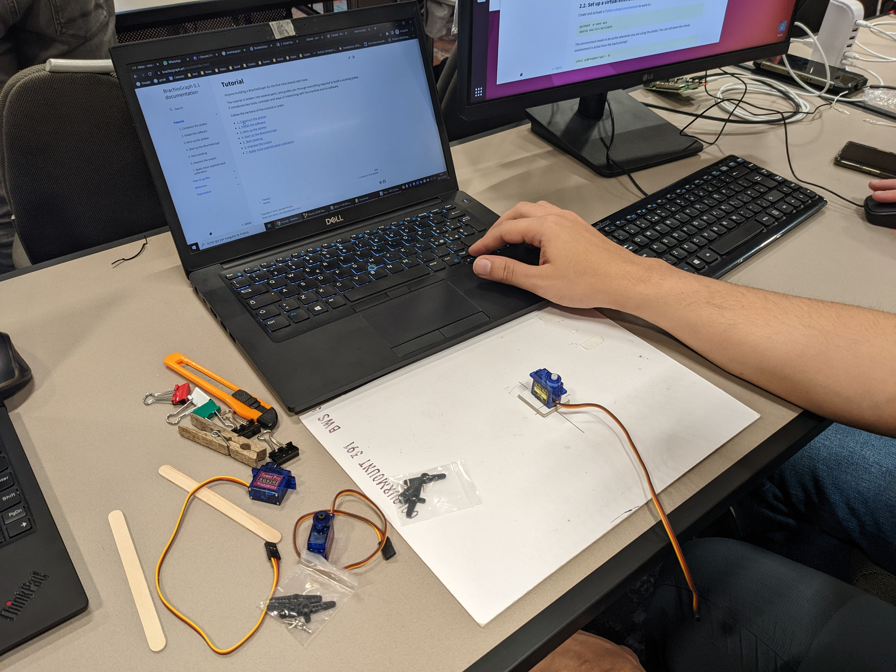
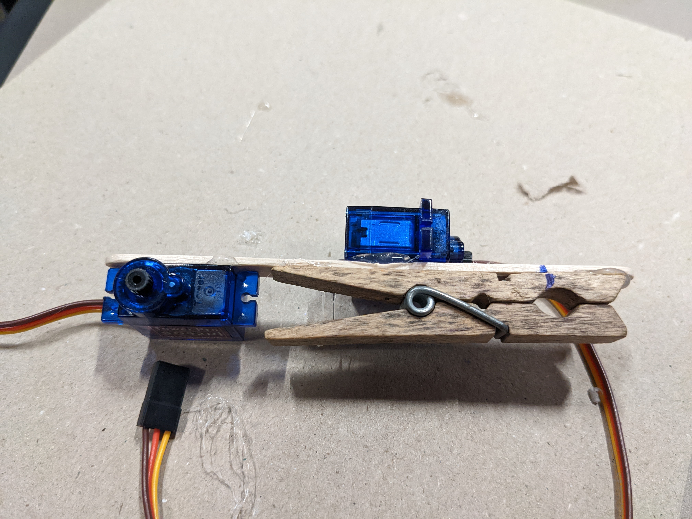
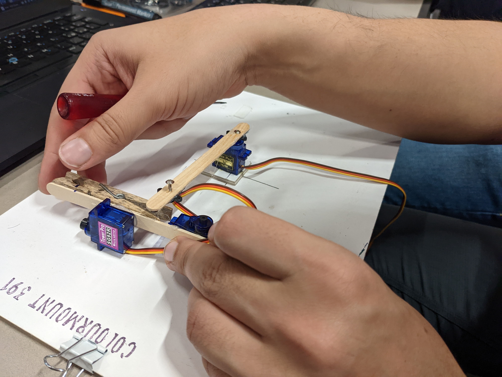
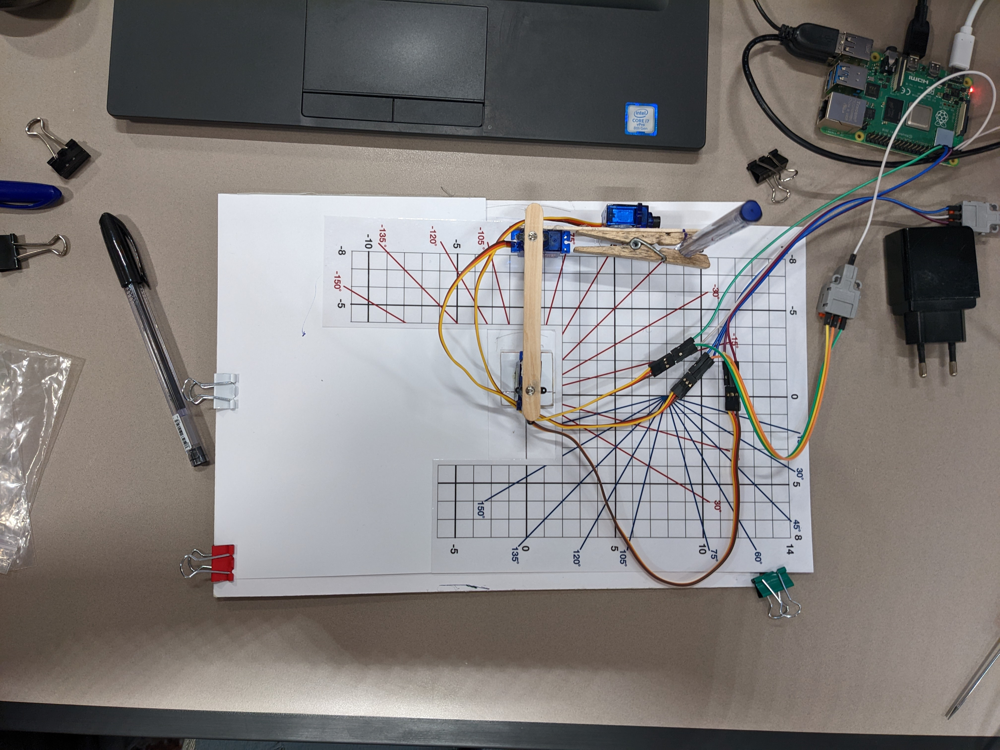
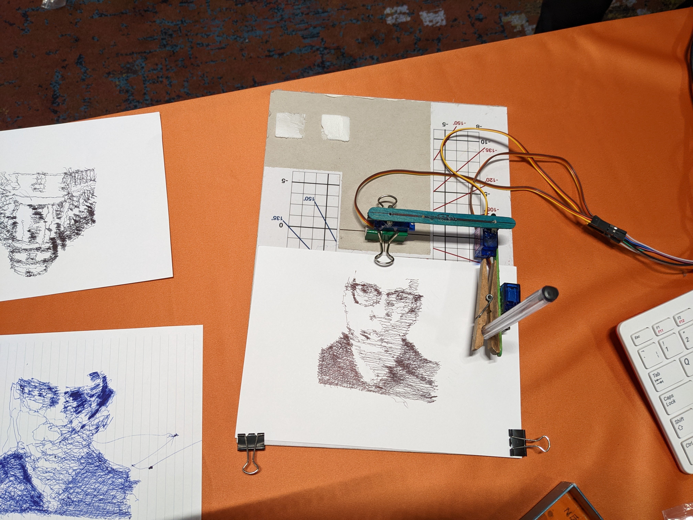

You all probably know that OpenPrinting is all about reproducing graphical content from a computer on paper or similar flat surfaces. The hardware to do this contains more or less sophisticated mechanics to precisely position pixels on the surface of the output media. And this hardware is usually only affordable because it is produced in an industrial mass-production process and because its ink or toner refills are expensive ...

Did you already think about why one does not construct a machine which puts the ink onto the paper like a human being, with an arm and a pen? Some kind of hand-writing machine, controlled by a computer?

Have you perhaps already thought about building such a machine by yourself, from simple, cheap parts, much cheaper than the cheapest available printer?

Did you already think about a huge conference hotel where you find free refills in each guest room and even more in the meeting rooms?

On the first Ubuntu Summit in Prague this got reality: Daniele Procida, Canonical's Engineering Director for Documentation, is the creator of the [Brachiograph](https://www.brachiograph.art/) (Ancient Greek: "Brachio" = arm, "Graph" = writer -> arm writer), a plotter made from a Raspberry Pi, 3 servos, and some household/office items, worth a total of ~12.50 EUR. He demoed the device at first on Monday and on Tuesday, it was the attendee's turn to build this device, in a 90-min interactive workshop.

Originally Daniele only submitted the 25-min demo session to the Call for Proposals, but when I was reviewing submissions (I was in the organization committee of the Summit) and found his proposal I immediately contacted him, suggesting him to also submit a workshop, where attendees can actually build this device, and Daniele liked my suggestion and submitted the [workshop](https://events.canonical.com/event/2/contributions/82/). So I wrote another nice, positve review ... and got able to build such a plotter myself!

So the workshop has taken place and I was so lucky that it was not to the same time as any of the 4 sessions where I was speaker/host of, so I actually attended it:

<br>
*Daniele Procida, master of the Brachiograph, explaining the wiring*

<br>
*The shoulder motor is already mounted on the base board, the other parts you see on the left*

<br>
*The assembled forearm, with elbow motor on the left, clothes peg to hold the pen on the right, and wrist motor (pen up/down) at the top*

<br>
*Putting it all together: Here the forearm gets fitted to the elbow*

<br>
*The motors are wired to the Raspberry Pi now and the plotter gets calibrated with the help of a template sheet*

<br>
*And finally, photos turn into pieces of art!!*

The software running on the Raspberry Pi which controls it is completely written in Python and includes everything needed, especially also the functionality for calibration of the device and for converting raster images/photos into a line plot.

Unfortunately, it does not contain a CUPS driver or even a Printer Application, but the simple mechanics, flex, non-linearity of the servos, hysteresis, and the fact that it is not able to plot straight horizontal or vertical lines, probably leave not enough precision anyway to plot things like normal-sized text in readable quality anyway ...

Nevertheless it is an ineresting experience seeing this device plotting pictures and what it makes out of a photo is some kind of art ...

And it is a low-budget first experience with robotics, not needing any expensive/sophisticated equipment, workshops, engineering skills ...

All details you find on [Daniele's web site](https://www.brachiograph.art/), and as Daniele is Canonical's master of documentation it is all well described and easily understandable (and you see that it follows Daniele's [Diataxis principle](https://diataxis.fr/)).


## The first Ubuntu Summit was a success!!

**NOTE: There are already some recordings from the plenary room (Ballroom) on YouTube on Ubuntu On Air, but there is no systematic linking to them. Also the talks (not workshops) in the breakout rooms (Karlin 1-4) are recorded but they are not yet edited and published. I will post an update here as soon as everything is edited and published.**

**Update: Recordings of day 1 (Mon, Nov 7) on [YouTube](https://www.youtube.com/playlist?list=PL-qBHd6_LXWYutOfi0r_jzyqHGmq1vIhf). Unfortunately there were problems with the A/V in the breakout rooms (Karlin 1-4) on the first day and we could only use the recordings of 4 sessions there, from the ballroom we have recordings of all sessions.**

Now I am back from Prague after 5 days of the Canonical-internal Engineering Sprint and 3 days of the [Ubuntu Summit](https://events.canonical.com/event/2/overview).

All the hard work I had with it, promoting it, participating in its organization, creating and organizing the Snap tutorial workshop series, and preparing my 4 sessions really worked out and we ended up with an awesome conference!

### The making-of
Back in March in Frankfurt, one Engineering Sprint earlier (Canonical does it twice a year, once per Ubuntu release), Ken VanDine (head of Canonical's Desktop Team, as long on GNOME as me on printing) gave a 5-min lightning talk announcing that, 10 years after the great era of [Ubuntu Development Summits](https://wiki.ubuntu.com/DeveloperSummit) (UDS) ended, we are returning to have a conference with the community, this time calling it Ubuntu Summit (as there are more than only developers contributing).

In that time the Summit was planned to be held in Vienna, Austria. I was already planning to go to the [Linux Application Summit (LAS) in Rovereto, Italy](/OpenPrinting-News-Flash-OpenPrinting-and-Ubuntu-on-the-Linux-App-Summit-2022/) to give a talk about the New Architecture and what needs to be done for it in the desktop environments. And as I am living in Vienna (so it had been a home game for me) I came to the idea to announce it on the LAS (Ken did not go there), the first time on a publicly accessible conference. A few weeks after Frankfurt Canonical's plans changed and Sprint and Summit were moved to Prague, but once formed my idea of the announcement I stayed with it and gave a [10-min lightning talk](https://www.youtube.com/watch?v=Qip0PIcYZjk), an enhanced version of Ken's original one.

Mid-July, 2 weeks before this year's [GUADEC](/OpenPrinting-News-August-2022/#guadec-2022) we formed the organization team for the Summit and had our very first team meeting via Google Meet. Mauro Gaspari from Canonical's Community Team was leading the organization and I was also in the team. Mauro was interested in my OpenPrinting work and conference and community experience with it and also in my UDS experience and asked me for staying in the line after the meeting. This led us to 3:30-hour 1:1 conversation (and for Mauro living in Taiwan it was midnight to 3:30am). I especially liked that the conference got as one of its session formats interactive workshops where the audience does exercises on their own laptops. So I ended up giving the ideas of doing a Snap tutorial workshop series with intro panel session, but also an OpenPrinting Community panel session, and a lightning talk about [saving legacy printers on Windows via WSL](/wsl-printer-app). And all these ideas I turned into reality.

So we all started reviewing submissions like hell, and I also started organizing the Snap tutorial workshop series. First I created some nice titles, for the whole thingie "**Your application everywhere, just in a Snap!**", for the [starter tutorial](https://events.canonical.com/event/2/contributions/15/) (given by Heather Ellsworth, nick "hellsworth") "**Snapping like hell(sworth)**", and for [my workshop](https://events.canonical.com/event/2/contributions/42/) "**Daemon Snapper's Workshop**". Then I had to line up teams, once the speakers for the workshops and second, the panelists for the Indaba-like intro, and in the end colleagues got tired of my inquiries on our internal chat channel of the Desktop Team ... And probably the organizers did not originally plan to pro-actively design sessions and sub-conferences and then search for speakers for them ...

And my participation in the organization had also some nice side effects and by-products. Once asking around for workshop speakers in the community I asked Frederik Feichtmeier whether he would do the one about snapping Flutter apps. He declined as he is not into snapping, but picked up on the workshop idea and submitted "[How to build an Ubuntu Flutter Desktop App like LEGO](https://events.canonical.com/event/2/contributions/84/)". Together with the actual [snapping-Flutter workshop](https://events.canonical.com/event/2/contributions/80/) and [another Flutter workshop](https://events.canonical.com/event/2/contributions/27/) independently submitted I "accidentally" created a Flutter workshop series ... And I have initiated the "[Let's build a pen-plotter](https://events.canonical.com/event/2/contributions/82/)" workshop, too ... (see above).

So I was the initiator of 6 workshops on the conference and I by myself was supposed to be on stage with 4 sessions ([Snap intro panel](https://events.canonical.com/event/2/contributions/125/), "[Daemon Snapper's Workshop](https://events.canonical.com/event/2/contributions/42/)", [OpenPrinting Community panel](https://events.canonical.com/event/2/contributions/115/), [WSL lightning talk](https://events.canonical.com/event/2/contributions/43/)) and this created a nice puzzle game for Philipp Kewisch, community manager at Canonical, who scheduled all the sessions, having to take care to have everything in the right order and no one of the speakers having to be cut apart to give two sessions at the same time ...

For the OpenPrinting Community panel ("[OpenPrinting - Join the team to make printing just work!](https://events.canonical.com/event/2/contributions/115/)") I also wanted to line up Aveek Basu (OpenPrinting Program Manager) and one or another GSoC mentor/contributor from India, but they were not able to obtain a Schengen visa to visit Prague. But fortunately, during the aftermath of this year's GSoC, I found out that Deepak Patankar, one of the mentors (and GSoC contributor 2018), moved to Amsterdam 2 months before the Summit, and so being in the EU already can freely travel to Prague! So I immediatly asked him whether he would like to come and I asked the organizers whether Canonical would pay, all 10 days before the Summit started, and all worked out and he joined the panel in-person! And Aveek could participate remotely.

E-mail threads pre-interviewing the guests of both panel sessions to find out about what they will tell more or less and also discussing the flow of the sessions followed.

Finally travelling to Prague I had the opportunity to meet all my colleagues already a week before the Summit on the [Engineering Sprint](https://discourse.ubuntu.com/t/desktop-team-updates-monday-14th-november-2022/32180/7?u=till-kamppeter). Usually serving for planning the next Ubuntu release, Lunar Lobster (23.04), the Sprint was for me mostly doing the final preparations for the Summit ... Especially worried about hosting panel sessions for the first time I had a working lunch with Heather Ellsworth, master of the Indabas, Mauro, and Philipp, and I also had a pre-meeting with the panelists of the Snap intro. I also had a meeting with all the speakers of the Snap workshops to coordinate the workshop content. Even the non-Canonical participants joined the meetings by Google Meet.

And having brought along my tripod and my external webcam for these pre-meetings I was also able to enhance the [November Ubuntu Desktop Team Indaba](https://www.youtube.com/watch?v=BqM4NT4oVJA) (about the Ubuntu release process) which was held in-person on the Sprint. Instead of the 4 participants sitting next to each other in the same room looking into the built-in webcams of each one's laptop, making up 4 frames with the same background, I have put the tripod with the external webcam in front of the 4, connected it to Heather's laptop, and so we have all the 4 in one single frame, conveying the in-person character of the Indaba!

### And the conference finally started ...
On the Sunday before the conference, in the morning, Deepak arrived and I had a walk through Prague with him and in the evening then we all met on the pre-conference reception in the rooftop bar of the hotel, finally getting together with all the friends and (former) colleagues from the Linux community, including those I have given a nice review for their submission and those I have lined up for the Snap series. And you remember me writing here [three months ago](/OpenPrinting-News-August-2022/#using-windows-we-can-help-you-too) about Heather Ellsworth introducing me to others back in 2019 ("This is Till, making printing just work, on ...")? Now she introduced me to [Cassidy Blaede](https://events.canonical.com/event/2/contributions/4/):

> This is Till, he makes printing just work, on any platform.

On Monday, in the opening plenary by Philipp Kewisch, Mauro Gaspari, and Mark Shuttleworth my [lightning talk](https://events.canonical.com/event/2/contributions/43/) about saving legacy printers under Windows was prominently mentioned but there was no mention at all of my Snap tutorial workshop series! Really a bug! So after Oliver Grawert's plenary talk "[An Ubuntu for a 10 ton steel press and your window shades, UbuntuCore at a glance](https://events.canonical.com/event/2/contributions/61/)", at the end of its Q&A, I grabbed the mic and [shouted out my tutorial track](https://youtu.be/TfB6QwR2GYg?t=1528). Was it not part of my work in Canonical's Desktop Team to fix bugs?

**Your app everywhere, just in a Snap!:** On the [Indaba-like intro panel](https://events.canonical.com/event/2/contributions/125/) ([**recording on YouTube**](https://www.youtube.com/watch?v=ido6kGmSHWI)) there were not only me as the host and Heather Ellsworth, Ken Vandine, Sergio Schvezov, Dani Llewellyn, and Graham Morrison as the invited guests, but Gustavo Niemeyer and Zygmunt Krynicki entered the panel as surprise guests, with Gustavo having originally declined my invitation to be on the panel due to the fact that he was not much involved in Snap any more. The conversation was going by itself and I did not need to ask much. The room was rather full during the session, in contrary to what I am used to on printing-related sessions on conferences. So my first panel session with me as the host was a success.

**The Snap tutorial workshops:** After the intro panel there were 5 workshops taking place throughout the conference to learn snapping (packaging applications as Snaps). Those who never snapped in their lives were supposed to attend one of "[Snapping like hell(sworth)](https://events.canonical.com/event/2/contributions/15/)" or the robotics/IoT-oriented "[Robotics and IoT deployment with snaps Workshop](https://events.canonical.com/event/2/contributions/78/)" and those having attended one of these or already having basic snapping knowledge could attend the advanced workshops "[Daemon Snapper's Workshop](https://events.canonical.com/event/2/contributions/42/)", "[Snapping desktop applications](https://events.canonical.com/event/2/contributions/75/)", and "[Deploying Flutter apps on Linux Desktop](https://events.canonical.com/event/2/contributions/80/)". The workshops are not just longer talks, they are interactive, attendees do exercises and examples on their own laptops. Unfortunately, in some tutorials attendees had problems setting up their systems, mainly due to the fact that everyone has another operating systen on their machines, but otherwise all was working fine. We should better have used the OS container/VM launcher [Workshops](https://snapcraft.io/workshops) for the workshops.

**Daemon Snapper's Workshop:** [My workshop](https://events.canonical.com/event/2/contributions/42/) which I did together with Sergio Cazzolato from Canonical's snapd team, was all about snapping daemons/system services. With my experience on snapping CUPS, ipp-usb, and Printer Applications I have decided that I give this workshop. I organized most of the workshop, creating its content and [slide deck](https://events.canonical.com/event/2/contributions/42/attachments/15/23/Daemon%20Snapper's%20Workshop.pdf) and Sergio coded the exercises based on my idea to create a super-simple daemon just receiving raw data on a network port and dropping it into a file, like a network printer listening for raw job data on port 9100 (on GitHub: [Exercise](https://github.com/tillkamppeter/snap-daemons-exercise), [Completed](https://github.com/tillkamppeter/snap-daemons-complete)). It was a success. The room was full and it seems that the attendees had the required pre-knowledge and also set up their systems appropriately, so that they could do the exercises right away. We also got some help on answering questions from Heather Ellsworth and Zygmunt Krynicki being in the room at least during a part of the time.

**OpenPrinting Community Panel on Ubuntu Summit 2022:** After having a pre-meeting in-person Monday night on the Summit with Zdenek Dohnal from Red Hat and last-minute guest Deepak Patankar the session itself took place on Wednesday, an [Indaba-like panel](https://events.canonical.com/event/2/contributions/115/) with me as the host and Zdenek Dohnal (Red Hat/OpenPrinting), Johannes Meixner (SUSE), and Deepak Patankar (OpenPrinting) as in-person guests and Aveek Basu (OpenPrinting) as remote guest. Unfortunately, it had only low attendance but people liked it, especially Oliver Smith, Product Manager Ubuntu Desktop, participated well in the discussion and also Liam Proven from [The Register](https://www.theregister.com/Author/Liam-Proven) was there.

**Save Legacy Printers under Windows with WSL and Printer Applications on Ubuntu Summit 2022:** My [lightning talk](https://events.canonical.com/event/2/contributions/43/) ([slides](https://events.canonical.com/event/2/contributions/43/attachments/3/4/Save%20Legacy%20Printers%20under%20Windows%20with%20WSL%20and%20Printer%20Applications.pdf), [**recording on YouTube**](https://youtu.be/y7GIiLPjdTk?t=624)) about Carlos Nihelton's [OpenPrinting HOWTO to save legacy printers](/wsl-printer-app/) was perhaps the greatest success of all my 4 sessions. Many people came up to me praising this idea and it also got an [**article in The Register**](https://www.theregister.com/2022/11/10/openprinting_keeps_old_printers_working/) by Liam Proven! Also **Craig Loewen from Microsoft** attended it and liked the idea a lot! At the end of the talk I called Carlos Nihelton and Dani Llewellyn onto the stage to express my special thanks to them. **Yes, we are sustainable!**

I also met a lot of people from the community, often old friends and colleagues, attended many great sessions, by Oliver Grawert about [Ubuntu Core and Snap](https://events.canonical.com/event/2/contributions/61/), by Craig Loewen from Microsoft about [WSL](https://events.canonical.com/event/2/contributions/24/), the [production of a podcast](https://events.canonical.com/event/2/contributions/18/) by the [Linux Lads](https://linuxlads.com/) (like an Indaba but without video, **they also took my e-mail address for a possible OpenPrinting episode**), playing with [Mini Pupper](https://events.canonical.com/event/2/contributions/5/), the little four-legged robot, [building a pen plotter](https://events.canonical.com/event/2/contributions/82/) (see above) ...

And especially I had a cute hallway session with KDE developer Harald Sitter and he wants to improve the user interface of the Qt print dialog. See below ...

And I met Martin Wimpress (Ubuntu Mate, former head of the Canonical Desktop Team) and learned about his project to create an all-Flutter desktop ...

### Thanks
Thanks a lot to Mark Shuttleworth to initiate the revival of the Ubuntu Developer Summits as the new Ubuntu Summit.

Thanks to Ken VanDine to promote this project.

Thanks a lot to Mauro Gaspari, Philipp Kewisch, Heather Ellsworth, Igor Ljubuncic, Nathan Haines, Oliver Smith, Adam Szopa, Sarah Craddock, Claire Newman, and others for organizing this great Summit!!

Thanks a lot to Mauro Gaspari to have the 3:30-hour 1:1 meeting with me to exchange ideas about what to do on the Summit.

Thanks to Heather Ellsworth, Ken VanDine, Sergio Schvezov, Dani Llewellyn, Graham Morrison, Gustavo Niemeyer, and Zygmunt Krynicki to be my guests on my Snap intro panel.

Thanks to Heather Ellsworth, Dani Llewellyn, Guillaume Beuzeboc, Sergio Cazzolato, Olivier Tilloy, Scarlett Moore, and Carlos Nihelton for being the speakers on the 5 awesome Snap tutorial workshops!

Thanks a lot to Zdenek Dohnal, Johannes Meixner, Deepak Patankar, and Aveek Basu to be my guests on my OpenPrinting Community panel.

And thanks to Heather Ellsworth, Mauro Gaspari, and Philipp Kewisch for their work lunch with me to learn about how to run an Indaba-like panel session. It helped me a lot for hosting my first two panel sessions.

Special thanks to Mauro Gaspari and Aaron Prisk for their great work on editing the recordings of all the sessions, and saving most of them, especially also my Snap panel.

Also thanks to everyone participating in any form on the Summit and making it an exceptional event!!


## OpenPrinting Micro-Conference on Linux Plumbers 2022 - The recordings
The [videos of the sessions on the Linux Plumbers Conference 2022 in Dublin](https://www.youtube.com/@LinuxPlumbersConference/videos) are edited and ready for watching!

Especially the recordings of the [OpenPrinting micro-conference](/OpenPrinting-News-September-2022/#openprinting-micro-conference-on-the-linux-plumbers-2022) are available now:

- [CUPS 2.5 and 3.0 Development](https://www.youtube.com/watch?v=KtJy72nPss4)
- [Testing and CI for OpenPrinting projects](https://www.youtube.com/watch?v=c--Uki7cvGE)
- [Restricting access to IPP printers with OAuth2 framework](https://www.youtube.com/watch?v=8UjrKos6LuY)
- [Documentation for OpenPrinting projects](https://www.youtube.com/watch?v=XoNydHus4VU)
- [Sandboxing/Containerizing alternatives to Snap for Printer Applications](https://www.youtube.com/watch?v=9_mpCqnMzHA)

Note that the documentation session finished early and we already started on containerization in the documentation time slot, so therefore some of the containerization talk and discussion is in the video of the documentation session.

I have also updated the [summary of the outcome of our Micro-conference](/OpenPrinting-News-September-2022/#openprinting-micro-conference-on-the-linux-plumbers-2022) in our September News Post with the links.


## Google Summer of Code 2023
The program will take place again [next year](https://opensource.googleblog.com/2022/11/get-ready-for-google-summer-of-code-2023.html)! Also the [timeline](https://developers.google.com/open-source/gsoc/timeline) is already published. And I will participate again with the Linux Foundation and OpenPrinting, there is enough on [our roadmap](/OpenPrinting-News-September-2022/#openprinting-micro-conference-on-the-linux-plumbers-2022). Also we started already with the selection and onboarding of the first contributor candidates.

Potential project ideas are:

- Adding support for the new functionality/attributes of IPP Everywhere 2.x to PAPPL, libcupsfilters, Common Print Dialog Backends (CPDB), ...
- CPDB backend for IPP infrastructure/cloud printers
- Turn cups-browsed into a Printer Application
- Native Gutenprint Printer Application - Take 2
- CI Testing programs for libcupsfilters, libpappl-retrofit, libppd, CPDB, ...

Note that the need of GUI/Desktop integration for printing with OAuth2 is still to be discussed, as in 2023 the IPP/OAuth2 standard will be significantly enhanced as in the current incarnation essential featues are still missing.

## Google Summer of Code 2022
Here are the final results of this year's Google Summer of Code. We got a lot of work done!

**GNOME Control Center GUI for discovering non-driverless printers and finding suitable Printer Applications for them**<BR>
Contributor: Mohit Verma<BR>
Mentors: Till Kamppeter, Michael Sweet, Pranshu Kharkwal, Divyasheel, Deepak Patankar<BR>
[Work Product](https://github.com/vermamohit13/GSOC_2022_Summary)

PASSED

**Create new printer setup tool for the GNOME Control Center**<BR>
Contributor: Shivam Mishra<BR>
Mentors: Till Kamppeter, Pranshu Kharkwal, Divyasheel, Deepak Patankar<BR>
[Work Product](https://github.com/7shivamx/Google-Summer-of-Code-2022-The-Linux-Foundation)

PASSED

**Adding Common Print Dialog Backends (CPDB) support to existing Print Dialogs**<BR>
Contributor: Gaurav Guleria<BR>
Mentors: Till Kamppeter<BR>
[Work Product](https://github.com/TinyTrebuchet/gsoc22/)

PASSED

**Scanning Support in PAPPL with eSCL Support**<BR>
Contributor: Rishabh Maheshwari<BR>
Mentors: Till Kamppeter, Michael Sweet, Dheeraj Yadav, Deepak Patankar<BR>
[Work Product](https://gist.github.com/Rishabh-792/b1a2960b7e0e3d2bd3a5f4db3d260fc0)

PASSED

**Scanning Support in PAPPL**<BR>
Contributor: Deepak Khatri<BR>
Mentors: Till Kamppeter, Michael Sweet, Dheeraj Yadav, Deepak Patankar<BR>
Work product not delivered.

FAILED

**Converting Braille embosser support into a printer application**<BR>
Contributor: Chandresh Soni<BR>
Mentors: Till Kamppeter, Samuel Thibault<BR>
[Work Product](https://gist.github.com/Chandresh2702/73923b2c686039404cdd9b050edbe995)

PASSED

**Add Avahi calls for discovering and resolving driverless IPP printers and Optimize the processes**<BR>
Contributor: Sachin Thakan<BR>
Mentors: Till Kamppeter, Michael Sweet, Deepak Patankar<BR>
[Work Product](https://github.com/thakan25/gsoc22-submission)

PASSED

**Make a native Printer Application from Gutenprint**<BR>
Contributor: Sahil Kumar Dhiman<BR>
Mentors: Till Kamppeter, Solomon Peachy, Michael Sweet<BR>
Failed already on mid-term.

FAILED


In all the evaluations the contributors submitted, both mid-term and final, they praised their mentors, especially me, and also the work at OpenPrinting.

Thanks a lot to all the contributors for their great work and also to the mentors for guiding our contributors through their projects.

Also thanks a lot to Aveek Basu for contacting universities and colleges in India to find these amazing contributors.


## cups-filters Second Generation - First Beta Release!
Organizing an amazing Ubuntu Summit and mentoring a great team of GSoC contributors is much more exciting work than the tedious clean-up of thousands of lines of code. This is probably the reason why the release got delayed ...

... but now, finally it is done:

**The first beta of the new generation of cups-filters is available!**

The cups-filters project is now split into several parts, similar to CUPS on its transition to the 3.x series. There are the following parts:

- **libcupsfilters:** The central library with the filter functions and some useful functions for printer drivers, human-readable strings and translation handling for IPP attributes, ... It does not contain any support for PPD files.
- **libppd:** PPD file support library providing the complete support for PPD files from libcups (2.x and earlier, see `ppd/ppd.h`), the CUPS PPD compiler and utilities (`ppdc`, see `ppd/ppdc.h`) and functions to convert PPD options into IPP attributes, to add PPD file support to the filter functions of libcupsfilters, to handle collections of PPD files, ... **This library is only for legacy PPD and driver support, it should not motivate anyone to create new PPD files!**
- **cups-filters:** Legacy CUPS filter/backend executables for CUPS 2.x. Uses both libcupsfilters and libppd. Any `XXXtoYYY` filters, `foomatic-rip`, `driverless`, ...
- **braille-printer-app:** The Braille embosser driver code plus Chandresh Soni's [GSoC](https://gist.github.com/Chandresh2702/73923b2c686039404cdd9b050edbe995) work to turn this code into a Printer Application.
- **cups-browsed:** Daemon to automatically create local print queues for network printers and remote CUPS queues and to create printer clusters. Will be turned into a Printer Application later (GSoC project?).

libcupsfilters is completely free of PPD file support, same for braille-printer-app. libcupsfilters can be used for all kinds of Printer Applications and wherever print data or scanned data has to get converted. The Braille Printer Application is a native Printer Application, it does not use PPD files internally.

libppd contains the complete PPD file support for Printer Applications which retro-fit PostScript PPD files or classic CUPS drivers. These Printer Applications are usually created based on [pappl-retrofit](https://github.com/OpenPrinting/pappl-retrofit). Distributions using the New Architecture for printing and scanning will not install libppd by default, as it is not needed any more.

cups-filters provides the filter executables needed by CUPS 2.x or earlier. Most executables are just simple wrappers and all the internal workings have moved into the filter functions in libcupsfilters, and the PPD file support into libppd. This package requires libppd, but it is for PPD-based classic CUPS versions only anyway.

cups-browsed is currently supporting and generating PPD files (for CUPS 2.x), and therefore also depending on libppd. In a later version, when it is turned into a Printer Application, the PPD file support will be removed.

An important goal of the separation is to put all PPD support into their own project so that it can get discontinued later and this way we can easily stop maintaining the PPD file support code while all the other useful code of the former cups-filters will live on.

- **libcupsfilters: [More Details and Download](https://github.com/OpenPrinting/libcupsfilters/releases/tag/2.0b1), [Discussion](https://github.com/OpenPrinting/libcupsfilters/discussions/1)**
- **libppd: [More Details and Download](https://github.com/OpenPrinting/libppd/releases/tag/2.0b1), [Discussion](https://github.com/OpenPrinting/libppd/discussions/1)**
- **cups-filters: [More Details and Download](https://github.com/OpenPrinting/cups-filters/releases/tag/2.0b1), [Discussion](https://github.com/OpenPrinting/cups-filters/discussions/491)**
- **cups-browsed: [More Details and Download](https://github.com/OpenPrinting/cups-browsed/releases/tag/2.0b1), [Discussion](https://github.com/OpenPrinting/cups-browsed/discussions/1)**

Note that [braille-printer-app](https://github.com/OpenPrinting/braille-printer-app) will only be released once the conversion to a Printer Application got committed.

Now all the code cleaning is done (`filter/`, `backend/`, and `utils/` were still missing) and the license/copyright headers of all the files (both code and non-code files, like PPDs, `*drv`, MIME rules, ...) are switched to the new Apache 2.0 license (same license as CUPS). Also the source package documentation files (`README.md`, `INSTALL`, `CHNAGES.md`, `COPYING`, ...) got updated, new documentation files (`DEVELOPING.md` and `CONTRIBUTING.md`), and the new license files (`LICENSE`, `NOTICE`) got added.

After that the actual separation has taken place. Studying how to best do the separation, especially conserving commit histories and avoiding clutter, I found [this method](https://docs.github.com/en/get-started/using-git/splitting-a-subfolder-out-into-a-new-repository) on GitHub and the [git-filter-repo](https://github.com/newren/git-filter-repo/) tool.

I did the separation thoroughly, one part at a time, with a lot of testing whether everything still builds and no files get missing or duplicate, did final adjustments in the source package documentation files, and released 4 of the 5 parts. And for the first time I assigned a GitHub discussion thread to each release.

**Now I need to also release pappl-retrofit and update the 4 retro-fitting Printer Application Snaps which currently do not build any more.**


## Getting Cute - New UI for the Qt print dialog
In a hallway session on the Ubuntu Summit I talked with Harald Sitter from KDE about my GUI GSoC work for OpenPrinting, especially of [Gaurav Guleria's project](https://github.com/TinyTrebuchet/gsoc22/) of switching both GNOME/GTK and KDE/Qt print dialogs to the [Common Print Dialog Backends](/achievements/#common-print-dialog-backends) and also about that this does not change the GUI of the dialogs and the GUI of the Qt dialog is still of the early 2000s when the [switchover to CUPS](/achievements/#getting-all-linux-distributions-to-use-cups) happened. Harald told that he wants to improve/modify the GUI and we agreed on getting at least a design similar to the GTK dialog. After being back from the Summit I sent him my OpenPrinting onboarding materials.


## Snap Store Overview
From OpenPrinting we have already [6 Snaps in the Snap Store](https://snapcraft.io/search?q=OpenPrinting):

|Name|Description|Downloads|
|:---|:---|---:|
|[cups](https://snapcraft.io/cups)|[CUPS](https://github.com/OpenPrinting/cups-snap)|850874|
|[ipp-usb](https://snapcraft.io/ipp-usb)|[ipp-usb](https://github.com/OpenPrinting/ipp-usb)|3106|
|[ps-printer-app](https://snapcraft.io/ps-printer-app)|[PostScript Printer Application](https://github.com/OpenPrinting/ps-printer-app)|2660|
|[ghostscript-printer-app](https://snapcraft.io/ghostscript-printer-app)|[Ghostscript Printer Application](https://github.com/OpenPrinting/ghostscript-printer-app)|2070|
|[hplip-printer-app](https://snapcraft.io/hplip-printer-app)|[HPLIP Printer Application](https://github.com/OpenPrinting/hplip-printer-app)|6440|
|[gutenprint-printer-app](https://snapcraft.io/gutenprint-printer-app)|[Gutenprint Printer Application](https://github.com/OpenPrinting/gutenprint-printer-app)|5193|

Note: The installed base of the CUPS Snap sky-rocketed to ~850000 (factor of 10) due to the switchover of the Chromium browser Snap to plugging the `cups` interface. Now all Chromium Snap installations auto-install the CUPS Snap as dependency.


## CUPS
Currently released is [**2.4.2**](https://github.com/OpenPrinting/cups/releases/tag/v2.4.2).

There will be further bug fix releases in the 2.4.x series. In the last month there were mainly typo fixes in comments and other minor fixes, nothing in the actual code of CUPS.

Ubuntu Lunar Lobster ([23.04](https://discourse.ubuntu.com/t/lunar-lobster-release-schedule/) will use some 2.4.x or 2.5.x release of CUPS. It is planned to use the [Snap package](https://github.com/OpenPrinting/cups-snap) of CUPS.

The CUPS Snap (in the Edge channel) and our CUPS-driver-retro-fitting Printer Application Snaps use the current GIT master of CUPS.

The CUPS Snap in the stable channel is version 2.4.2.


## cups-filters
Currently released is [2.0b1](/cups-filters-Second-Generation-First-Beta-Release/).

The first beta (2.0b1) of the second generation of cups-filters is now released. cups-filters is now split into 5 separate packages. See above for more details.

cups-filters 1.x releases can happen depending on need of the ditros.

Ubuntu Lunar Lobster ([23.04](https://discourse.ubuntu.com/t/lunar-lobster-release-schedule/) will use the New Architecture and with this use 3.x packages of libcupsfilters, libppd, cups-filters, braille-printer-app, and cups-browsed. CUPS will be included as Snap.

The CUPS Snap is currently locked to the [/e496badbf2](https://github.com/OpenPrinting/cups-filters/commit/e496badbf2) commit (from May 20) of cups-filter's GIT master (2.x) until the restructuring gets more tested. This lock will get lifted soon.

The Printer Application Snaps use the current GIT master of cups-filters and currently do not build. They need to get adapted to the split repositories.


## PAPPL
Currently released is [1.2.3](https://github.com/michaelrsweet/pappl/releases/tag/v1.2.3).

In the last months the development of the 1.3.x series has already started. See changes below.

All the CUPS-driver-retro-fitting Printer Applications in the Snap Store (see above) use the current GIT master of PAPPL, so they contain all the latest fixes and improvements.

See also the [currently open](https://github.com/michaelrsweet/pappl/issues) and [closed](https://github.com/michaelrsweet/pappl/issues?q=is%3Aissue+is%3Aclosed) issues of PAPPL.

```
Changes in PAPPL
================

Changes in v1.3.0
-----------------

- Added debug logging for device management.
- Added support for job hold and release (Issue #15)
- Added support for PNG image scaling using embedded resolution information
  (Issue #65)
- Added `papplLocGetDefaultMediaSizeName` function to get the default media size
  for the current country (Issue #167)
- Added support for localized banners at the top of printer and system web pages
  (Issue #183)
- Added timer APIs to manage periodic tasks (Issue #208)
- Added support for network configuration via callbacks (Issue #217)
- Added APIs to limit the maximum size of JPEG/PNG images (Issue #224)
- Added support for the Clang/GCC ThreadSanitizer with the `--enable-tsanitizer`
  configure option.
- Added Turkish and Norwegian Bokmål localizations.
- Added a password visibility button to the Wi-Fi password field.
- Changed names of PAPPL-specific attributes to use "smi55357" prefix.
- Updated USB device code to generate a 1284 device ID and use the manufacturer
  and product strings when necessary (Issue #234)
- Updated the USB gadget code to handle disconnections.
- Fixed a device race condition with job processing.
- Fixed a initialization timing issue with USB gadgets on newer Linux kernels.
- Fixed a potential memory underflow with USB device IDs.
- Fixed web interface support for vendor text options (Issue #142)
- Fixed a potential value overflow when reading SNMP OIDs (Issue #210)
- Fixed more CUPS 2.2.x compatibility issues (Issue #212)
- Fixed a 100% CPU usage bug when cleaning the job history (Issue #218)
- Fixed the default values of `--with-papplstatedir` and `--with-papplsockdir`
  to use the `localstatedir` value (Issue #219)
- Fixed storage of label offsets for printers that implement them.
- Fixed some thread access issues on ARM.
- Fixed when the kernel USB printer driver is unloaded on Linux (Issue #233)
- Fixed `papplDevicePrintf` to allow the "%c" character to be 0.
- Updated PAPPL to conform to the new prototype PWG 5100.13 specification
  (Issue #216)
```
