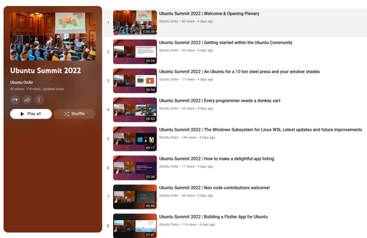

This is the last News Post of 2022. Most of us will be meeting family and friends during the holidays. And many of them are not Linux and free software users as we are.

Struggling with their Windows and Mac systems and considering you as computer guru they are asking you to solve their problems. If it is Windows 11 (or at least updateable to 11) and an old printer, you are lucky as we have already posted [the solution](/wsl-printer-app/) here ([video](https://youtu.be/y7GIiLPjdTk?t=624)).

But if there are more severe problems, like for example network printing with Windows, with Windows' printing system being "that mess of Windows 3.0" (of the late 90s, see also [below](#podcasts-and-videos)), it is at the time to convince them to switch over. And for that there is now a nice Christmas gift available, the book "Beginning Ubuntu for Windows and Mac Users" by Nathan Haines, one of my colleagues in the organization committee of the [Ubuntu Summit](#ubuntu-summit---videos-pictures-blogs-podcasts-). Still in doubt that this is the right book? Then let Nathan tell you more about it in the December edition of the [Ubuntu Desktop Team Indaba](https://discourse.ubuntu.com/t/ubuntu-desktop-team-indaba-ama-december-16-2022-4pm-utc/) which has taken place some days ago ([YouTube video](https://www.youtube.com/watch?v=9vP-9vds--g)).

And also the organization team of the [Ubuntu Summit](#ubuntu-summit---videos-pictures-blogs-podcasts-) has a nice holiday gift for you: Hours of entertainment (and knowledge) with the recordings of [nearly all the sessions on YouTube](https://www.youtube.com/playlist?list=PL-qBHd6_LXWYutOfi0r_jzyqHGmq1vIhf) and [lots of photos](https://ubuntu.com/blog/ubuntu-summit-memories-live-on), and there is even more to read and listen to about the Summit by bloggers and podcasters ... ([see below](#blogs-and-articles)).

Best wishes for the holidays from the [OpenPrinting team](https://www.youtube.com/watch?v=RbgXmDjxYa4)!

## Adobe gets 40 and releases PostScript source code
40 years ago, in December 1982, Adobe got founded, to start the development of the page description language PostScript. The language was intended as a universal, device-independent form of describing printable content. Especially the characters of the fonts and also other graphical content should not be described as bitmaps, handcrafted for every needed resolution, but as device-resolution-independent mathematical descriptions, Bezier curves, vector graphics, ...

It got the standard for page description languages for a long time, many printers were made which use it and it got the standard format for Unix and later Linux to describe print job content in a device-independent way, until Michael Sweet and me replaced it by PDF, the Portable Document Format, also from Adobe.

On the occasion of their 40th anniversary Adobe, being known to keep well their algorithms and methods as trade secrets, they have released the source code of an early development stage (version 0.1.0) of their PostScript language and made it available via the Computer History Museum in Mountain View, CA. It is available through a [blog article](https://computerhistory.org/blog/postscript-a-digital-printing-press/).

But do not think, it will now make the rounds through the free software community or even be made use of by OpenPrinting. Its [license](https://computerhistory.org/blogs/deluxepaint-computer-history-museum-software-license-agreement/) puts the "Don´t Touch" sign on it (which you know very well from museums). No redistribution, no commercial use, ... And as it does not compile with modern compilers (like `gcc`) without modifications anyway, you should simply pass over straight to [Ghostscript](http://www.ghostscript.com) ...

Also have a look on some comments on [Hackaday](https://hackaday.com/2022/12/13/after-40-years-adobe-releases-postscript-source-v0-10-for-posterity/).

By the way, I had already visited the museum many years ago. The [Babbage Difference Engine No. 2](https://computerhistory.org/exhibits/babbage/) which had been there was really awesome. A completely mechanical computer, even with printer. Someone should implement IPP on it ...

## Ubuntu Summit - Videos, pictures, blogs, podcasts ...
The first [Ubuntu Summit](https://events.canonical.com/event/2/overview) was really one of the greatest and most awesome conferences I have experienced. As reported here already in the [last month](https://openprinting.github.io/OpenPrinting-News-November-2022/#the-first-ubuntu-summit-was-a-success) I and many others have put a lot of work into it and the result was overwhelming ...

### Recordings
You did not make it to Prague? Or, while you have attended a great session on the Ubuntu Summit an awesome session was taking place in another room? No problem! We have recorded most of the talks and panels in the ballroom and the 4 breakout rooms Karlin 1-4 and they are now available on YouTube in a [playlist](https://www.youtube.com/playlist?list=PL-qBHd6_LXWYutOfi0r_jzyqHGmq1vIhf).

Note that we did not record the workshops, as they were highly interactive and so watching a recording of them would not make much sense.

Also we had technical problems in the breakout rooms on the first day, and therefore we could not use the recording of most of the sessions, only 4 we could save with a lot of editing work.

By the time of writing this News Post the uploading process of the videos to YouTube was not yet completed. The third day is still missing. It will be added to the playlist in the next days. Note that editing and uploading the videos is really a lot of hard work. Thanks a lot to Mauro Gaspari and Aaron Prisk of Canonical's Community Team for doing this.

I have also updated my [report in last month's news](https://openprinting.github.io/OpenPrinting-News-November-2022/#and-the-conference-finally-started-) adding links to the recordings of every session I mentioned there.

And I have to give a special thank you to Mauro and Aaron as the recordings of all the (non-workshop) sessions where I was the speaker or host of worked out great:

- [Your app everywhere, just in a Snap!](https://www.youtube.com/watch?v=ido6kGmSHWI)
- [OpenPrinting - Join the team to make printing just work!](https://www.youtube.com/watch?v=RbgXmDjxYa4)
- [Save Legacy Printers under Windows with WSL and Printer Applications](https://youtu.be/y7GIiLPjdTk?t=624)

Especially to mention is Mauro's amazing editing work on my Snap panel where everyone is audible, especially the 7 panelists using one mic lying on the chair in front of them. Thanks a lot!

### Photos
Such an event gives also a lot of opportunities to take photos. Once we have hired a professional photographer for the first 2 days and the closing party and second, we have asked the attendees in our post-Summit blogs to submit their pictures, leading us to two nice photo galleries:

- [Professional photographer](https://photos.google.com/share/AF1QipOh8jEJZ1XeYtkytZBjArYB-dqHLZHaVAjaF-gNxizyEklCsBIkNSFM5pRPRX-uEQ?key=bzRlVWo5Tk5vN195cEd0WktnVFo5S2xuRWlTQmhR)
- [Attendee's photos](https://photos.google.com/share/AF1QipOJVBqx9TAInKEvjsVuD42F71kM4qzr4JTnlHT70rwbg3oQ86YP55G0jYhVZPG-NA?key=OHlxVHR5TFR0NjIxUjFjbm5FcjBVVTFyUXUwQTJR)

Have you been on the Ubuntu Summit and taken some interesting shots? Submissions are still open until mid-January. Please use [this upload form](https://forms.gle/rb1wqyQgDqwiYU7r7).

### Blogs and articles
The conference also attracted several bloggers and news writers, so there is a lot to read about the Summit.

My [lightning talk](https://youtu.be/y7GIiLPjdTk?t=624) about [saving old printers under Windows with WSL and Printer Applications](/wsl-printer-app/) was a special success. When one looks through all these articles and blogs (and especially also the podcasts) it can feel like the conference was a printer-saving-under-Windows Summit despite this subject matter only being presented in a 10-minute lightning talk and the Summit being all about Linux. What perhaps contributed to this was also Mark Shuttleworth who has [mentioned me and my lightning talk as the very first highlight](https://youtu.be/ZtY7_fv0vwo?t=1141) of the Summit in his opening plenary. I have never seen that a lightning talk got so much attention.

- [**Canonical's Ubuntu Blog**](https://ubuntu.com/blog)
  + [Ubuntu Summit Highlight Reel](https://ubuntu.com/blog/ubuntu-summit-2022-reflections): Heather Ellsworth (with some help by Mauro Gaspari, Igor Ljubuncic, and me) writes about what has happened: Lots of photos from the sessions (including my Snap panel), the GNOME panel (or better stand-up meeting?), the Mini Pupper and plotter workshops, the foosball action, the Kinetic Knitting workshop of the first night the game night, the boat party ...
  + [Ubuntu Summit Memories Live On](https://ubuntu.com/blog/ubuntu-summit-memories-live-on): In the second post-Summit blog Heather gives us the links to the photo galleries and the recordings, and she also motivates to come or even speak next year, or make the next Summit a part of your day job, working at Canonical!
- [**Canonical's Snap Blog**](https://snapcraft.io/blog)
  + [Snapcrafters: 2022 wrap-up](https://snapcraft.io/blog/snapcrafters-2022-wrap-up): This is about what happened in the volunteer organization [Snapcrafters](https://github.com/snapcrafters) (they snap what upstream is not snapping) during the year 2022. Especially it also tells about the Ubuntu Summit and mentions (and YouTube-links) Dani Llewellyn's plenary talk "Getting started within the Ubuntu Community" and my Snap panel "Your app everywhere, just in a Snap!", the latter even with YouTube thumbnail image.
- [**OpenPrinting**](https://openprinting.github.io/news/)
  + [OpenPrinting News - November 2022](https://openprinting.github.io/OpenPrinting-News-November-2022/): I have also written about the Summit, especially my work on contributing to its organization, on creating the Snap tutorial workshop series, preparing the first 2 panel sessions I have hosted in my life, the build-a-plotter workshop (with photos), my 4 sessions, the hallway track, and the success of my lightning talk.
- [**Jonathan Esk-Riddell**](https://jriddell.org/)
  + [Ubuntu Summit 2022 Prague](https://jriddell.org/2022/11/14/ubuntu-summit-2022-prague/): The KDE-related sessions on the Ubuntu Summit (Jonathan is creator of the KDE Neon distro and former leader of Kubuntu).
- [**The Register**](https://www.theregister.com/)
  + [Looking for a holiday DIY project? Build your own pen-plotter, for under $15](https://www.theregister.com/2022/11/14/brachiograph_15_buck_plotter/): Liam Proven writes about Daniele Procida's workshop on building a pen plotter.
  + [No formal certifications? CUE the Ubuntu skills testing scheme](https://www.theregister.com/2022/11/10/ubuntu_skills_informal_certifications/): Liam Proven writes about Adrianna Frick's talk "The Problem of 'Street Cred'", the skills-testing and training scheme CUE, Canonical Ubuntu Essentials.
  + [OpenPrinting keeps old printers working – even on Windows](https://www.theregister.com/2022/11/10/openprinting_keeps_old_printers_working/): Liam Proven writes about my lightning talk. He met me on the hallway after my OpenPrinting panel session and told me about his intention to write this article and asked me some questions.
  + [Strong support for Snap and Ubuntu Core as Canonical meet IRL](https://www.theregister.com/2022/11/09/canonical_conference/): Liam Proven writes about Oliver Grawert's talk about Snap and Ubuntu Core, "An Ubuntu for a 10 ton steel press and your window shades: UbuntuCore at a glance." and about Snap in general.
- [**Deepak Patankar on LinkedIn**](https://in.linkedin.com/in/deepak-patankar-797622148)
  + [Ubuntu Summit and Google Summer of Code](https://www.linkedin.com/posts/deepak-patankar-797622148_openprinting-ubuntusummit-opensource-activity-7000381114443780097-D2vq?utm_source=share&utm_medium=member_desktop): Deepak Patankar, former GSoC contributor and currently GSoC mentor for OpenPrinting, tells about the Ubuntu Summit and the opportunity to get contributor in GSoC 2023.

### Podcasts and videos
The Summit was not only written about a lot but also talked about. Here are podcasts and videos I found about the Summit:

- [**TuxDigital: Destination Linux**](https://tuxdigital.com) (Video Podcast)
  + [Celebrating 300 Episodes by Giving Thanks to Open Source](https://www.youtube.com/watch?v=I3Rk44jTRB8): Brief discussion about Ubuntu Summit, Michael Tunnell’s talk "Open Source Marketing Done RIght", Mark Shuttleworth interview, Canonical contributions to OSS. Beginning of section "Giving Thanks To Open Source Contributors", ~11:00 min
- [**Linux Downtime**](https://linuxdowntime.com) (Podcast)
  + [Episode 60](https://linuxdowntime.com/linux-downtime-episode-60/): Martin Wimpress talks about his exciting experience with the Flutter Track on the Ubuntu Summit and about his project Butterfly, an Ubuntu with an all-Flutter desktop. Right in the beginning, first section of the podcast.
- [**Late Night Linux**](https://latenightlinux.com/) (Podcast)
  + [Episode 203](https://latenightlinux.com/late-night-linux-episode-203/): Starting at minute 13:55 up to the very end of the episode, Graham Morrison (co-host at Late Night Linux and documentation manager for Snap/Core at Canonical) has interviewed Ken VanDine (leader Canonical Desktop Team) in-person in Prague, on the Sunday before the Summit. Ken talks about the importance of the Desktop, the sub-teams of the Desktop Team, Snap and its advantages, also for maintenance of Ubuntu, the Steam Snap, and that Canonical is hiring for the Desktop Team.
  + [Episode 204](https://latenightlinux.com/late-night-linux-episode-204/): Alan Pope (Popey) and Will Cooke (former leader of Canonical's Desktop Team) tell about my lightning talk about saving legacy printers under Windows with WSL and about OpenPrinting as an organization in general, what we are doing, GSoC, ... (8:50 min -> 11:50 min)
- [**2.5 Admins**](https://2.5admins.com/) (Podcast)
  + [Chaos Emerald Wealth](https://2.5admins.com/2-5-admins-118-chaos-emerald-wealth/): Jim Salter was on the Summit and starting at 14:00 min he is talking about the Summit, complaining about too much Snap ("it is rather a Snap Summit than an Ubuntu Summit"), but what he liked most were the hallway sessions (sorry, Jim).
- [**Ask Noah**](http://www.asknoahshow.com/) (Podcast)
  + [Ask Noah Show 312](https://podcast.asknoahshow.com/312): Noah speaks about the Ubuntu Summit via Simon Quigley’s experience. Overall a very positive review
(29:35 min -> 32:10 min). Mentioned as the very first item was my lightning talk about saving old printers under Windows with WSL (again), but they called this method OpenPrinting (which is not correct), after that the KDE session by KDE president Aleix Pol i Gonzalez, the hallway track, and the Ubuntu flavors panel got prominently mentioned.
- [**Ubuntu Portugal**](https://podcastubuntuportugal.org/) (Podcast)
  + [Ubuntu Summit 2022, o Rescaldo](https://podcastubuntuportugal.org/e221/): (In Portuguese) This is all about the Ubuntu Summit, Prague, and the Summit itself. The authors Tiago Carrondo and Diogo Constantino, who were on the Summit presenting about Ubuntu PT and the Ubucon in Sintra, Portugal, liked most the talks from the Africans, and as many listed here, liked a lot my lightning talk about saving old printers under Windows and also me (“an exotic, entertaining, and very special person”) and complain about the printing stack of Windows (“the mess of Windows 3.0”) (34:40 min -> 38:00 min) and they liked Daniele Procida's build-a-plotter workshop. And playing Bomb Jack with Martin Wimpress. And especially important: The hallway track.
  + [Jardim das Borboletas](https://podcastubuntuportugal.org/e222/): (In Portuguese) The title "Jardim das Borboletas", means "Butterfly Garden" and at minute 50:10 to the end Tiago Carrondo and Diogo Constantino talk about Martin Wimpress' Butterfly project, Ubuntu with an all-Flutter desktop. Earlier there is also talk about Nathan Haines' books.
- [**TechnikTechnik**](https://techniktechnik.de/) (Podcast)
  + [Schmetterlinge in Prag](https://techniktechnik.de/?podcast=tt167-schmetterlinge-in-prag): (In German) Marius Quabeck ([Nerdzoom.de](https://nerdzoom.de)) was invited to the Ubuntu Summit and reports about it, practically everything, the talks he has attended, the hallway sessions, people he met all over the event, the evening events, the report is really packed, as the Summit was (and nothing about saving old printers) ... The title of the podcast "Schmetterlinge in Prag" means "Butterflies in Prague" and it is because of Martin Wimpress' all-Flutter "Butterfly"  Ubuntu flavor. Marius had a longer meeting with Wimpy and others about it. Great podcast! 1:09:42 min -> 1:31:18

These podcasts were all **ABOUT** the Summit, and here is one which was **ON** the Summit:

- [**Linux Lads**](https://linuxlads.com/) (Podcast)
  + [Live from Ubuntu Summit](https://linuxlads.com/episodes/season-7-episode-18/): This podcast got [produced live on the Summit](https://events.canonical.com/event/2/contributions/18/). It is about how these podcasts get produced. With a lot of audience interaction, contains also some words of the masters of Ardour, Paul Davis and Robin Gareus, and the master of the Indabas, Heather Ellsworth. Special thanks to Mauro Gaspari for editing the audio recording done with the Ubuntu Summit infrastructure and making the whole session well audible.

Now I have talked such a lot about podcasts here. would you like to listen to a podcast produced by me, or about OpenPrinting? Then listen to the audio of the following YouTube videos, close your eyes or put another window in front of your browser. The sessions are not originally designed to be podcasts but are all without slides and so also consumable audio-only:

- [Your app everywhere, just in a Snap!](https://www.youtube.com/watch?v=ido6kGmSHWI)
- [OpenPrinting - Join the team to make printing just work!](https://www.youtube.com/watch?v=RbgXmDjxYa4)
- [Ubuntu Community Office Hours - Summer of Printers](https://www.youtube.com/watch?v=diB3wm4HB1Y)

And there are probably also some other panel sessions without slides on the Ubuntu Summit which you could listen to ...

And at the end we have something to relax: A video of the [**closing party on the boat**](https://youtu.be/OqxCUEkm0XA). Simply the impressions, no talking.

## Google Summer of Code 2022
In India the end-of-year exams at the universities/colleges are over and now, during their winter break, I am working with our contributors on the upstreamization of their work.

To ease the acceptance of the pull/merge requests of the new code and also its acceptance by OS distributions I have released first beta versions of the libraries, libcupsfilters, libppd, cups-filters, and cpdb-libs (see below).

Many of the contributors already have posted pull requests during the coding period:

Mohit Verma, working on making the ["Add Printer" part](https://github.com/vermamohit13/GSOC_2022_Summary) of the "Printers" module in the GNOME Control Center ready for the New Architecture, has submitted two merge requests:

- [GNOME Issue report #1878](https://gitlab.gnome.org/GNOME/gnome-control-center/-/issues/1878): Allow to add new printers via Printer Applications
- [cups-pk-helper PR #7](https://gitlab.freedesktop.org/cups-pk-helper/cups-pk-helper/-/merge_requests/7): Added discovery of Printers via lpinfo, PAPPL and Printer Applications

He is shortly before completing the work on them. Then only the UI/UX design team of GNOME needs to refine the user interface changes.

There are further feature requests on the "Printers" module:

- [#1877](https://gitlab.gnome.org/GNOME/gnome-control-center/-/issues/1877): Improve setting of IPP options
- [#1879](https://gitlab.gnome.org/GNOME/gnome-control-center/-/issues/1879): Do not show setting of drivers for IPP printers
- [#1911](https://gitlab.gnome.org/GNOME/gnome-control-center/-/issues/1911): Printers: Make adminurl available for IPP printers

Shivam Mishra was [working towards this part](https://github.com/7shivamx/Google-Summer-of-Code-2022-The-Linux-Foundation), but did not reach far enough. Mohit will carry on voluntarily here.

Gaurav Guleria, working on the [CPDB support for the GNOME and GTK print dialogs](https://github.com/TinyTrebuchet/gsoc22/), has already done several changes on CPDB itself, especially support for human-readable option and choice names and improved support for media sizes and margins, leading it into its second generation, see the [2.0b1 release](#common-print-dialog-backends-second-generation---first-beta-release) below.

And he naturally submitted merge requests for his work on the print dialogs:

- [Qt Merge Request #437301](https://codereview.qt-project.org/c/qt/qtbase/+/437301): Add CPDB support to Qt print dialog
- [GTK Merge Request #4930](https://gitlab.gnome.org/GNOME/gtk/-/merge_requests/4930): New CPDB print backend for GTK Print Dialog

Sachin Thakan, working on [optimizing the use of Avahi](https://github.com/thakan25/gsoc22-submission), has submitted a pull request for cups-filters, but before the splitting for the 2.x release. Now he needs to update it for the split repositories.

- [cups-filters Pull Request #487](https://github.com/OpenPrinting/cups-filters/pull/487): Driverless avahi optimization

Chandresh Soni, working on the [Braille embosser Printer Application](https://gist.github.com/Chandresh2702/73923b2c686039404cdd9b050edbe995), did not yet submit a pull request but is currently preparing it. It will get right into the new [braille-printer-app](https://github.com/OpenPrinting/braille-printer-app) repository.

## Common Print Dialog Backends Second Generation - First Beta Release!
We are now releasing the first beta of the second generation of the Common Print Dialog Backends (CPDB).

As part of making everything ready for the [New Architecture of printing](/current/#the-new-architecture-for-printing-and-scanning) we have finally added CPDB support to the print dialogs of the major desktop environments/GUI toolkits, GNOME/GTK and KDE/Qt. This was done in [Gaurav Guleria's GSoC project](https://github.com/TinyTrebuchet/gsoc22/) and in the course of his work on the print dialogs he also did a lot of improvements on the CPDB framework, mainly due to missing features but also to work well in a PPD-less world.

The components we are currently maintaining got all updated and released as version 2.0b1:

- **cpdb-libs:** The central library package implementing both ends of the D-Bus interface (backend = server, frontend = client) and the APIs for frontends and backends.
- **cpdb-backend-cups:** The CUPS backend. It allows the print dialogs (frontends) to print with CUPS. It polls the list of available printers (queues) from CUPS and also the option/setting list for a selected printer, and it passes on jobs with option settings to CUPS. It uses the current APIs of libcups for that and does not interact with PPD files at all, so that porting the backend to CUPS 3.x will be easy.
- **cpdb-backend-file:** This backend allows the print dialogs to print into a file. As most print dialogs have already their own functionality for that, this backend will probably not be needed in production. We have it at least for sake of completeness, but it is also useful as code example for backend developers.

After the last 1.x releases of the CPDB components, the following changes have been done:

- **Added interfaces to get human-readable option and settings names**
  Print attributes/options and their choices are usually defined in a machine-readable form which is more made for easy typing in a command line, not too long, no special characters, always in English and in a human-readable form for GUI (print dialogs), more verbose for easier understanding, with spaces and other special characters, translated, ...
  Older backends without human-readable strings can still be used. In such a case it is recommended that the dialog does either its own conversion or simply shows the machine-readable strings as a last mean.
- Added **`get_media_size()` function** to retrieve media dimensions for a given `media` option value
- Support for **media sizes to have multiple margin variants** (like standard and borderless)
- Support for **configurable user and system-wide default printers**
- **Acquire printer details asynchronously** (non blocking)
- Made **cpdb-libs completely CUPS-neutral**
  Removed CUPS-specific functions from the frontend library functions and the dependency on libcups, renamed CUPS-based function and signal names
- Debug logging now includes system error messages now

The API and the organization of the source and header files got vastly changed with the transition to version 2.x (note that this makes the API incompatible with 1.x):

- **Renamed all API functions, data types and constants**
  To make sure that the resources of libcpdb and libcpdb-frontend do not conflict with the ones of any other library used by a frontend or backend created with CPDB, all functions, data types, and constants of CPDB got renamed to be unique to CPDB.
  Here we follow the rules of CUPS and cups-filters (to get unique rules for all libraries by OpenPrinting): API functions are in camelCase and with `cpdb` prefix, data types all-lowercase, with `_` as word separator, and constants are all-uppercase, also with `_` as word separator, and with `CPDB_` prefix.
- **All headers go to `/usr/include/cpdb` now**
  Base API headers `cpdb.h` and `cpdb-frontend.h`, interface headers (and also part of the API) `backend-interface.h` and `frontend-interface.h`, and the convenience header files `backend.h` and `frontend.h` (include exactly the headers needed).
- **Renamed and re-organized source files** to make all more standards-conforming and naming more consistent.
- **Bumped soname of the libraries to 2.**

The CUPS backend has also the followig functionality added:

- Added function to **query for human readable names** of options/choices
  With the added functionality of cpdb-libs to poll human-readable names for options/attributes and their choices this commit adds a simple function to provide human-readable strings for the user-settable printer IPP attributes of CUPS queues.
- Added support for **common CUPS/cups-filters options**
  Options like `number-up`, `page-set`, `output-order`, ... Available for
  all CUPS queues, not specific to particular printer.

The new versions of the CPDB components:

- **cpdb-libs: [More Details and Download](https://github.com/OpenPrinting/cpdb-libs/releases/tag/2.0b1), [Discussion](https://github.com/OpenPrinting/cpdb-libs/discussions/13)**
- **cpdb-backend-cups: [More Details and Download](https://github.com/OpenPrinting/cpdb-backend-cups/releases/tag/2.0b1), [Discussion](https://github.com/OpenPrinting/cpdb-backend-cups/discussions/16)**
- **cpdb-backend-file: [More Details and Download](https://github.com/OpenPrinting/cpdb-backend-file/releases/tag/2.0b1), [Discussion](https://github.com/OpenPrinting/cpdb-backend-file/discussions/2)**

## pappl-retrofit - First Beta Release!
This is the first beta release of the upcoming pappl-retrofit 1.0.0.

pappl-retrofit is a library to convert classic CUPS drivers, consisting of PPD files, CUPS filters, and sometimes also CUPS backends, into Printer Applications, the new format of printer drivers, mainly for CUPS 3.x which goes all-IPP and does not support the PPD/filter concept for printer drivers any more. Printer Applications are emulations of driverless IPP printers which on their other end pass on the jobs to the actual printer.

pappl-retrofit uses [PAPPL](https://github.com/michaelrsweet/pappl), a library for Printer Applications in general, as its base, and so it does not need to care of the general functionality of Printer Applications. So it only contains the code to adapt classic CUPS drivers and PPD files into the Printer Application framework.

To support as many classic drivers as possible pappl-retrofit supports all kinds of PPD files, with and without specification of a CUPS filter, installable accessory settings, CUPS extension for custom option values, `*.drv` PPD compiler files, PPD-file-generating executables, CUPS filters, CUPS backends, side and back channels for filter/backend communication, pre-filtering from the driverless-IPP-standard input formats to the input formats of the driver filters.

pappl-retrofit also comes with the Legacy Printer Application, which when it is classically (not as Snap or other container) installed sees all classically installed CUPS drivers on the system and maps them into its IPP printer emulation, so that CUPS 3.x can make use of all these drivers. This way the user does not loose their old printer drivers on the transition to CUPS 3.x, which is especially important for (often proprietary) drivers from printer manufacturers.

As this library was developed along with the 4 retro-fitting Printer Applications for [PostScript](https://github.com/OpenPrinting/ps-printer-app), [Ghostscript](https://github.com/OpenPrinting/ghostscript-printer-app), [HPLIP](https://github.com/OpenPrinting/hplip-printer-app), and [Gutenprint](https://github.com/OpenPrinting/gutenprint-printer-app) as the base for them, it has grown with these applications and contains all functionality they need. It has also grown with PAPPL, getting support for PAPPL's newest features.

So we are not releasing now because we completed a pre-planned feature list but rather to have releases of this package and the Printer Applications for their easier adoption into Linux distributions. With this we will also version the Printer Application Snaps in the Snap Store, so that when distributions adopt them as their default printer drivers, they can also better manage their customer support.

Feature-wise we are even not 100% complete. We will still add ink level read-out from the printer (SNMP-based network printers, same as supported by CUPS) and internationalization, but this will not cause any compatibility-breaking API changes.

[**More Details and Download**](https://github.com/OpenPrinting/pappl-retrofit/releases/tag/1.0b1)

[**GitHub Discussion**](https://github.com/OpenPrinting/pappl-retrofit/discussions/4)

Before the release, I switched to using the new `papplLocGetDefaultMediaSizeName()` function of [PAPPL 1.3.0](#pappl-130) to determine the default paper size (A4 or Letter) taking into account **all** Letter countries, which are many ([commit](https://github.com/OpenPrinting/pappl-retrofit/commit/76e61a6c10e)).

I also finally made the web interface displaying the actual human-readable strings of the PPD options for the vendor-specific options on the "Printing Defaults" pages ([commit](https://github.com/OpenPrinting/pappl-retrofit/commit/5eebfe43c1)). This was already possible with PAPPL 1.2.x though, but there were a lot of other, more important things I had to do.

And as with cups-filters and CPDB I renamed all functions to follow OpenPrinting policy, API function names starting with `pr` and name itself in CamelCase, library-internal function's names starting with `_pr`, constants `PR_` and then all-uppercase underscore-separated. White-space/indentation clean-up, renamed the internal header files to `...-private.h` and the API header file (former `base.h`) to `pappl-retrofit.h`.

## PAPPL 1.3.0
Michael Sweet has [released PAPPL 1.3.0](https://github.com/michaelrsweet/pappl/releases/tag/v1.3.0). It contains important features like string option support in the web interface, automatic A4/Letter default page size selection by location information, new job management, image printing, and a lot more ...

It also made it into [Phoronix](https://www.phoronix.com/news/PAPPL-1.3)!

And here is the long list of new features and fixes:
- Added debug logging for device management.
- Added support for job hold and release ([Issue #15](https://github.com/michaelrsweet/pappl/issues/15))
- Added support for PNG image scaling using embedded resolution information ([Issue #65](https://github.com/michaelrsweet/pappl/issues/65))
- Added `papplLocGetDefaultMediaSizeName` function to get the default media size for the current country ([Issue #167](https://github.com/michaelrsweet/pappl/issues/167))
- Added support for localized banners at the top of printer and system web pages ([Issue #183](https://github.com/michaelrsweet/pappl/issues/183))
- Added timer APIs to manage periodic tasks ([Issue #208](https://github.com/michaelrsweet/pappl/issues/208))
- Added support for network configuration via callbacks ([Issue #217](https://github.com/michaelrsweet/pappl/issues/217))
- Added APIs to limit the maximum size of JPEG/PNG images ([Issue #224](https://github.com/michaelrsweet/pappl/issues/224))
- Added support for the Clang/GCC ThreadSanitizer with the `--enable-tsanitizer` configure option.
- Added Norwegian Bokmål, Polish, and Turkish localizations.
- Added a password visibility button to the Wi-Fi password field.
- Changed names of PAPPL-specific attributes to use "smi55357" prefix.
- Updated USB device code to generate a 1284 device ID and use the manufacturer and product strings when necessary ([Issue #234](https://github.com/michaelrsweet/pappl/issues/234))
- Updated the USB gadget code to handle disconnections.
- Updated PAPPL to conform to the new prototype PWG 5100.13 specification ([Issue #216](https://github.com/michaelrsweet/pappl/issues/216))
- Fixed a device race condition with job processing.
- Fixed a initialization timing issue with USB gadgets on newer Linux kernels.
- Fixed a potential memory underflow with USB device IDs.
- Fixed web interface support for vendor text options ([Issue #142](https://github.com/michaelrsweet/pappl/issues/142))
- Fixed a potential value overflow when reading SNMP OIDs ([Issue #210](https://github.com/michaelrsweet/pappl/issues/210))
- Fixed more CUPS 2.2.x compatibility issues ([Issue #212](https://github.com/michaelrsweet/pappl/issues/212))
- Fixed a 100% CPU usage bug when cleaning the job history ([Issue #218](https://github.com/michaelrsweet/pappl/issues/218))
- Fixed the default values of `--with-papplstatedir` and `--with-papplsockdir` to use the `localstatedir` value ([Issue #219](https://github.com/michaelrsweet/pappl/issues/219))
- Fixed storage of label offsets for printers that implement them.
- Fixed some thread access issues on ARM.
- Fixed when the kernel USB printer driver is unloaded on Linux ([Issue #233](https://github.com/michaelrsweet/pappl/issues/233))
- Fixed `papplDevicePrintf` to allow the "%c" character to be 0.

[**More Details and Download**](https://github.com/michaelrsweet/pappl/releases/tag/v1.3.0)

[**GitHub Discussions**](https://github.com/michaelrsweet/pappl/discussions)

## Snaps of the retro-fitting Printer Applications and of CUPS updated
I have updated all the Snaps to build and work with the new second-generation libcupsfilters, libppd, cups-filters, and pappl-retrofit. Setting `build-environment:` (environment variables for build process of a part) for the next part finding the libraries built by the previous parts, removing bogus `*.la` files (they contain paths of libraries where they get with a classic installation), distribution of the old cups-filters' dependencies and `./configure` arguments to libcupsfilters and libppd.

I also removed the unnecessary `patches` parts as one can access patches directly in the Snap's source repo via `$SNAPCRAFT_PROJECT_DIR`. Thanks to Sergio Cazzolato for giving me the hint when preparing the [Daemon Snapper's Workshop](https://events.canonical.com/event/2/contributions/42/)) on the Ubuntu Summit.

## Bug fixes in libcupsfilters, libppd, and cups-filters
The updating of the Snaps to the new, split cups-filters packages has revealed some bugs, some caused by the splitting, and also some general bugs.

I found some bugs in the filter functions: `cfFilterGhostscript()` does not use the page dimensions of the input pages if no page size information is supplied, `cfFilterPDFToPDF()` can produce output which Ghostscript turns into blank pages, `cfTextToPDF()` produces one blank page per input character if no page size information is supplied. Investigating these bugs it turned out that all are caused by missing page dimension information when no printer IPP attributes (PPD file if classic CUPS filter wrapper is used) are supplied. I fixed this by now accepting any specification of media size/properties given as options or job attributes when no printer attributes are given and defaulting to US Letter when not even any specification of the page size got found ([main commit](https://github.com/OpenPrinting/libcupsfilters/commit/8de58de), [commit](https://github.com/OpenPrinting/libcupsfilters/commit/55c74cf38), [commit](https://github.com/OpenPrinting/libcupsfilters/commit/52d26b85), [commit](https://github.com/OpenPrinting/libcupsfilters/commit/2e25fb825)).

I have also added a NULL check to prevent the `ppdFilterEmitJCL()` function in libppd from crashing when no PPD file is supplied. The function adds JCL (PJL)  commands to PDF print jobs when they are sent to a (non-driverless-IPP) PDF printer ([commit](https://github.com/OpenPrinting/libppd/commit/3cd2cd62e)).

In all the components I did fixes on minor bugs found while preparing the release of pappl-retrofit and making all the Snaps (Printer Applications, CUPS) building with libcupsfilters, libppd, and cups-filters 2.0b1. I added `foreign` to `AM_INIT_AUTOMAKE()` in `configure.ac` to cope with `README.md` instead of `README`, removed the check for GLib in libcupsfilters, and did many fixes and improvements in `README.md`, `CHANGES.md`, and `INSTALL`.

## OpenPrinting GitHub repositories have discussion forums now
GitHub does not only have the issues and pull requests as a mean for users and contributors to communicate with the project's developers, but also a platform for open discussion, simply called "Discussions".

Unfortunately, this functionality is not turned on by default when creating a new repository. So now I have activeted it for our more than 30 repositories and on new releases I have checked the box for doing the release announcements also in the appropriate GitHub discussions.

I hope we will get more and easier communication by that.

## Snap Store Overview
From OpenPrinting we have already [6 Snaps in the Snap Store](https://snapcraft.io/search?q=OpenPrinting):

|Name|Description|Downloads|
|:---|:---|---:|
|[cups](https://snapcraft.io/cups)|[CUPS](https://github.com/OpenPrinting/cups-snap)|877688|
|[ipp-usb](https://snapcraft.io/ipp-usb)|[ipp-usb](https://github.com/OpenPrinting/ipp-usb)|3300|
|[ps-printer-app](https://snapcraft.io/ps-printer-app)|[PostScript Printer Application](https://github.com/OpenPrinting/ps-printer-app)|2742|
|[ghostscript-printer-app](https://snapcraft.io/ghostscript-printer-app)|[Ghostscript Printer Application](https://github.com/OpenPrinting/ghostscript-printer-app)|2119|
|[hplip-printer-app](https://snapcraft.io/hplip-printer-app)|[HPLIP Printer Application](https://github.com/OpenPrinting/hplip-printer-app)|6890|
|[gutenprint-printer-app](https://snapcraft.io/gutenprint-printer-app)|[Gutenprint Printer Application](https://github.com/OpenPrinting/gutenprint-printer-app)|5379|
