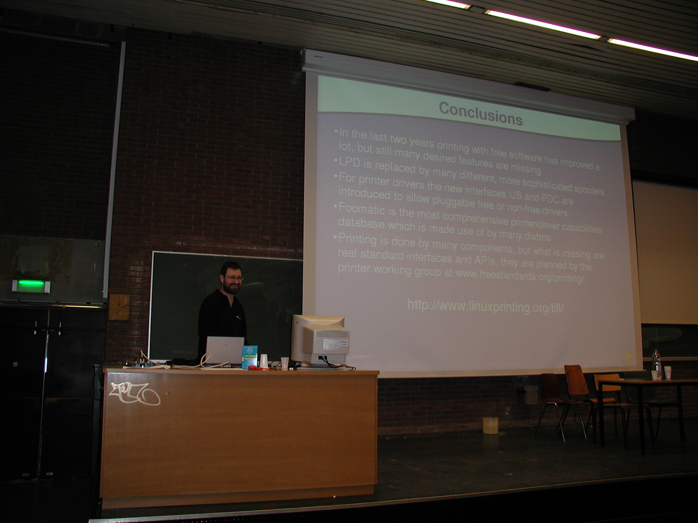

Good News! The [**CUPS Snap works with Ubuntu Touch**](#cups-snap-on-ubuntu-touch), the smartphone operating system formerly created, maintained, and discontinued by Canonical and continued by the community organization UBPorts. So the CUPS Snap has a good chance to get the official printing stack for this system.

And generally the world of Linux will get more snappy in 2024: Zygmunt Krynicki (the one in yellow in the middle of the [Ubuntu Summit 2022 Snap panel](https://www.youtube.com/watch?v=ido6kGmSHWI)) is returning to Canonical to make Snap working better with all distros especially non-Ubuntu ones ([Phoronix](https://www.phoronix.com/news/Better-Cross-Distro-Snaps)). So snapping your apps will make them available for all distros (including Ubuntu Core Desktop but also most of the others). **Especially we at OpenPrinting can easily distribute printer and scanner drivers as Printer/Scanner Application Snaps then!**

So on [Mastodon](https://ubuntu.social/@till/111728780544435425) I already posted a little feature request:

> Zygmunt, I did not test it by myself, but distros derived from RedHat/Fedora use SELinux instead of AppArmor and as of now Snap only supports AppArmor, making Smaps running on those distros only partially protected. My feature request for snapd would be to not only map the rules of Snap's interfaces to AppArmor rules but also to SELinux rules, so that one gets the same level of security on both.

Highlight of this month was the [FOSDEM 2024](#fosdem-2024) in Brussels, unfortunately without Zdenek as he got sick, but I have given my 2 talks with great success, one even made it to Phoronix, and I met my former Canonical colleague Heather Ellsworth together with the other Thunderbirdies, and many others ...

Many have already seen on these pages that I live in Vienna in Austria and with this I will have a home game for this year's [Open Source Summit Europe and Linux Plumbers](#open-source-summit-and-plumbers-in-vienna).

And as OpenPrinting is part of the Linux Foundation, I share here a nice [article about the LinuxFoundation on ZDNet](https://www.zdnet.com/article/jim-zemlin-and-the-linux-foundation-share-not-so-secret-open-source-sauce/).

So let us see what happened at OpenPrinting in February ...

**And as usual: Stay updated on Mastodon: [#OpenPrinting](https://ubuntu.social/tags/OpenPrinting) and [@till@ubuntu.social](https://ubuntu.social/@till).**

**Or discuss on our mailing lists:**
- **Development:** printing-architecture AT lists DOT linux DOT dev ([Archive](https://lore.kernel.org/printing-architecture/))
- **Users:** printing-users AT lists DOT linux DOT dev ([Archive](https://lore.kernel.org/printing-users/))

Subscribing/Unsubscribing [instructions](https://subspace.kernel.org/subscribing.html)

## CUPS Snap on Ubuntu Touch
Many of you know that a complete CUPS printing stack (CUPS, cups-filters, Ghostscript, QPDF, cups-browsed, ...) is available as a Snap in the Snap Store, the [CUPS Snap](https://snapcraft.io/cups), an immutable system component for a wide range of Linux distributions, the latest and greatest right from upstream, from OpenPrinting.

And this Snap will be used in the immutable all-Snap distro Ubuntu Core Desktop, and will also, later on, be used in standard Ubuntu.

But [**Snap made it also into Ubuntu Touch**](https://forum.snapcraft.io/t/updates-on-bringing-snapd-and-snaps-to-ubuntu-touch/), the smartphone operating system which Canonical has given up on and which got continued by the community. Alfred E. Neumayer (beidl, fredldotme, Codemaster Freders) from [UBPorts](https://ubports.com/) did not only succeed to make Snap in general working on Ubuntu Touch but especially also succeeded to make the CUPS Snap work and this way introduce print functionality to the system.

I got note of it when I met Rudra Saraswat on the [FOSDEM 2024](#fosdem-2024). He is not only leading the [Ubuntu Unity](https://ubuntuunity.org/) and [BlendOS](https://blendos.co/) projects but also contributing to UBPorts, and so he took me to the booth of UBPorts where Alfred proudly told me that he made the CUPS Snap working.

I asked him to write some 10-15 lines about it for this news post but he never did. So I googled for more information and found the thread in the Snapcraft forum which I linked above. I also found the [Ubuntu Touch Q&A episode 131](https://ubports.com/en/blog/ubports-news-1/post/ubuntu-touch-q-a-131-3909), where, according to the summary, as an answer to a user asking about the state of printing Alfred has told in the live-streamed Q&A session that he has made the CUPS Snap working.

The recording of the session is available on YouTube and the relevant part is at [45:30 min -> 48:45 min](https://www.youtube.com/watch?v=IEsT_Wl5oQ4&t=2730s) and here Alfred does not only explain how he did it but also shouted out the people who made the CUPS Snap possible, without explicitly mentioning their names. and Diogo Constantino from the Podcast Ubuntu Portugal, wrote into the live chat:

> 46:45 Podcast Ubuntu Portugal ​​**Til rocks!**

Now let us hope that the CUPS Snap will actually get the official printing stack of Ubuntu Touch.

## FOSDEM 2024
[FOSDEM](https://fosdem.org/2024/) was a great experience. It has grown a lot compared to the early 2000s, now having 32 rooms in ~10 different buildings vs. the plenary room plus some rooms in another building back in 2002. So it was often not easy to find the desired building, room, or booth on the conference.

And sorry, I have told something wrong in my previous news posts here, I have actually given a talk on a FOSDEM already before, in 2002! It was about my first one and a half years of printing work at MandrakeSoft. I have compared different printing systems, like LPD, LPRng, CUPS, PDQ, PPR, ..., especially I told what is better in CUPS, I also talked about Foomatic, printer drivers, the printing working group at freestandards.org, ...

 
*My talk on my first FOSDEM, back in 2002. The slide shows a summary about my first 1.5 years of printing work.*

And now, 22 more years have passed and a lot has changed, which I have reflected in my second FOSDEM talk about printing: **[OpenPrinting - We make printing just work!](https://fosdem.org/2024/schedule/event/fosdem-2024-1930-openprinting-we-make-printing-just-work-/)** ([Video](https://video.fosdem.org/2024/k1105/fosdem-2024-1930-openprinting-we-make-printing-just-work-.av1.webm), [Slides](https://fosdem.org/2024/events/attachments/fosdem-2024-1930-openprinting-we-make-printing-just-work-/slides/20807/talk-openprinting-2024_1f9Sa4r.pdf))

The talk has taken place in the second room of the Main Track, in the ~800-seat "La Fontaine" lecture hall in the K building, the building where also most of the booths were located. The room was perhaps filled to 1/3.

And people were interested. I had the last 8 minutes for Q&A (starting at 40:50 min) and got 3 questions, about restrictions against unauthorized printing in a school network, about scanning standards, and also about why Microsocft did not use CUPS/OpenPrinting for Windows. Had been great if they had used CUPS ...

Harald König, an old friend from the LinuxTag times in the early 2000s, attended my talk and came up to me afterwards.

Also my second talk, **[Desktop Linux, as easy as a smartphone! Just in a Snap!](https://fosdem.org/2024/schedule/event/fosdem-2024-1860-desktop-linux-as-easy-as-a-smartphone-just-in-a-snap-/)** ([Video](https://video.fosdem.org/2024/ua2118/fosdem-2024-1860-desktop-linux-as-easy-as-a-smartphone-just-in-a-snap-.av1.webm), [Slides](https://fosdem.org/2024/events/attachments/fosdem-2024-1860-desktop-linux-as-easy-as-a-smartphone-just-in-a-snap-/slides/20944/talk-snap-2024_XNtSTSC.pdf)), in the Distributions Track, was successful.

I did not have time left for Q&A right after the talk in the room, as the person showing me these "XX minutes left" cards was aiming for the end of the full 25-min slot, not for some minutes earlier for the questions. But afterwards some of the attendees went with me and Philipp Kewisch to ask some questions on the hallway and I showed to them Ubuntu Core Desktop running in a virtual machine on my laptop. I also told a person about how is it to work at Canonical.

And the talk got mentioned in **Phoronix**: [Snaps & Ubuntu Core Desktop Talked Up At FOSDEM 2024](https://www.phoronix.com/news/FOSDEM-2024-Snaps)  As usual, the people complaining about Snap in the comments.

**But there were not only my two talks but a lot of other things happened ...**

It started with meeting Petr Mensik from Red Hat, who is taking care of Avahi, on the plane from Vienna to Brussels and also getting around with him in the city after arriving, having lunch with him (mussels with fries, a typical dish) and going with him to the CentOS Connect conference (at least for some hours) which happend in the same hotel (Radisson Collection Grand Place) where the Canonical-internal Engineering Sprint happened in the fall of 2018.

**Petr does great work on Avahi** ([GitHub](https://github.com/avahi/avahi)), which was practically abandoned by its former maintainer Trent Lloyd. He is continuing maintaining it and is releasing 0.9.0 ([Announcement of 0.9-rc1](https://lists.freedesktop.org/archives/avahi/2024-February/002624.html).

Friday evening I met with a lot friends and colleagues: Heather Ellsworth, Alan Pope ("Popey"), Iain Lane, Marco Trevisan, Olivier Tilloy, ...

On Saturday the event started. I was not able to attend the opening plenary, as on the conference with ~8000 attendees it took place in the "tiny" plenary room with only ~1400 seats.

So at first I visited the booth of Thunderbird, to meet Heather Ellsworth with her new colleagues. It was great to see my former Canonical colleague Heather as a happy Thunderbirdie, working for the best e-mail client.

The booth  was in the K building, where there was the largest group of booths. There were many smaller groups in other buildings, so it was easy to miss some of the booths.

Other booths I visited were especially the ones from the [Google Summer of Code](http://g.co/gsoc), [Linux Foundation](https://www.linuxfoundation.org/), [UBports](https://ubports.com/en/) (see above), and [Prusa](https://www.prusa3d.com/) 3D printing.

Only Ubuntu/Canonical was not successful to get selected for a booth. There were 3 times as many proposals as there were booth spaces and no booth spaces reserved for sponsors of the event and also no possibility to rent space for a commercial booth. But Philipp Kewisch, Community Team manager of Canonical, and Michal Kohútek created a "mobile booth" walking around with a box of Ubuntu swag and with QR codes pointing to Ubuntu-related activities: Ubuntu Summit, Ubuntu local communities, and jobs at Canonical. And both were wearing orange Ubuntu beanies.

Philipp also interviewed some people (including me) for producing content for a video for the 20th-anniversary of Ubuntu.

The booth of Prusa was really impressive where they demonstrated some of their 3D printers live, especially one with an automatic tool changer to be able to print objects composed of up to 5 materials. Did I not say above that there are no commercial or sponsor booths? But what makes Prusa having gotten there is that their 3D printers are [open-source hardware](https://de.wikipedia.org/wiki/Open-Source-Hardware), meaning that everything needed to reproduce the devices, all their design, 3d-print models of the parts, PCBs, firmware, software, ... is available under a free license, in case of Prusa on [GitHub](https://github.com/prusa3d). This motivated me to invite them to the Ubuntu Summit 2024 (where I am in the organization team again), to give a talk and a workshop, so that attendees try out 3D printing by themselves.

There were also great **evening events** after the conference days.

On Saturday, Google has invited the participants of the Google Summer of Code for the FOSDEM GSoC Meetup with free food and drinks. I met several fellow mentors there and also Stephanie Taylor, organization lead of the GSoC. I invited her to the Ubuntu Summit 2024, for a GSoC panel and other sessions, but unfortunately, due to the Ubuntu Summit being shortly after the Mentor Summit, the last major piece of work for the GSoC organizers, she is usually on (a well-deserved) vacation at that time.

After that I went on to the [GNOMEbeers](https://foundation.gnome.org/2024/01/29/gnome-at-fosdem-2024/), the social event of GNOME.

And on Sunday evening we had a joint dinner of Thunderbird and OpenPrinting, 13 Thunderbirdies and me ...

I will come back next year for sure ...

## OpenPrinting Summit/PWG Meeting is only online again
Due to lack of willingness to travel to the Lexmark facilities in Lexington, Kentucky in the US, and most probably also due to lack of funding by employers, this year's annual meeting will be totally online again.

It will take place on [May 6-8](https://www.pwg.org/chair/meeting-info/meetings.html).

## GUADEC 2024
In July we have a GUADEC again! And so it is at the time to mention it here in the News. This time the GNOMies and friends will meet in Denver, Colorado, in the US (1 hour drive from Heather Ellsworth's home)!

I will also be there (I will soon book my flights) and I have rushed in a talk submission before the (very early) deadline of February 18 which they announced first. They have extended the deadline to March 24 afterwards, so I will perhaps submit another talk.

The talk already submitted is a talk about Snap and Ubuntu Core Desktop, similar to the one I have given on the FOSDEM. But now there will be a 40-min slot, and I am aiming for leaving 10 minutes for Q&A.

I will perhaps submit another one with an OpenPrinting subject.

## Open Source Summit and Plumbers in Vienna
If you have a look into my news posts of the 2 post-pandemic years 2022 and 2023 you see that I have been on many conferences, so I had a lot of trips, sometimes also long ones, to another continent, as for GUADEC 2022, Opportunity Open Source/DebConf 2023 and the GSoC Mentor Summit 2023, but I also had a short 2-hour train trip to Brno for the Linux App Summit 2023.

Yes, that conference was really close by, compared to all the others, but it was not really that close, as for this year's Open Source Summit Europe and Linux Plumbers it gets even closer.

They both take place in Vienna in Austria! This is the city where I live, and so for me it is the loooong trip from my home to the Austria Center by Vianna's subway.

So you have the chance to visit this nice city, and you wiil meet me there, as I will attend the conferences, too. To make it even easer for you and to give you the chance to enjoy Vienna for a longer time, the 2 conferences are in the same week and at the same venue:

- [**Open Source Summit Europe**](https://events.linuxfoundation.org/open-source-summit-europe/): September 16-18, 2024 (Mon-Wed)
- [**Linux Plumbers Conference**](https://lpc.events/): September 18-20, 2024 (Wed-Fri)

Both take place in the Austria Center in Vienna, so we have one week of conferences there and on Wednesday one can even hop between the two.

## Google Summer of Code 2024
The Linux Foundation got accepted as mentoring organization in the 20th GSoC! So we are again looking for amazing contributors to do projects with us and improve the printing and scanning experience with Linux.

Our selection process has already started some months ago and we already got some promising candidates. If you want to participate, too, have a look at our [project ideas list](https://wiki.linuxfoundation.org/gsoc/google-summer-code-2024-openprinting-projects). Please contact us as soon as possible and not only when Google's application time window opens (March 18 - April 2).

Please send us your resume/CV and tell us what you like to work on, either on one of the project ideas or you can also provide your own project idea. Also have a look what we are doing via the [introduction](https://wiki.linuxfoundation.org/gsoc/google-summer-code-2024-openprinting-projects#introduction) on the project ideas list page (there are also a lot of [videos](https://wiki.linuxfoundation.org/gsoc/google-summer-code-2024-openprinting-projects#videospodcasts)) and the links on our [About Us](/about-us/) and [News and Events](/news/) pages.

A nice side effect of having the contributors working on assignments we give them is that we get several bugs fixed and smaller features implemented.

This year, the candidate **Rudra Pratap Singh** even landed an **improvement on an external project**. As I told [already last month here](/OpenPrinting-News-January-2024/#snap-automation) I gave him the assignment of applying [Snap update automation](https://ubuntu.com/blog/improving-snap-maintenance-with-automation) on the CUPS Snap and on the Printer Application Snaps. He ran into some problems with the [GitHub action provided for that by Ubuntu](https://github.com/ubuntu/desktop-snaps/) and did some improvements on it. He also made the Snap versioniung automation which I had implemented in a scriptlet in the CUPS Snap available for everyone by adding it to Ubuntu's GitHub action. **All his pull requests got accepted now!**

**Biswadeep Purkayastha** applied as contributor already last year on CI testing for OpenPrinting but we did not get enough slots from Google to accommodate his project. So he picked up some tasks at OpenPrinting voluntarily. He attended my [Snap workshop](/OpenPrinting-News-November-2023/#snap-workshops) on the [Opportunity Open Source](/OpenPrinting-News-September-2023/#opportunitiy-open-source-in-the-iit-mandi-india) in Mandi, India, and I asked him, already back in October, to **snap the [CPDB backend for CUPS](https://github.com/OpenPrinting/cpdb-backend-cups/)** (see [October 2023](/OpenPrinting-News-October-2023/#libcups3-support)), and he worked on that. We ran into some problems, have discussed them on [snapcraft.io](https://forum.snapcraft.io/t/snapping-cpdb-cups-backend-a-user-daemon-using-d-bus/), and he is currently working on the snappability of the code of the CPDB backend.

When he got stuck inbetween, he also **added support for CUPS 3.x's libcups3 to libcupsfilters, libppd, and pappl-retrofit** (see also [October 2023](/OpenPrinting-News-October-2023/#libcups3-support)).

**Akarshan Kapoor** did great work on **[scanning support in PAPPL](https://dev.to/kappuccino111/sandboxing-scanners-a-leap-into-the-driverless-realm-gsoc-23-report-3eci)** and he wants to continue working on it in this year's GSoC.

So we have already 3 great candidates, but we need more. Unfortunately, many of those to whom we have given GitHub issues as assignments did not report back and seem to have given up.

Since [last month](/OpenPrinting-News-January-2024/#google-summer-of-code-2024) I have also **added 2 new project ideas**:

- [Integrating C-based OpenPrinting projects in OSS-Fuzz testing](https://wiki.linuxfoundation.org/gsoc/google-summer-code-2024-openprinting-projects#integrating_c-based_openprinting_projects_in_oss-fuzz_testing)
- [Official OCI containers (Docker, ROCKs, podman, ...) of CUPS and Printer Applications](https://wiki.linuxfoundation.org/gsoc/google-summer-code-2024-openprinting-projects#official_oci_containers_docker_rocks_podman__of_cups_and_printer_applications)

Please [contact us](https://wiki.linuxfoundation.org/gsoc/google-summer-code-2024-openprinting-projects#contact) as soon as possible if you are interested in being a GSoC contributor for OpenPrinting on one of these projects or on your own project idea.

## Printer Applications - New releases
Michael Sweet has issued new feature releases of his 2 Printer Applications, the [HP Printer Application](https://github.com/michaelrsweet/hp-printer-app/) and [LPrint](https://github.com/michaelrsweet/lprint/).

[**HP Printer Application 1.3.0**](/hp-printer-app-1.3.0/)

> Adds support for snap server configuration settings and updates the builds.

[**LPrint 1.3.0**](/lprint-1.3.0/)

> Adds a new dithering algorithm, support for new printers, support for configuration files, and fixes a number of bugs.

[**LPrint 1.3.1**](/lprint-1.3.1/)

> Bug fix release.

Also [PAPPL](https://github.com/michaelrsweet/pappl/) got new releases, [1.4.5](/pappl-1.4.5/) and [1.4.6](/pappl-1.4.6/), both bug fix releases.

These releases especially remind me to update our retro-fitting Printer Applications to support the newest features of PAPPL 1.4.x, especially support for server configuration settings and configuration files.
