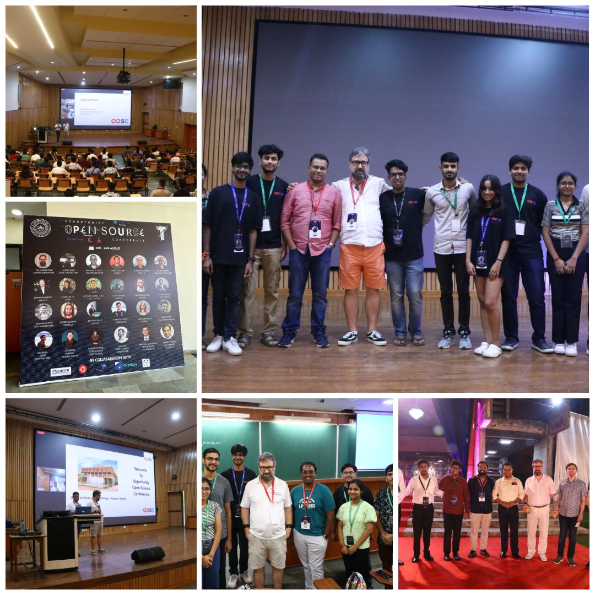
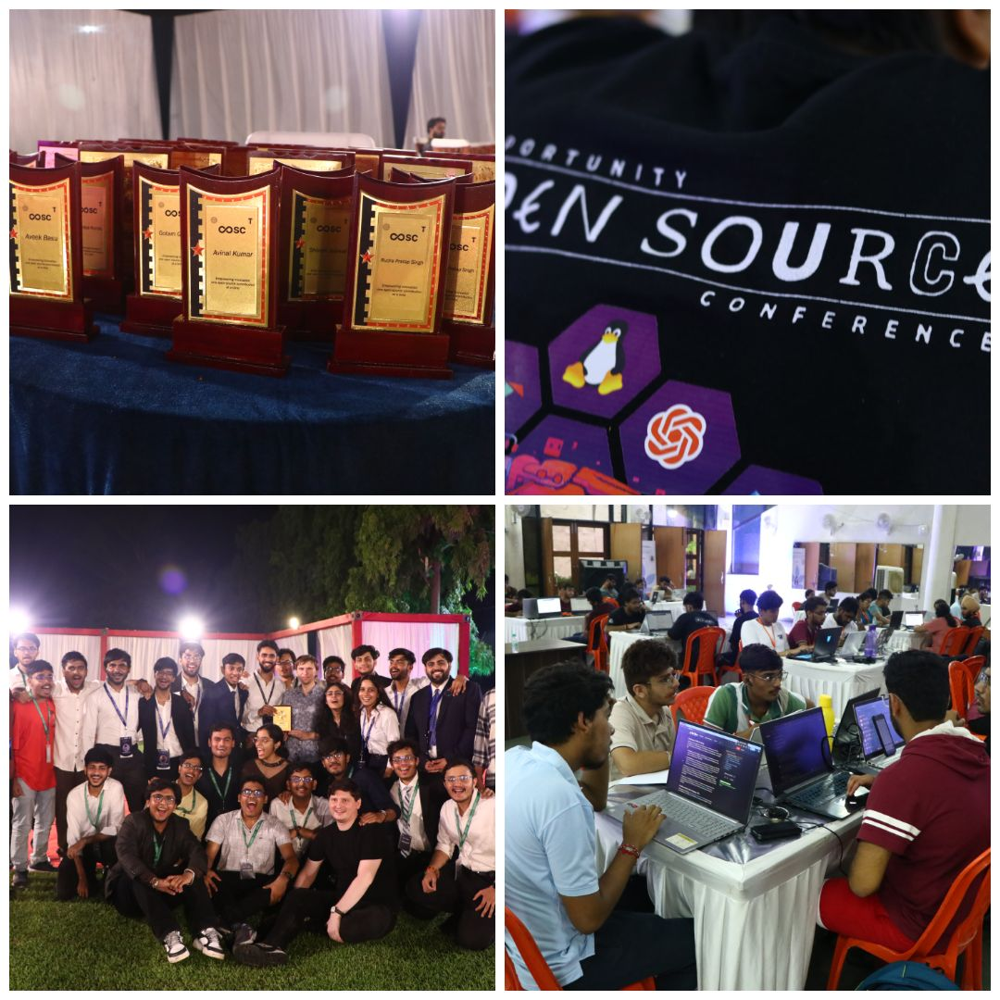
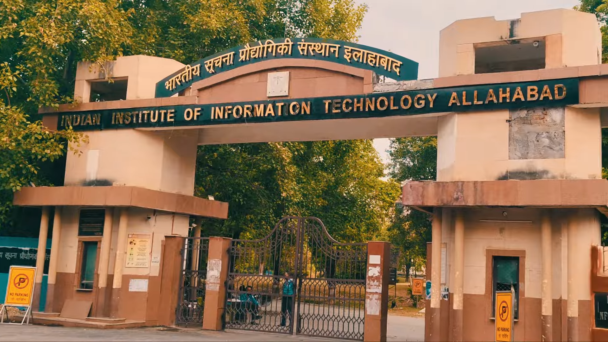
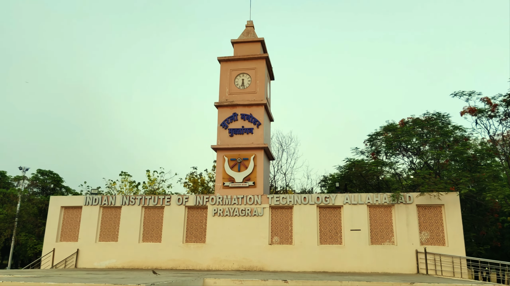
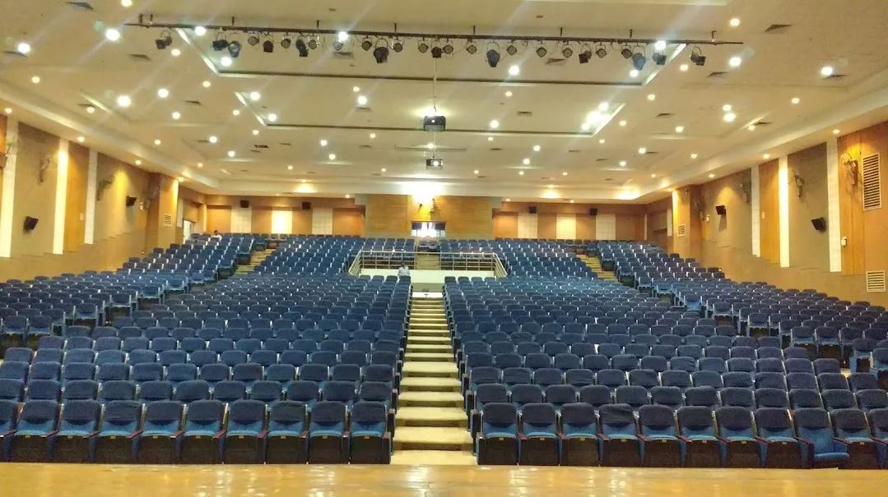
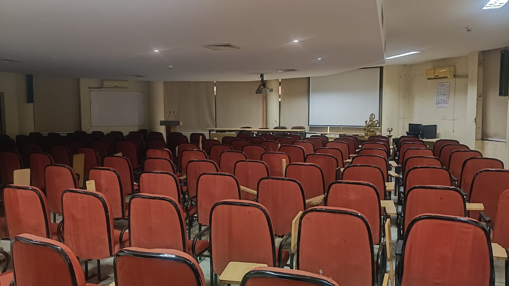

After three great Opportunity Open Source conferences we will celebrate the forth one!

## IIIT Allahabad

*Photos and description of the location contributed by Sudhanshu*

Our [Call for Localtions](/OpenPrinting-News-Opportunity-Open-Source-4.0-Call-for-Locations/) showed a lot of interest. Several groups from different places in India have answered. Some only told in a short answer that they are interested but did not follow up, and 4 groups gave more detailed information and had a video meeting with us. In the end, the most convincing bid came from the Google Developer Group (GDG) IIIT Allahabad and we settled with them.

**IIIT Allahabad** stands among **India’s premier technology institutes**, located in the historic and intellectually vibrant city of **Prayagraj**, in the state **Uttar Pradesh** in India. Renowned for its rich cultural legacy, academic excellence, and deep-rooted scholarly atmosphere, Prayagraj has long been a meeting point of ideas, innovation, and learning.

 
*IIT Allahabad: Main Gate and Clock Tower*

The region hosts some of the country’s most respected educational institutions, including **MNNIT Allahabad**, the historic **University of Allahabad**, **SHUATS**, and several other prominent institutes and research centres. Together, they create a dynamic academic ecosystem that attracts students, researchers, developers, innovators, and technology enthusiasts from across India. With this we also count with many more attendees than just those from IIIT Allahabad.

The conference will be held across selected campus venues at IIIT Allahabad, including **Computer Centre-3 (CC-3 / C. V. Raman Bhavan)**, the **Auditorium** (Plenary), and the **Admin Auditorium** (Breakout). These spaces will host talks, workshops, discussions, and other conference activities. The campus also provides suitable facilities for attendees, including dining options and other essential support for a smooth event experience.

 
*IIT Allahabad: Main Auditorium and Admin Auditorium*

Details regarding sponsors are currently being finalised and will be shared in due course.

**Rishu Kumar**, **Sudhanshu**, and **Aditya Ajay** will be the overall coordinators, and together with faculty coordinator **Prof. Bibhas Ghoshal** they will create a team of volunteers, mostly students who will do the **on-location organization**. They will look for local sponsors, reserve conference rooms and spaces for hallway track and exhibition, accommodation for speakers and non-local attendees, organize meals, prepare and test audio/video setup in the rooms, ...

## Selecting the date

The date we have set to be **some weeks after the summer break at the IIIT**, so that the **students volunteering in the organization team** are back for some weeks already to have time to **prepare the event**. On the other side we also had to care **not to fall into an exam week**, so that students have time to attend.

Another criteria for the selection of the event date are **other national and internationsl conferences** happening at this time, especially the **aKademy** 2026 in Graz, Austria, on September 19-24, and the **IndiaFOSS** in Bengaluru, on September 26-27.

And in **October** we have the **festive season** in India.

So we ended up choosing **August 28-30 (Fri-Sun), the last weekend of August**.

## Call for Proposals is open

As in the other years we want to motivate students (and also professors and researchers) to learn about free and open-source software and to join the community of developers and contributors. Not only coding and debugging can be contributed, but also designers, technical authors, evangelists, … are highly welcome.

And to make this event really great, we need your contributions: Talks, panels, workshops, demo tables, lightning talks ... Show us how you are contributing to free and open-source software, how you make our lifes better with it, You do not need to be a coder. also sessions about documentation, design, community, success stories, ... are highly welcome.

**Our [Call for Proposals](https://events.canonical.com/event/154/abstracts/) is open! Until July 3, 2026!**

So please post your proposals. We (and also our attendees) are eager to have your contribution on our conference.

## Let us celebrate a great event!

We will again have many sessions about OpenPrinting, Zephyr, Google Summer of Code, AI/LLMs/ML, ...

And especially we will again have many interactive workshops where you can learn new skills hands-on. So bring your laptop and experience it by yourself.

aWe also want to have some demo tables, where things can be tried out and conversations will fuel an exciting hallway track. And if it works out, we will also offer a Hackathon again.

**We hope to see you all in India ...**

... but you are also welcome to attend and/or speak remotely

- [LinkedIn Site](https://www.linkedin.com/company/opportunityopensource/)
- [Practical info: Location, remote attending/speaking, ...](https://events.canonical.com/event/154/)
- [Call for proposals](https://events.canonical.com/event/154/abstracts/)
- Mastodon: [#OpportunityOpenSource](https://ubuntu.social/tags/OpportunityOpenSource)

**And as usual: Stay updated on Mastodon: [#OpenPrinting](https://ubuntu.social/tags/OpenPrinting) and [@till@ubuntu.social](https://ubuntu.social/@till).**

**Or discuss on our mailing lists:**
- **Development:** printing-architecture AT lists DOT linux DOT dev ([Archive](https://lore.kernel.org/printing-architecture/))
- **Users:** printing-users AT lists DOT linux DOT dev ([Archive](https://lore.kernel.org/printing-users/))

Subscribing/Unsubscribing [instructions](https://subspace.kernel.org/subscribing.html)

**Or on the Telegram [OpenPrinting chat](https://t.me/+RizBbjXz4uU2ZWM1)**
