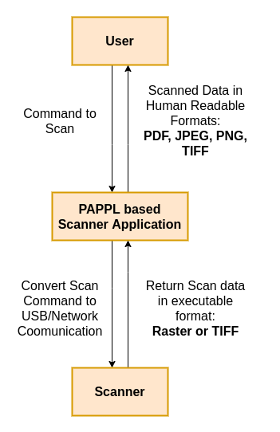

**Currently PAPPL only provides framework for Printer Applications. The codebase is currently under development and will be expanded in a future version of PAPPL to incorporate Multi Function Printer (MFP) functionalities such as scanning.** 

**This document contains information for manufacturers for designing scanner drivers. Note that since the codebase is still under development, the document describes things as planned to be executed. In case of any changes, it will be updated as soon as possible. Also a complete tutorial along with examples will be provided after the support for MFP functionality is released.**

## Introduction

A driver is code or data specific to a certain model or group of hardware devices, needed to make the hardware work with the hardware-model-independent code of the operating system. Printing in Linux has moved towards [Driverless Printing](https://openprinting.github.io/driverless/) and so does Scanning, which means there is no need for any hardware-model-specific code or data. 

Kindly refer to <a href="../02-designing-printer-drivers/">Tutorial to Design Printer Drivers</a> to know more about Printer Applications and their designing. Designing Scanner Applications is very similar and expects the manufacturers to use the PAPPL framework to reduce their effort in implementing all things from scratch..

## How a PAPPL-based Scanner Driver should work

PAPPL provides support for the below-mentioned sub-commands by default:

* add
* cancel
* default
* delete
* devices
* drivers
* jobs
* modify
* options
* printers
* scan
* server
* shutdown
* status
* submit

Once the User issues any of the following sub-commands, the printer/scanner application converts these commands (or corresponding IPP requests) into the necessary USB/network/etc. communication to perform a scan, get capabilities, and so forth.

In the class of device that we are supporting with PAPPL, the scanner will only produce raster data. It might provide native TIFF support, but that is probably all about it. PDF for example is not supported.

The PAPPL scan interface should pull image data for the current page in one of three formats: 1-bit grayscale, 8-bit grayscale, and 24-bit sRGB. It will then be up to PAPPL to deliver the pages to the Client in `PNG`, `JPEG`, `TIFF`, or `PDF` format.  For `PNG` and `JPEG`, each page is a separate document in the scan job.  For `TIFF` and `PDF`, a single document is generated and streamed to the Client in response to the Get-Next-Document-Data operation.

    

The scanner interface returns a single page at a time as uncompressed (or losslessly compressed) data, and PAPPL will convert that to a handful of formats requested by the Client.  In the case of IPP Scan, `PDF` and `JPEG` are required and PAPPL should support `PNG` for lossless compression of single images and `TIFF` for multi-page images.

## Designing Components

PAPPL provides callbacks for most of the events including submitting print/scan jobs, querying printer/scanner status and capabilities, and so forth to reduce the manufacturer's workload and hence designing scanner applications is very much similar to designing printer applications. The only difference is the additional callback support provided for the scan command. Since this support is added in PAPPL, you as a manufacturer do not need to worry about this implementation as well.

Hence refer to <a href="../02-designing-printer-drivers/">Tutorial to Design Printer Drivers</a> and follow the same for Designing Scanner Applications as well.

## Example for PAPPL-based Scanner Driver

This section is under development. It will be documented after the support for Multi Function Printer (MFP) functionalities is released.

## Template for PAPPL-based Scanner Driver

This section is under development. It will be documented after the support for Multi Function Printer (MFP) functionalities is released.

## Design Guidelines

* **1 Printer/Scanner Application = 1 Snap:**
Don't make a Snap which contains tons of different printer and scanner applications. This is to ensure that you don't occupy lots of ports and network resources when you have many printer and scanner applications.

* **Printer/Scanner/Fax support can be in a single application:**
To support multi-function devices you can put all the printer, scanner, and fax support into one application.
For example, we recommend [HPLIP](https://developers.hp.com/hp-linux-imaging-and-printing) to be put into one single application.  

* **Recommended: 1 Printer/Scanner Application per project or manufacturer/product line:**
It may be possible that a multi-function device may be served by different applications for printing and scanning. For example for legacy devices, scanning may be supported by retrofitted sane-airscan scanner application while printing is supported by the Gutenprint printer application. But here it is easier and better for the project, organization, and management that each project has its own printer/scanner application snap. So SANE will maintain a SANE scanner application snap and they put it on the Snap Store. Similarly, Gutenprint, HPLIP, foo2zjs, Epson, Canon, Ricoh, and so on will do the same.

* **NOT make 1 Printer/Scanner Application for each device:** 
For example, HP Laserjet 4 and HP Laserjet 5 should not have different applications. Otherwise, Snap Store will be cluttered with thousands of applications, and spotting the real application would be difficult. Also, it would result in a lot of code duplication, requiring more storage on the user's machine.

* **1 Printer/Scanner Application = 1 Port:**
If there are several devices connected to the system and they are served by one printer/scanner application, do not open ports for each device. Because you may run out of ports. Also, ports are not always the same on each boot as other applications may start up before on the next boot.

* **For more than 1 device on 1 Application use URI: ipp://localhost:\<PORT\>/ipp/print/\<NAME\>**
This is the recommended way to cope up with several devices by only using a single port.

* **DNS-SD service names must be always the same:**
They must be independent of order application start at boot or of device discovery. To make sure that a printer application can serve several devices of the same model include the DNS-SD service name the CEON number of the devices.

* **Web admin interface should allow:**
    1. **suppressing auto-setup for selected devices:**
    Auto detecting devices might be unsuitable for some cases. For example, if two printer applications support the same device, the user must be able to select with which application he wishes to print. So web interface must contain the option to somehow blacklist a printer application.

    2. **manual setup of additional devices/instances**
    Necessary for legacy printers that cannot be auto-discovered in the network. 

    3. **configuration of options not accessible via IPP**
    Many manufacturers have options that cannot be translated into IPP attributes. So web interface has to provide the possibility to set up these options.

* **sane-airscan in SANE Scanner Application must be built without IPP Scan to avoid recursive discovery infinite loop (“Scanner bomb”)**

## Resources
[1] <a href="../02-designing-printer-drivers/">Tutorial to Design Printer Drivers</a>
 
[2] <a href="https://github.com/michaelrsweet/pappl/">PAPPL</a>
 
[3] <a href="../../pappl-system-utilities/">PAPPL System Utilities</a>
 
[4] <a href="../04-packaging-drivers/">Packaging Drivers and Uploading them to Snap Store</a>